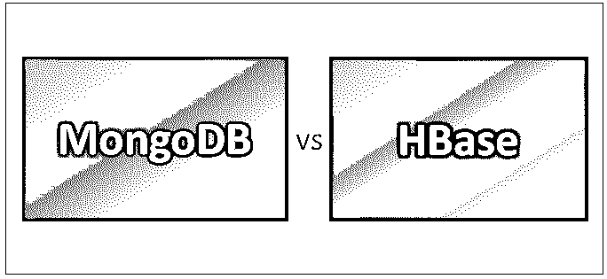

# 蒙戈布 vs 巴塞

> 原文：<https://www.educba.com/mongodb-vs-hbase/>

## MongoDB 和 HBase 的区别

数据库在所有组织和行业中都扮演着重要的角色。这些替代品正在快速发展，需要更快的结果。为了满足这些新的需求，行业正在使用非表格数据库，我们有 MongoDB vs HBase。MongoDB 是一个开源的非关系数据库。所有相关信息都存储在一起，以便快速访问数据。另一方面，HBase 是用 Java 编写的，在 Hadoop 框架上工作。它使用一个键值对来访问生成的随机模式。

### MongoDB 和 HBase 的面对面比较(信息图)

下面是 MongoDB 与 HBase 之间的 4 大对比

<small>Hadoop、数据科学、统计学&其他</small>

### MongoDB 和 HBase 的主要区别

MongoDB vs HBase 都是市场上的热门选择；让我们讨论一些主要差异:

HBase 和 MongoDB 都不是 SQL 数据库，它们有很大的不同。MongoDB 的查询模型提供了不同种类的投影、过滤和聚合函数。另一方面，Hbase 有一个数据的键值对。

对于文本搜索，MongoDB 为文本索引提供了一个原生特性，并在 HBase 中为搜索引擎复制数据。MongoDB 提供了三个节点，即主节点和辅助节点，以及一个用于复制的节点。HBase 有 10 个主节点、区域服务器、备用名称节点、数据节点和动物园管理员节点。

在 MongoDB 中，可以使用哈希、范围和区域分片来进行分区，而 HBase 只提供哈希技术。

在备份和恢复方面，MongoDB 拥有 Ops manager 和 Atlas consistent，可提供及时的备份和分片集群。HBase 在集群的每个节点上每 60 秒拍摄一次数据快照。

MongoDB 中的 Group by 使用聚合管道执行，HBase 中使用 Hadoop 传统的 map reduce。

### MongoDB 与 HBase 对照表

下面是 MongoDB 和 HBase 的对比表

| **比较的基础** | **MongoDB** | **HBase** |
| 基本区别和历史 | MongoDB 是一个开源的面向文档的 NoSQL 数据库程序。它使用带有模式的 JSON 文档。MongoDB 的开发是由 10gen software 在 2007 年开始的。它是跨平台的，并提供高可用性和可伸缩性。它致力于收集和文档概念。它主要使用数据库、集合和文档。 | HBase 也是一个开源的非关系分布式数据库模型。它由 Apache 基金会开发，运行在 Hadoop 分布式文件系统上。它是由 Powerset 公司开始的，因为他们需要大量的数据。它类似于谷歌的大表，提供对海量数据的访问。它是 Hadoop 生态系统的一部分，数据消费者可以使用 HBase 读取和访问数据。 |
| 装置 | 1.  You can download MongoDB from https://www.mongodb.org/downloads首先，你需要确定你的 windows 版本。

2.下载完成后，您可以解压缩文件夹 MongoDB-win32-i386-[版本]或 MongoDB-win32-x86 _ 64-[版本]。

3.转到命令提示符并运行以下命令:

*C:\>move MongoDB-win 64-**MongoDB 1 dir(s)moved。该文件夹的默认位置应该是 C:\data\db。

4.现在转到 MongoDB 安装文件夹中的 bin 目录，设置路径如下:

*C:\用户\XYZ > d:*

*D:\ > cd【设置】*

*D:\设置> cd mongodb*

*D:\ setup \ MongoDB>CD bin*

*D:\ set up \ MongoDB \ bin>mongod.exe–dbpath " D:\ set up \ MongoDB \ data "*

5.安装 MongoDB，并使用以下命令进行安装:

*apt-get 安装 mongodb-10gen = 2.2.3 并使用以下命令启动* MongoDB:

*sudo 服务 mongodb 启动*

 | Linux should be set up before installing Hadoop. Hence this can be done using ssh. The steps involved in an installation are as below:1.使用以下命令创建用户:*$苏**密码:**#useradd Hadoop**#passwd Hadoop**新密码:**重新输入新密码*2.下一步涉及 ssh 设置和密钥生成。以下命令可以帮助您使用 ssh 生成一个键值对。*$ ssh-keygen–t RSA**$猫~/。ssh/id_rsa.pub > > ~/。ssh/authorized_keys**$ chmod 0600 ~/。ssh/authorized_keys*3.安装 Java 包括 jdk-7u71-Linux-x64.tar.gz 的 JAVA 版本。提取这个文件并将其移动到/usr/local。完成后，在~/中设置 path 和 JAVA_HOME 变量。巴沙尔侧写。4.通过配置 hdfs-site.xml、yarn-site.xml、core-site.xml、mapred-site.xml 等所有文件来设置 Hadoop 环境5.通过配置 Hbase-NV . sh 和 hbase-site.xml 文件，在独立模式下设置 h base。也可以通过配置 hbase-site.xml 文件以伪模式安装它。 |
| 创建表和集合 | MongoDB uses databases, collections, and documents for storing all the data. To create collection one must use createCollection() method.语法:db.createCollection(名称，选项)名称:需要创建的集合的名称选项:这是一个可选字段，指定内存大小和索引。可选字段可以有以下选项:1)Capped:它启用 Capped 集合，该集合具有一旦达到最大大小就自动覆盖固定大小和旧条目的能力。2)auto index:它自动创建索引

3)大小:它指定上限集合的最大字节数。

4)Max:确保允许的最大文档数。

示例:

*>使用测试*

*切换到 db 测试*

*> db.createCollection("我的收藏")*

*{“ok”:1 }*

这些可以通过以下方式进行检查:

*>展示收藏*

*我的收藏*

*系统索引*

 | HBase enables the user to create tables using create command. User can specify the table name and columns.语法:创建“表名”、“列族”示例:hbase(main):002:0 >创建“员工”、“个人数据”、“专业数据”也可以使用 JAVA API 创建表格。创建它的步骤可以是:1)实例化 HBaseAdmin这需要将 configuration 作为一个参数，该参数将实例化相应的配置类并将其传递给 HBaseAdmin。*配置 conf = hbaseconfiguration . create()；**hbasedmin admin = new hbasedmin(conf)；*

2)接下来，用户可以创建表描述符。HTableDescriptor 是包含表名和列族的类。

*//创建表格描述符*

*htable descriptor new Table = new htable descriptor(toBytes("表名"))；*

*//创建列族描述符*

*hcolumndedescriptor new family = new hcolumndedescriptor(toBytes("列族"))；*

*//将列族添加到表中*

*table . add family(new family)；*

3)通过 Admin 执行:使用 createTable()方法，我们可以使用以下命令执行 HBaseAdmin 中的方法:

*admin.createTable(表格)；*

 |
| 删除表和集合 | The method to drop collection is db.collection.drop which drops collection in database.语法:db.collection_name.drop() | For dropping table in Hbase user must disable the table. This can be done as below:*hbase(main):018:0 >禁用‘EMP’**1.4580 秒内 0 行*禁用表格后，您可以使用以下命令删除该表格:*hbase(main):019:0 >丢弃‘EMP’**0 行 0.3060 秒*使用正则表达式，你也可以删除多个表。 |

### 结论

当数据采用键值对的形式并且具有大量数据时，可以使用 HBase。另一方面，MongoDB 可用于用户希望跟踪用户在在线应用程序上的行为的情况。HBase 具有高性能和可伸缩性，而 MongoDB 支持广泛的应用程序。用户需要决定他们是想要更好的性能还是想要支持不同的应用程序

### 推荐文章

这是 MongoDB 和 HBase 之间主要差异的指南。在这里，我们还将讨论信息图和比较表的主要区别。您也可以看看下面的 HBase vs MongoDB 文章来了解更多信息——

1.  [MongoDB vs Cassandra](https://www.educba.com/mongodb-vs-cassandra/)
2.  [h base vs Cassandra–最大差异](https://www.educba.com/hbase-vs-cassandra/)
3.  [MongoDB vs PostgreSQL](https://www.educba.com/mongodb-vs-postgresql/)
4.  [HDFS vs h base——哪个更好](https://www.educba.com/hdfs-vs-hbase/)
5.  [MongoDB vs DynamoDB:差异](https://www.educba.com/mongodb-vs-dynamodb/)
6.  [MongoDB vs SQL:有什么区别](https://www.educba.com/mongodb-vs-sql/)
7.  [h base 创建表的各种示例](https://www.educba.com/hbase-create-table/)
8.  [蒙戈布 vs 弹性搜索|信息图形](https://www.educba.com/mongodb-vs-elasticsearch/)

