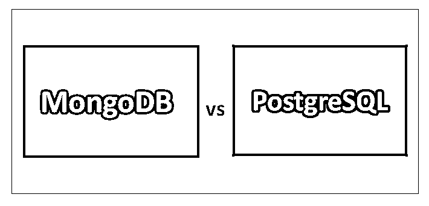

# MongoDB vs Postgres

> 原文：<https://www.educba.com/mongodb-vs-postgres/>

## MongoDB 和 Postgres 的区别

这个概念没有开始，导致 10gen 放弃了应用相关的 unharness MongoDB 作为开源项目。MongoDB 实际上会被认为是一个巨大的数据答案，它的价格表明它是一个非常通用的平台。PostgreSQL 是一个开源的 RDBMS。PostgreSQL 将数据存储在表中，并使用结构化源语言(SQL)进行信息访问，此外还有 PL/pgSQL，类似于 Oracle 的 PL/SQL 过程语言。

### 什么是 MongoDB？

MongoDB 最初是由企业 10gen 在 2007 年开发的，作为一个基于云的应用引擎，旨在运行不同的软件包和服务。他们开发了两个主要元素，Babble(应用引擎)和 MongoDB(数据库)。MongoDB 旨在交换或增强现有的 RDBMS 系统，为其提供一种健康的用例类型。

<small>Hadoop、数据科学、统计学&其他</small>

MongoDB 是如何工作的？

MongoDB 将数据存储在集合中，在集合中完全不同的数据字段可以被查询一次。数据库以二进制 JSON (BSON)的形式保存，可快速用于即席查询、索引、复制和 Map Reduced 聚合。可以应用数据库分片来允许跨多个系统的分布，用于水平可测量性 PRN。MongoDB 是用 C++编写的，可以部署在 Windows 或 UNIX 操作系统机器上，但是特别考虑到 MongoDB 的低延迟时间，UNIX 操作系统在效能方面是一个完美的选择。MongoDB 和 Hadoop 之间的主要区别在于，MongoDB 是真正的数据库，而 Hadoop 可以是构成数据处理框架的各种包元素的组合。

### PostgreSQL 是什么？

PostgreSQL 已经开发了 30 多年，由 PostgreSQL 国际开发集群维护，该集群由公司和开放供应贡献者组成。各种公司以及企业数据库为信息提供支持、服务和额外的工业计算机代码。

在 PostgreSQL 中，您预先定义了支持您的需求的 info 模式，并根据规则来处理表中字段之间的关系。连接的信息也可以保存在单独的表中，但是通过使用连接来关联。模式中的任何更改都需要迁移过程，这将使信息离线或降低应用程序性能。

### MongoDB 和 Postgres 的正面比较(信息图)

下面是 MongoDB 和 Postgres 的 7 大区别

### MongoDB 和 Postgres 的主要区别

两者都是市场上的热门选择；让我们讨论一些主要的区别:

*   Mongo 可能是一个智能文档 DB。PostgreSQL 可能是一个智能的相对数据库，它还提供了文档模型的许多优点。
*   MongoDB 将其 BSON 格式限制为 64 位中的大部分，用于表示整数或浮点数。Postgres 的 JSONB 格式没有限制。
*   此外，MongoDB 还通过延迟写入磁盘来帮助您增加写入输出。这意味着您可能会丢失一些数据，但是对于那些不太担心跟踪数据的用户来说，这通常是明智的。
*   Postgres 没有提供任何本地机制来扩展远端服务器上的信息，或者产生始终在线的信息便利性。
*   在 Postgres 中计算 JSON 数据并不自然——这可能会降低开发人员的工作效率，从而减少应用程序的运行时间。大多数工具都不支持对 SQL 的非标准扩展来询问和操作 JSON
*   如今，Postgres 处理当今世界上最重要的保险公司、银行、经纪公司、政府机构和国防承包商最迫切的需求，并且已经这样做了多年。Postgres 的性能增强随着每年的发布而持续，并为其非结构化数据排序带来了更好的性能。

### MongoDB 与 Postgres 对比表

主要比较讨论如下:

| **比较的基础** | **MongoDB** | **Postgres** |
| 主要用途 | 不需要数据一致性和完整性的高容量和高速度的大数据 | 享受规范化类型、连接、数据约束和事务支持的事务性应用程序。 |
| 业务逻辑 | 跨应用程序分布 | 带触发器的集中式过程 |
| 与数据存储轻松集成 | 没有人 | 与 Oracle、MySQL、MongoDB、CouchDB、Redis、Neo4j、Twitter、LDAP、File、Hadoop 等集成的外部数据包装器… |
| 服务器端编程 | 没有。 | 几种过程语言，如 Python、JavaScript、C、C++、Tcl、Perl 和许多其他语言 |
| 通用 Web 数据格式支持 | JSON(文档)，键值，XML | JSON(文档)，键值，XML |
| 支持的 Web 开发语言 | JavaScript、Python、Ruby 等等… | JavaScript、Python、Ruby 等等… |
| 支持关系数据/规范化形式存储 | 不 | 是 |

### 结论

当您开始一个项目时，选择正确的数据层非常重要。如果您正在构建原型或者想要高度的灵活性，MongoDB 可能是一个不错的选择。如果您已经获得了能够保证结构和一致性的极其相关的数据，PostgreSQL 可能是一个不错的选择

我知道，我知道:你希望我们会告诉你去做一个或相反的事情，从而浪费你大量的时间和麻烦，对吗？麻烦的是，它比这更高级，正如这篇 Postgres vs MongoDB 的文章所显示的那样。

打电话时，假设你非常挑剔地想从你的信息系统中得到什么，甚至同样重要的是，你在几年内无疑希望得到什么。不仅仅是就存储而言，还包括您想尝试用数据做些什么。

如果你已经在使用 Postgres vs MongoDB，一个不断变化的轨道可能会让你感到非常痛苦，但是，你需要敦促这一权利，因为不久你就可以这样做了。随着您的数据不断增长并变得更加先进，扭转局面会变得更加困难！

### 推荐文章

这是 MongoDB 和 Postgres 之间最大差异的指南。在这里，我们还将讨论信息图和比较表的主要区别。您也可以看看以下文章，了解更多信息–

1.  [Hadoop vs MongoDB](https://www.educba.com/hadoop-vs-mongodb/)
2.  [SAP vs 甲骨文](https://www.educba.com/sap-vs-oracle/)
3.  [Oracle vs PostgreSQL](https://www.educba.com/oracle-vs-postgresql/)
4.  [ES6 vs ES5](https://www.educba.com/es6-vs-es5/)
5.  [MongoDB vs Postgres:差异](https://www.educba.com/mongodb-vs-postgres/)
6.  [MongoDB vs Oracle:有什么区别](https://www.educba.com/mongodb-vs-oracle/)
7.  [MongoDB vs Cassandra:收益](https://www.educba.com/mongodb-vs-cassandra/)
8.  [MongoDB vs DynamoDB:特点](https://www.educba.com/mongodb-vs-dynamodb/)
9.  [Oracle vs OpenJDK:最好的好处是什么](https://www.educba.com/oracle-vs-openjdk/)
10.  [MongoDB vs SQL:有什么特点](https://www.educba.com/mongodb-vs-sql/)

