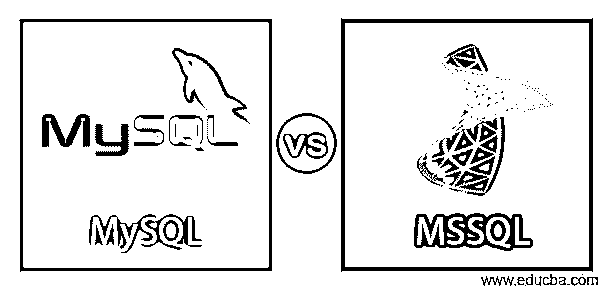

# MySQL vs MSSQL

> 原文：<https://www.educba.com/mysql-vs-mssql/>

## MySQL 和 MSSQL 的区别

MySQL vs MSSQL 是关系数据库管理系统(RDBMS)。RDBMS 是一种以表格形式(即行和列)存储信息的软件。每行和每列分别称为一个记录和一个字段。结构化查询语言(SQL)是与数据库系统进行交互以创建、更新和删除数据的手段。

### 关系型数据库

MySQL 最初是由瑞典的 MySQL AB 公司在 1995 年作为一个开源 RDBMS(关系数据库管理系统)发布的。后来，甲骨文公司收购了 MySQL AB。目前，MySQL 的开源版本在 GNU GPL(通用公共许可证)条款下可用，专有版本受 Oracle Inc .条款管辖，当然还有附加功能。MySQL 是开源 LAMP (Linux、Apache、MySQL、PHP/Python/Perl) web 开发技术栈的组件之一。由于其高性能，MySQL 被大型技术巨头广泛用于各种应用程序，包括 TYPO3、MODx、Joomla、WordPress、Drupal、Google、脸书、Twitter、Flickr 和 YouTube 等。

<small>Hadoop、数据科学、统计学&其他</small>

### MSSQL

MSSQL Server 是微软开发的专有 RDBMS(关系数据库管理系统)。它最初于 1989 年推出。MSSQL 主要是用 C 和 C++编写的。Microsoft 提供了多种 MSSQL 版本，适合软件开发项目的不同需求，从小型数据存储需求到数百万用户同时访问的企业级应用程序。MSSQL 最初是为 Windows 设计的，通常是 Windows 环境的一部分。

### MySQL 和 MSSQL 的面对面比较(信息图表)

以下是 MySQL 和 MSSQL 的 9 大区别

### MySQL 和 MSSQL 的主要区别

两者都是市场上的热门选择；让我们讨论一些主要的区别:

*   MySQL 和 MSSQL 在 Linux 和 Windows 环境下都能很好地工作。然而，MSSQL 最初是为 windows 平台开发的，而 MySQL 则与 Linux 和 LAMP 技术堆栈集成在一起。
*   MySQL 的 GNU GPL 版可以免费获得源代码。尽管 MSSQL 是一种专有软件，但它的使用需要购买许可证，这反过来对于具有多个数据库的企业应用程序来说成本很高。
*   MySQL 和 MSSQL Server 在多种编程语言下都表现良好。这两种 RDBMS 都可以与 Java、PHP、C++、Python、Ruby、Visual Basic、Delphi、Go 和 r 集成。然而，MySQL 还支持某些编程语言，如 Perl 和 Haskel，这使它在广大开发人员社区中更受欢迎。
*   MySQL 支持广泛的存储引擎。此外，程序员还可以选择使用插件存储引擎。相比之下，MSSQL 只提供一个存储引擎。因此，MySQL 在存储引擎方面提供了更好的灵活性。
*   MSSQL 使用户能够利用基于行的过滤的好处，这是通过数据库的方式在数据库中实现的。同时，过滤后的数据暂时保存在单独的数据库中。相比之下，MySQL 要求用户按单个数据库过滤行、表或用户。因此，MSSQL 中使用的过滤机制更加优化。
*   在 MySQL 中，数据备份是一个繁琐的过程。虽然备份通常被视为 SQL 语句，但它可以最大限度地减少将 MySQL 的一个版本升级到另一个版本时数据损坏的可能性。但是，在进行备份恢复的同时执行多个 SQL 语句非常耗时。另一方面，MSSQL 既不会在备份过程中阻塞数据库，也不需要开发人员承担耗时的备份过程，从而使备份变得更加简单和直接。
*   MySQL 不允许用户中途中断查询执行，也就是说，一旦 SQL 查询启动，它就必须继续运行。而 MSSQL 用户可以控制查询的执行，并在查询完成前暂停查询。MSQL 事务引擎将这一功能交给了开发人员。
*   MySQL 和 MSSQL 都将数据存储为二进制集合。MySQL 允许其他进程在运行时访问和操作数据库文件。但是，MSSQL 不提供对其托管文件的访问和操作。它限制了对数据库二进制文件的未授权访问，保护了数据的完整性。在这一点上，MSSQL 比 MySQL 提供了更好的安全约束。
*   MSSQL server 有多个版本，从企业版、快速版、Web 版、标准版、商业智能版和工作组版。而 MySQL 主要有社区版和企业版。
*   MyISAM 和 InnoDB 是 MySQL 的特色。这些引擎是可配置的，允许开发者执行非常不同的设计和编程。另一方面，在创建数据库时，程序员不要明确指定不同的引擎。

### MySQL 与 MSSQL 对照表

主要比较讨论如下:

| **比较的基础** | **MySQL** 的实现 | **MSSQL** |
| 总公司 | MySQL AB 推出了 MySQL | 微软发布 MSSQL |
| 许可证 | 开源版本由 GNU GPL 管理，专有版本由 Oracle Inc .管理。 | 微软提供了一个单独的专有版本 |
| 潜在语言 | C，C++ | C，C++ |
| 平台 | Linux、Solaris、macOS、Windows、FreeBSD | 微软视窗服务器，微软视窗，Linux |
| 表演 | 为高端应用提供强大的性能 | 性能和速度的相似性 |
| 数据库模型 | 将数据存储为行和列的表格 | 将数据存储为行和列的表格 |
| 表间关系 | 使用主键和外键 | 使用主键和外键 |
| 可量测性 | 随着数据大小的增长，灵活处理增加的事务 | 可扩展到足以适应增加的事务 |
| 主要实施 | Joomla，WordPress，Drupal，Google，脸书，Flickr | 微软，堆栈溢出，麻省理工学院，Brilium 公司。 |

### 结论

总之，MySQL 和 MSSQL 都是企业级关系数据库，广泛用于数据存储后端。MySQL 和 MSSQL 都为高事务应用程序提供了同等水平的性能和速度。虽然，MySQL 和 MSSQL 都可以部署在任何平台上，但是，MySQL 在所有主流平台上都有更好的集成。成本是另一个考虑因素，这也是选择技术堆栈之前的主要动机，在这里，MySQL 再次拥有优势，因为它的开源非专有版本的可用性。

### 推荐文章

这是 MySQL 和 MSSQL 之间最大区别的指南。在这里，我们还将讨论信息图和比较表的主要区别。您也可以看看以下文章，了解更多信息–

1.  [MySQL 与 SQL Server 的主要区别](https://www.educba.com/mysql-vs-sql-server/)
2.  [CSS vs JavaScript:惊人的差异](https://www.educba.com/css-vs-javascript/)
3.  [CSS 与 CSS3–惊人的对比](https://www.educba.com/css-vs-css3/)
4.  [微软 SQL vs MYSQL](https://www.educba.com/mysql-vs-mssql/)
5.  [Oracle vs MSSQL:有什么好处](https://www.educba.com/oracle-vs-mssql/)
6.  [Oracle vs OpenJDK:有哪些惊人的好处](https://www.educba.com/oracle-vs-openjdk/)
7.  [MySQL vs MongoDB:好处](https://www.educba.com/mysql-vs-mongodb/)
8.  [SQL Server 面试问题:想知道最好的问题](https://www.educba.com/sql-server-interview-questions/)
9.  [了解 Cassandra 与 MySQL 的 6 大区别](https://www.educba.com/cassandra-vs-mysql/)

