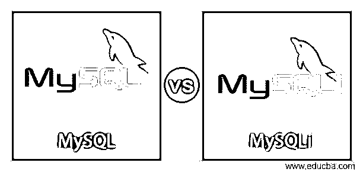

# MySQL vs MySQLi

> 原文：<https://www.educba.com/mysql-vs-mysqli/>

## MySQL 和 MySQL 的区别

MySQL 和 MySQL 都是关系数据库管理系统。回想一下，关系 DBMS 是基于代表现实世界关系的实体建模的。数据以表格格式存储，并通过规范化和约束与其他数据相关。

MySQL 是一个开源的关系数据库管理系统。它是应用最广泛的数据库管理系统。一些重量级的应用程序名称包括脸书，推特，YouTube 等。它在方法上是程序性的。

<small>Hadoop、数据科学、统计学&其他</small>

**MySQLi—**MySQLi 是一个关系数据库驱动程序，用于提供 MySQL 数据库的接口。MySQLi 中的字母 *i* 代表改良。它主要用于 PHP 脚本语言中。它在方法上是面向对象的。

### MySQL 和 MySQL 的直接比较

以下是 MySQL 和 MySQLi 之间的 9 大区别:

### MySQL 和 MySQL 的主要区别

让我们讨论一下 MySQL 和 MySQL 之间的一些主要区别。

*   本质上，MySQLi 不是一个数据库。这是一个改进的接口，用于访问由 MySQL 数据库提供的功能。这种改进的接口简化了开发人员的查询任务。
*   MySQL 的另一个优点是对底层 MySQL 数据库的面向对象支持。这有助于程序员创建连接对象，并通过连接对象的类中的方法执行所有任务。同时，对于对数据库的查询是简单的 CRUD 操作的应用程序，MySQL 的性能和 MySQLi 一样好。
*   说到安全，MySQLi 有一个针对 [SQL 注入攻击](https://www.educba.com/what-is-sql-injection/)的防范机制。此外，MySQL 支持 MySQL 的所有功能，并具有 API 的额外优势。这些 API 让 MySQL 比 MySQL 更有优势。开发人员经常发现使用 API 比为多余的任务制定自己的查询更容易。除此之外，强大的语言兼容性和社区支持也促使 PHP 程序员使用 MySQL 而不是 MySQL。

### MySQL 与 MySQL 对比表

让我们讨论一下 MySQL 和 MySQLi 之间最重要的比较。

| **比较的基础** | **MySQL** 的实现 | **MySQLi** |
| **数据库管理系统** | 是的，MySQL 是一个成熟的关系数据库管理系统。 | 不 MySQL 是 MySQL 提供的接口的扩展。它在底层架构中使用 MySQL 数据库。 |
| **编程范例** | 过程化——MySQL 有一个过程化的方法来查询数据库。查询的结果对象被视为过程中的一个步骤。 | 双重(面向过程和面向对象)——MySQLi 有双重方法。对于从 MySQL 界面迁移的用户，支持过程化方法。但是，您也可以自由选择面向对象的方法。在面向对象的方法中，重点是结果对象。每一步都围绕着 MySQLi 连接对象。功能根据其用途围绕对象进行分组。
然而，这两种方法之间没有显著的性能差异。你可以自由选择你觉得舒服的界面。 |
| **界面** | 命令行界面——MySQL 附带了一个命令行界面。它类似于 DOS 控制台。SQL 指令以命令的形式给出，结果以表格形式显示在控制台中。 | 图形/编程界面**–**MySQL 有一个到底层 MySQL 数据库的图形界面。您可以通过单击按钮发出某些命令，结果会显示在单独的结果页面上。
还有一个编程接口，你可以利用暴露的 API 编写命令。 |
| **用语言写的** | C 和 C**++**–MySQL 已经用 C 和 C++语言编码。 | PHP——MySQLi 是用 PHP 编写的，主要用于 PHP 脚本语言。 |
| **SQL 注入** | 容易遭受 SQL 注入攻击——MySQL 一次又一次遭受 SQL 注入攻击。黑客在用户输入字段中注入恶意查询，然后在服务器上执行。这导致了数据安全性的损害。 | 防止 SQL 注入——MySQLi 有防止 SQL 注入攻击的机制。当通过用户输入字段发送 SQL 查询时，MySQLi 会返回一个错误，并且不执行该查询。 |
| **交易支持** | ACID 事务——MySQL 的 InnoDB 引擎完全支持 ACID 事务。事务的 ACID 属性代表原子性、一致性、隔离性和持久性。这确保了每次交易都是准确、完整的，并且数据完整性不会受到损害。 | MySQL 事务的 API 支持——MySQL 为底层 MySQL 事务提供 API 支持。这实质上意味着 MySQLi 中的事务可以通过 API 调用来控制。有用于启用或禁用自动提交模式、提交事务或回滚事务的 API。 |
| **多语句支持** | MySQL 允许一次向服务器发送多条语句来执行。这节省了从客户端到服务器的往返时间。从服务器返回的所有结果集都必须由客户端使用。 | 是的 MySQL 支持底层 MySQL 数据库中的多条语句。这种支持是通过 MySQLi 连接对象的 multi_query 方法提供的。 |
| **准备好的报表支持** | MySQL 数据库已经准备好了语句。预准备语句用于以更高的效率多次执行同一查询。准备好的语句有两个阶段——准备和执行。当准备好语句时，服务器对语句进行编译，准备语句模板并分配必要的资源。在执行阶段，客户端将实际参数发送到服务器，服务器使用参数值和分配的资源执行之前准备好的模板。因此，该语句可以以更高的效率执行多次。 | 是的 MySQL 支持底层 MySQL 数据库中的预处理语句。这种支持是通过 MySQLi 连接对象的 prepare、bind_param 和 execute 方法提供的。 |
| **发布** | 1995 年 5 月 23 日 | 在 2004-05 年以多种包装形式发布 |

### 结论

MySQL 绝对是 MySQL 的改进版。但是选择哪一个取决于你的技术。PHP 对 MySQLi 有很大的支持，但其他语言就不一样了。如果您的应用程序是 LAMP (Linux、Apache、MySQL、Perl/Python/PHP)堆栈的一部分，您最好使用 MySQL。这是因为 MySQL 对于 LAMP 架构引起的问题有很好的社区支持。所以，明智选择，不断学习。

### 推荐文章

这是 MySQL 和 MySQL 的对比指南。在这里，我们还将讨论信息图和比较表的主要区别。您也可以浏览我们推荐的其他文章，了解更多信息——

1.  [MySQL 字符串函数](https://www.educba.com/mysql-string-functions/)
2.  [MySQL vs 甲骨文](https://www.educba.com/mysql-vs-oracle/)
3.  [什么是 NoSQL 数据库](https://www.educba.com/what-is-nosql-database/)
4.  [MySQL 与 SQLite |最大差异](https://www.educba.com/mysql-vs-sqlite/)
5.  [Cassandra 与 MySQL 的主要区别](https://www.educba.com/cassandra-vs-mysql/)

