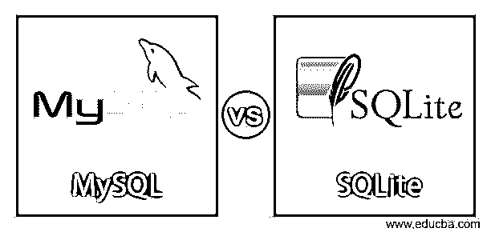

# MySQL 与 SQLite

> 原文：<https://www.educba.com/mysql-vs-sqlite/>

## MySQL 和 SQLite 的区别

MySQL 是最流行和最受欢迎的开源关系数据库管理系统之一。它广泛应用于许多小型和大型工业应用中，能够处理大量数据。MySQL 支持标准的结构化查询语言(SQL)。它是由 Michael Widenius 和 David Axmark 在 1994 年用 C 和 C++语言编写的。目前，Oracle 公司正在开发、分发和支持 MySQL 应用程序。

SQLite 是一个用 C 语言编写的库，实现了一个无服务器、无配置和事务的 SQL 数据库。与其他 SQL 数据库引擎不同，它没有单独的服务器。它使用普通的磁盘文件进行读写操作。SQLite 数据库文件是跨平台的，很容易在 [32 位和 64 位操作系统](https://www.educba.com/32-bit-vs-64-bit-operating-system/)之间复制。

<small>Hadoop、数据科学、统计学&其他</small>

### MySQL 和 SQLite 的面对面比较(信息图表)

以下是 MySQL 和 SQLite 之间的 14 大区别

### MySQL 和 SQLite 的主要区别

MySQL 数据库服务器和 SQLite 有许多共同点，但是有一些关键的区别，程序员在选择数据库之前应该提前了解。让我们来看看 MySQLvs SQLite 之间的主要区别。

#### 1.应用程序界面

如您所知，要将应用程序与数据库连接起来，您需要某种连接器或 API，这使得连接设置非常容易。MySQL 有自己的 API，而 SQLite 没有提供任何 API。虽然两个数据库系统的访问方法相同，即 JDBC、[ADO.NET](https://www.educba.com/what-is-ado-dot-net/)和 ODBC。

#### 2.身份验证和安全性

大多数应用程序处理需要最高安全性和有限访问的个人身份信息数据。数据库应该有某种身份验证，以避免未经授权的人轻易访问数据。MySQL 提供了内置的安全特性，如 SSH 来验证其用户，还可以为用户分配不同的角色来授予有限的权限。不幸的是，SQLite 缺乏所有这些特性，事实上，SQLite 没有任何机制来验证用户。任何人都可以访问数据库文件。

#### 3.数据库即服务

随着像 Azure、 [Amazon Web Services 和 Google Cloud](https://www.educba.com/google-cloud-vs-aws/) 这样的云服务的出现，许多公司都在寻找一种解决方案，或者一种产品既可以作为服务也可以作为客户的服务。当托管在云上时，MySQL 可以用作服务，而 SQLite 不支持这一点。

#### 4.多用户连接

经常有这样的需求，即多个开发人员需要同时在同一个数据库上工作，MySQL 是专门为满足这种需求而设计的，可以处理并发用户。不幸的是，SQLite 没有提供任何用户管理，所以一次只有一个用户可以访问数据库。

#### 5.可量测性

可伸缩性确实是任何开发人员在数据库中检查的最重要的因素。MySQL 具有高度可伸缩性，能够处理大量数据，而 SQLite 却无法达到同样的水平。随着数据量的增加，SQLite 的性能往往会下降，因为它直接将数据写入占用大量内存的文件中。

### MySQL 和 SQLite 的对照表

以下是 MySQL 和 SQLite 之间最重要的比较:

| **MySQL** 的实现 | **SQLite** |
| MySQL 是用 C 和 C++语言开发的。 | SQLite 完全是用 C 语言开发的。 |
| MySQL 需要一个数据库服务器通过网络与客户机交互。 | SQLite 是一个无服务器的嵌入式数据库，作为应用程序的一部分运行，不能通过网络与任何其他应用程序连接。 |
| MySQL 是开源的，由 Oracle 管理。 | SQLite 不仅是开源的，而且其代码也可以在公共领域用于商业和个人用途。 |
| MySQL 服务器需要大约 600 Mb 的空间来运行。 | SQLite 是一个非常轻量级的库，大约 250 kb。 |
| MySQL 支持几乎所有的数据类型，如 TINYINT、SMALLINT、MEDIUMINT、INT、BIGINT、FLOAT、DOUBLE、DOUBLE PRECISION、REAL、DECIMAL、NUMERIC、DATE、DATETIME、TIMESTAMP、YEAR、CHAR、VARCHAR、TINYBLOB、TINYTEXT、BLOB、TEXT、MEDIUMBLOB、MEDIUMTEXT、LONGBLOB、LONGTEXT、ENUM、SET 等。 | SQLite 仅支持 BLOB、NULL、INTEGER、TEXT、REAL。 |
| MySQL 中数据的可移植性是一项单调乏味的工作，因为您首先需要将其导出为文件，然后再将其移动到其他系统。此外，因为它的大小，这是耗时的。 | SQLite 直接将数据写入一个文件，可以非常容易地移动。 |
| MySQL 可以处理多个同时连接。 | SQLite 一次只能满足一个连接。 |
| 在 MySQL 中，您可以创建具有不同权限和角色级别的多个用户。 | SQLite 不支持用户管理。 |
| 它也支持 XML 格式。 | 它不支持 XML 格式。 |
| MySQL 是高度可伸缩的，可以处理大量的数据。 | SQLite 非常适合小数据集，它的性能会随着数据量的增加而下降，因为它会消耗大量内存。 |
| MySQL 提供并支持许多身份验证方法来保护对数据库的未授权访问。它包括对高级 SSH 验证的基本用户名和密码保护。 | SQLite 没有任何内置的认证技术，任何人都可以访问数据库文件。此外，他们还可以读取和更新数据。 |
| 设置 MySQL 服务器需要许多服务器配置。 | SQLite 不需要任何配置，与 MySQL 服务器相比，它的启动和运行非常容易。 |
| MySQL 通常用于需要大量计算和频繁事务的 web 应用程序和桌面应用程序。 | SQLite 通常用于移动应用程序，主要用于检索某些预定义的信息。 |
| MySQL 由 Oracle 公司支持和维护。 | 一个全职开发 SQLite 的国际开发团队正在为该应用程序提供支持。他们负责缺陷修复和改进。 |

### 结论

现在我们已经到了文章的结尾，让我们总结一下从这次讨论中得到的关键。对于安全性非常重要且数据量非常大的 web 应用程序，请选择 MySQL。对于相对较小的应用程序或不需要任何安全特性且数据量不太大的移动应用程序，请选择 SQLite。

### 推荐文章

这是 MySQL 和 SQLite 的对比指南。在这里，我们还讨论了 MySQL 和 SQLite 在信息图表方面的主要区别。您也可以浏览我们推荐的其他文章，了解更多信息——

1.  WordPress vs Django
2.  [Hadoop vs Hive](https://www.educba.com/hadoop-vs-hive/)
3.  [拉拉维尔 vs Zend](https://www.educba.com/laravel-vs-zend/)
4.  [什么是主机？](https://www.educba.com/what-is-hosting/)

