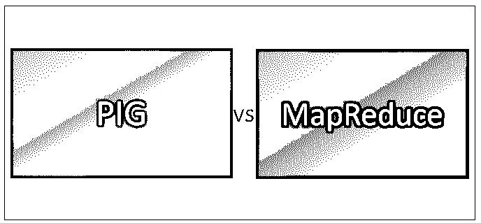
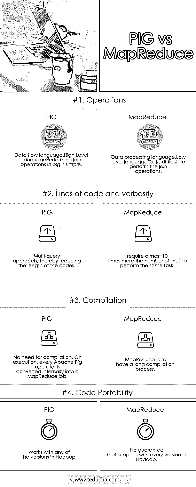
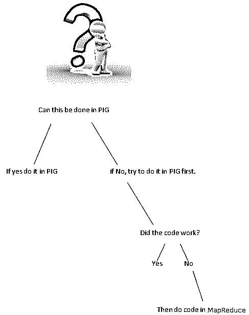

# PIG vs MapReduce

> 原文：<https://www.educba.com/pig-vs-mapreduce/>

## PIG 与 MapReduce 的区别

Pig 是一种用于探索大型数据集的脚本语言。Pig Latin 是 Hadoop 的扩展，它通过给出一种高级数据处理语言来简化 Hadoop 编程。由于 Pig 正在编写脚本，我们可以通过编写很少几行代码来实现该功能。MapReduce 是一个用于缩放数据处理的解决方案。MapReduce 不是一个程序，它是一个编写分布式数据处理程序的框架。使用 MapReduce 框架编写的程序已经成功地扩展到数千台机器上。

### 猪

Pig 是一种数据流和高级语言。Pig 可以与 Hadoop 中的任何版本一起工作。

<small>Hadoop、数据科学、统计学&其他</small>

**清管器的组成**

*   猪拉丁语——一种用于表达数据流的语言
*   Pig 引擎—基于 Hadoop 的引擎

**猪的优点**

*   消除了用户调整 Hadoop 的需要
*   使用户免受 Hadoop 界面变化的影响。
*   生产率的提高。

1.  在一次测试中，10 行猪拉丁文≈ 200 行 Java
2.  用 Java 写 4 个小时的东西，用猪拉丁语只需要 15 分钟
3.  向非 Java 程序员开放系统

如果我们意识到了 HIVE 和 PIG，就没必要关心代码，如果 [Hadoop 版本是](https://www.educba.com/hadoop-versions/)升级到更高版本。

例如:如果 Hadoop 版本是 2.6，现在就升级到 2.7。PIG 支持任何版本，无需担心代码在更高版本中是否有效。

**猪的特征**

猪拉丁语是一种数据流语言

*   提供对数据类型的支持——长整型、浮点型、字符数组、模式和函数
*   可扩展并支持用户定义的函数
*   元数据不是必需的，但在可用时使用
*   在 HDFS 处理文件
*   提供常见操作，如连接、分组、过滤、排序

**清管器使用场景**

*   博客处理
*   网络搜索平台的数据处理
*   跨大型数据集的即席查询
*   处理大型数据集的算法的快速原型

**谁用猪**

*   雅虎是 Hadoop 的最大用户之一，它在一头猪身上运行 40%的 Hadoop 任务。
*   Twitter 也是 Pig 的另一个知名用户

### MapReduce

*   在过去，处理越来越大的数据集是一个问题。你所有的数据和计算都必须放在一台机器上。为了处理更多的数据，你必须购买更大、更贵的机器。
*   那么，当在单台机器上处理大量数据在技术上或经济上不再可行时，有什么解决方案呢？
*   MapReduce 是一个用于缩放数据处理的解决方案。

MapReduce 有 3 个阶段

以下步骤按顺序执行。

*   **映射器阶段**

来自 HDFS 文件系统的输入。

*   **洗牌和排序**

洗牌和排序的输入是映射器的输出

*   **减速器**

到缩减器的输入被输出到混洗和排序。

MapReduce 将只根据键值组合来理解数据。

*   映射阶段的主要目的是读取所有输入数据，并对其进行转换或过滤。在 reduce 阶段，业务逻辑会进一步分析经过转换或过滤的数据，尽管 reduce 阶段并不是严格要求的。
*   归约阶段的主要目的是使用业务逻辑来回答问题和解决问题。

### PIG 和 MapReduce 之间的直接比较(信息图表)

以下是 PIG 和 MapReduce 的四大对比:

### PIG 和 MapReduce 的主要区别

以下是 PIG 和 MapReduce 之间最重要的区别:

**PIG 或 MapReduce 更快**

任何 PIG 作业都会在 MapReduce 中重写，因此，Map Reduce 只会更快。

**猪身上不能有的东西**

当有些东西很难用 Pig 来表达时，你会以一个表演结束，也就是说，用几个原语来构建一些东西

一些例子:

*   复杂的分组或连接
*   组合大量数据集
*   分布式缓存的复杂使用(复制连接)
*   复杂叉积
*   在嵌套的 FOREACH 中做疯狂的事情

在这些情况下，Pig 将会降低大量 MapReduce 作业的速度，而这些作业本来可以用更少的资源来完成。

**MapReduce 场景的使用**

*   当有棘手的事情要做时，使用 MapReduce。

猪的发育要快得多？

*   更少的代码行，即更小的代码，节省了开发人员的时间。
*   需要解决的 java 级错误更少，但是这些错误更难发现。

除了上述差异猪支持

*   它允许开发人员在管道中的任何地方存储数据。
*   声明执行计划。
*   它提供操作员来执行 ETL(提取、转换和加载)功能。

### PIG 和 MapReduce 之间的直接比较

以下是点列表，描述 PIG 和 MapReduce 之间的比较:

| **比较依据** | **猪** | **MapReduce** |
| **操作** | 

*   Data stream.
*   Advanced language.
*   It is very simple to perform the connection operation on pigs.

 | 

*   Data processing language.
*   Low level language
*   It is quite difficult to perform the join operation.

 |
| **代码行和冗长度** | 多查询的方法，从而减少了代码的长度。 | 执行同样的任务几乎需要 10 倍多的线路。 |
| **编译** | 不需要编译。在执行时，每个 Apache Pig 操作符都在内部转换成一个 MapReduce 作业。 | MapReduce 作业的编译过程很长。 |
| **代码可移植性** | 适用于 Hadoop 中的任何版本 | 不保证支持 Hadoop 中的每个版本 |

### 结论

例如:我们需要计算单词在句子中的重复出现次数。

做节目更好的方法是什么？

**PIG 或 MapReduce**

**在猪身上写程序**

input _ lines = LOAD '/tmp/word . txt ' AS(line:chararray)；

words = FOREACH input_lines 生成 FLATTEN(TOKENIZE(line))AS word；

filtered_words =按单词匹配过滤单词' \ \ w+'；

word_groups =按单词分组 filtered _ words

word_count = FOREACH word_groups 生成 count(filtered_words)作为 COUNT，group 作为 word；

ordered_word_count =按 DESC 计数排序的单词计数；

将 ordered_word_count 存储到“/tmp/results.txt”中；

在 MapReduce 中编写程序。

导入 org . Apache . Hadoop . fs . path；

导入 org . Apache . Hadoop . io . int writable；

导入 org . Apache . Hadoop . io . text；

导入 org . Apache . Hadoop . MapReduce . lib . input . file input format；

import org . Apache . Hadoop . MapReduce . lib . output . file output format；

导入 org . Apache . Hadoop . MapReduce . job；

公共类字数{

公共静态 void main(String[] args)引发异常{

if (args.length！= 2) {

System.out.printf(

"用法:word count<input dir="">

<output dir="">\ n ")；</output>

system . exit(-1)；

}

@SuppressWarnings("deprecation ")

Job job =新作业()；

job . setjarbyclass(word count . class)；

job.setJobName("字数")；

file input format . setinputpath(作业、新路径(args[0])；

file output format . setoutputpath(job，new Path(args[1]))；

job . setmapper class(word mapper . class)；

job . setreducerclass(sumreducer . class)；

job . setoutputkey class(text . class)；

job . setoutputvalueclass(int writable . class)；

boolean success = job . waitforcompletion(true)；

System.exit(成功？0 : 1);

}

}

如果功能可以用 PIG 实现，那用 MapReduce(冗长的代码)写功能有什么用。

总是使用正确的工具，更快更好地完成工作。

### 推荐文章

这是 PIG vs MapReduce 的有用指南。在这里，我们已经分别讨论了直接比较、关键差异以及信息图和比较表。您也可以阅读以下文章，了解更多信息——

1.  [Pig vs Spark——要学习的 10 个有用差异](https://www.educba.com/pig-vs-spark/)
2.  MapReduce 是如何工作的？
3.  [Hadoop 中的分布式缓存](https://www.educba.com/distributed-cache-in-hadoop/)

