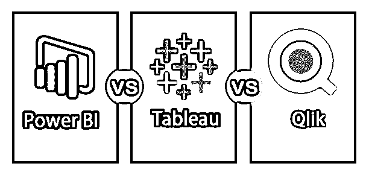

# Power BI vs Tableau vs Qlik

> 原文：<https://www.educba.com/power-bi-vs-tableau-vs-qlik/>

## Power BI 与 Tableau 和 Qlik 的区别

Power Bi 是一款[商业智能工具](https://www.educba.com/business-intelligence-tool/)我们可以在公司内部上传和发布数据。商业智能响应任何查询并改进决策。增强业务能力，实现良好的数据可视化。Power BI 的另一个特性是快速洞察，我们可以在数据集内搜索感兴趣的模式，并提供图表列表以更好地理解数据。它使用人工智能和数据挖掘来分析数据。Qlik 也是一个商业智能和数据可视化工具。

这是一个端到端的 ETL 解决方案，可以提供良好的客户服务。使用 qlik，我们可以创建灵活的最终用户界面，根据数据制作良好的演示文稿，创建动态图形图表和表格，执行统计分析，构建自己的专家系统。Qlik 可以与虚拟数据库一起使用。它是一个基于窗口的工具，需要以下组件:Qlik Server、Qlik Publisher。

<small>Hadoop、数据科学、统计学&其他</small>

它们是最常用的商业智能工具，用于随时创建、显示和共享交互式报告给用户。它们是独立于平台的，并且需要较少的技术专家。他们致力于客户-服务器体系结构的快速部署。它们非常适合需要良好商业智能的高层管理人员。Tableau 具有访问速度快、交互可视化、性价比高、维护安全性好等优点。

### 电源 BI 的特点

1.  复杂 BI 数据的丰富图形可视化。
2.  临时报告
3.  良好的导航窗格
4.  包括带有可自定义仪表板的数据集。

### Qlik 的功能

1.  通过使用混合方法，用户可以将存储在大数据源中的数据与存储在 Qlik view 内存数据集中的数据相关联。
2.  在直接发现的帮助下，它们允许用户执行业务发现和可视化分析。
3.  移动就绪、角色和权限
4.  与动态应用程序、仪表盘互动。

### 画面特征

1.  他们有一个很好的拖放。
2.  对于数据共享，他们使用 Tableau Public。
3.  他们在网络上实现交互式数据可视化。
4.  它们的性能强大而可靠，并在海量数据上运行。
5.  它们是移动友好的，并支持完整的在线版本。

### Power BI 与 Tableau 和 Qlik 的直接对比(信息图)

下面是 Power BI vs Tableau vs Qlik 的 9 大区别

### Power BI 与 Tableau 和 Qlik 的主要区别

这些是市场上流行的选择；让我们讨论一些主要的区别:

*   多个用户可以立即访问 Qlik。Qlik 比 Tableau 快。Power bI 连接到任何数据源，它们不需要 ETL。
*   文档存储在中。qvw 格式我们可以通过 Qlik Views 专有的通信协议访问这些文件并存储在 Windows OS 中，而所有的事件都是在 Qlik Server 中进行的，它们负责客户机-服务器的电源 BI 有三种类型的文件 excel(.xls)、power BI desktop(。pbix)、(。csv)。Tableau 提取文件可以有(。tde)文件扩展名。
*   Qlik 支持外部数据源的 OLEDB 接口。Power bi 从 OLEDB 加载数据，并在 bi 服务器中发布。目前他们只支持实时连接。
*   Qlik 结构没有得到很好的管理，而 Tableau 结构得到了很好的用户指南管理。
*   Qlik 是一项独立的技术。向外界发布数据由 QlikView Publisher 管理。Power BI 仅在 SAAS 模式上可用[，而 Tableau 有云和内部部署选项。Power BI 桌面版免费。](https://www.educba.com/what-is-software-as-a-service-saas/)
*   使用 POwerBI 增加了数据建模工具。在 Qlik 中，数据洞察会快速生成。
*   Tableau 和 Power BI 界面友好。Qlik 具有高度可定制的模式。
*   [Qlik 和 tableau 工作](https://www.educba.com/tableau-vs-qlikview/)进行统计分析。Power BI 没有这个能力。

### Power BI 与 Tableau 和 Qlik 对比表

下面是 9 个最上面的比较

| **比较的基础** | **功率 BI** | 表 | **Qlik** |
| **性能** | 它缺乏数据可视化的支持。 | 它们更加用户友好，因为非技术用户也可以使用这个工具。他们使用立方技术 | Qlik needs a developer to work with reports and dashboards. They take all types of datasets.他们有很好的视觉效果。 |
|  **用户界面** |  当有一个好的用户界面来发布报告时，仪表板是 PowerBI 的关键特性。 |  用户界面更好 |  

与 Tableau 相比，用户界面相当糟糕。

 |
|  **易学性** |  用户友好 Excel 知识就足够了 |  它们不需要任何技术或编程技能。 |  有数据科学背景容易学。 |
|  **支持性要求** |  

Power BI 拥有 Power BI 台式机、网关

 |  他们使用前端工具，如 r | Qlik 由前端(Qlik 开发人员)和后端(Qlik 发布人员)组成 |
|  **版本** | 桌面版是免费的，Power BI Pro 是每月付费的。 | Tableau Reader 是免费版本。Tableau 服务器是授权的。 | Qlik 个人版是 Qlik 的免费版本，无需许可证密钥即可运行。 |
| **成本效益** | 更便宜。 | 它省钱、省时、省力。加载数据仓库非常昂贵。 | Qlik 网站有两个版本。个人版是免费的，企业版可以和团队联系使用。 |
| **在线分析编程** | 他们通过 SQL 服务器连接到 OLAP 立方体进行多维分析。 | Tableau 可以连接到 OLAP 取出最深层次的立方体措施。 | 对 OLAP 的访问提供了封装的数据视图。 |
| **速度** | 他们有聪明的恢复 | 速度取决于 RAM 和数据集。 | 它们的速度更快，因为它们将数据存储在服务器 RAM(内存存储)中 |
| **优势** | Power BI 价格低廉，并且对于大型项目具有可伸缩性。 | 他们在智能可视化方面名列前茅。 | They provide wide range deep analytics and they have good customer satisfaction收视率。 |

### 结论

决定哪一个是最好的需求分析。拖放功能以及安全的数据连接使 tableau 成为市场的领跑者。Qlik 的优势包括可视化模式的内存引擎功能。通过 Power BI 创建的报告可以在团队之间共享，并且可以在任何设备上访问。总体而言，Power BI 在三种工具中脱颖而出，成为竞争对手的工具。它是高级的微软应用程序和平台，并对云平台提供高级支持。Tableau 是当前商业分析市场的首选。

### 推荐文章

这是 Power BI 与 Tableau 和 Qlik 之间最大差异的指南。在这里，我们还将讨论信息图和比较表的主要区别。你也可以看看下面的文章来了解更多。

1.  [电力 BI vs SSRS–最高分差](https://www.educba.com/power-bi-vs-ssrs/)
2.  [Looker 与 Tableau 之间的有用比较](https://www.educba.com/looker-vs-tableau/)
3.  【Winforms 与 WPF 的主要区别
4.  [如何在 Power BI 桌面中使用图标？](https://www.educba.com/power-bi-icon/)
5.  [如何在 Power BI 中使用日历 DAX 功能？](https://www.educba.com/power-bi-calendar/)
6.  [功率 BI IF 语句](https://www.educba.com/power-bi-if-statement/)
7.  [如何在 Power BI 中使用滤镜 DAX 功能？](https://www.educba.com/power-bi-filter/)
8.  [谷歌数据工作室 vs Tableau |最大差异](https://www.educba.com/google-data-studio-vs-tableau/)

