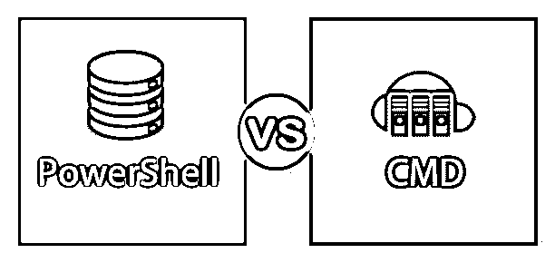
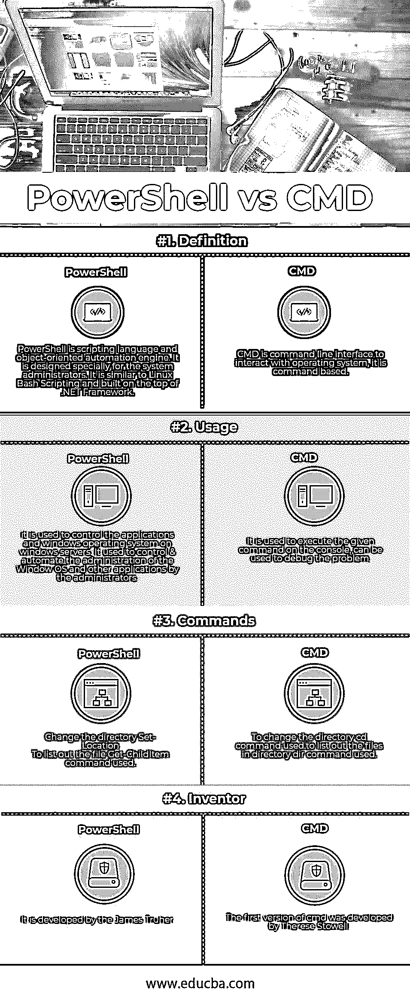

# PowerShell vs CMD

> 原文：<https://www.educba.com/powershell-vs-cmd/>

## PowerShell 和 CMD 的区别

PowerShell 是一种脚本语言，也是一种面向对象的自动化引擎。它是专门为系统管理员设计的。它类似于 Linux Bash 脚本，构建在。NET 框架，它用于控制 windows 服务器上的应用程序和 windows 操作系统。它用于控制和自动化管理员对 Windows 操作系统和其他应用程序的管理。它被用来做几乎每一种 GUI 曾经做过的工作。它主要用于自动化。命令提示符通常用于不基于 GUI 的传统方案中，在这种方案中，您必须只通过命令来做所有事情，在命令提示符中，您对设备的控制比人多，但也有一个缺点，即用户友好性较差。要运行 java 程序，你必须进入 cmd，然后只有它才能执行程序，知道 CMD 命令的人可以很容易地从 windows 转移到 Linux 和 UNIX 操作系统。它没有考虑到 CD 或 CD 将被同等对待的情况。要启动命令提示符，您必须进入 begin type cmd 并获得命令提示符。

### PowerShell 和 CMD 之间的直接比较(信息图表)

以下是 PowerShell 与 CMD 的四大区别

<small>Hadoop、数据科学、统计学&其他</small>

### PowerShell 与 CMD 的主要区别

PowerShell vs CMD 都是市场上的热门选择；让我们讨论一些主要的区别:

1.  PowerShell 是一种全新的、得到极大增强的 Shell 和编程语言，首次在 Windows 操作系统上提供。它之前是作为附加产品出现的。它是专门为系统管理员设计的。它类似于 Linux Bash 脚本，构建在。NET 框架。
2.  虽然 CMD 是通过命令与操作系统交互的命令行界面，但是还有许多命令与系统交互。与 PowerShell 相比，cmd 中的流量控制不容易控制，因为与 PowerShell 相比，它的特性较少。
3.  PowerShell 是一个 CMD 超集，与 CMD 相比，它具有许多功能，但功能有限，有权调用 CMD 或执行任何操作，PowerShell 可以调用外部程序或新程序。它可以直接访问所有的。NET，轻松访问 COM、C#、F#等。网络语言。PowerShell 可以向另一个命令传递和返回包含方法、事件和属性的对象结构数据。
4.  而在[中，与 PowerShell 和功能相比，CMD 缺少命令](https://www.educba.com/what-is-cmd/)。与 PowerShell 相比，它有局限性，只能生成简单的文本。
5.  PowerShell 是面向对象的，具有面向对象语言的所有特征，比如多态、封装、继承和抽象。
6.  而 CMD 是一个字符串。它不具有面向对象的语言特性，所以它不能提供面向对象的语言特性。
7.  PowerShell 与. net framework 集成在一起，因此。net 框架在 PowerShell 中是可用的。该特性有助于系统管理员和开发人员通过使用。net 框架，这就叫 PowerShell 的力量。
8.  而与 PowerShell 相比，CMD 没有这种类访问权限。CMD 也可以用它来自动化事情，但是它不能访问 the.net 类，这需要很多开发人员的尝试。
9.  PowerShell 可以在运行时与 the.net 框架结合，也可以很容易地使用其他应用程序的输出。
10.  CMD 没有这样的功能。
11.  PowerShell 可以运行所有类型的程序，产生不同类型的结果、对象文本等。
12.  虽然 CMD 只能生成文本输出类型，但它只能生成控制台程序类型。

### PowerShell 与 CMD 对照表

下面是 PowerShell 与 CMD 之间的 4 个最重要的比较

| **比较的基础** | **PowerShell** | **CMD** |
| **定义** | PowerShell 是一种脚本语言和面向对象的自动化引擎。它是专门为系统管理员设计的。它类似于 Linux Bash 脚本并建立在。NET 框架 | CMD 是与操作系统交互的命令行界面，它是基于命令的。 |
| **用途** | 它用于控制 windows 服务器上的应用程序和 windows 操作系统。它用于控制和自动化管理员对 Window 操作系统和其他应用程序的管理 | 它用来在控制台上执行给定的命令，可以用来调试问题。 |
| **命令** | 更改目录集位置。列出文件中使用的 Get-ChildItem 命令。 | 要更改目录，请使用 cd 命令。要列出目录中的文件，请使用 dir 命令。 |
| **发明者** | 它是由詹姆斯·特鲁厄开发的 | 第一版 cmd 是由泰蕾兹·斯托维尔开发的 |

### 结论

PowerShell 和 CMD 都非常强大，正如我们看到的，PowerShell 是微软的新产品，它有许多与 CMD 相比的功能，它可以做许多自动化工作。在 PowerShell 的帮助下，它可以帮助系统管理员非常容易地自动执行任务，与 CMD 相比，它提供了许多命令和更多功能。它不仅可以产生字符串形式的输出，也可以是对象或任何其他类型的数据。它可以与集成。net 应用程序，并且可以使用。而 CMD 是微软非常老的产品。

与 PowerShell 相比，它的功能有限，对于那些对计算机有基础知识或刚开始从事计算机领域工作的人来说，这是很好的选择。net framework 在自动化过程中需要比 PowerShell 更多的工作，但它只生成基于文本的输出，并且只执行基于控制台的应用程序。所以最后我们说我们应该使用 PowerShell，因为它是新的和更强大的。PowerShell 是操作系统非常好的集成命令行体验。它可以完全访问各种。net 框架。

在 PowerShell 系统的帮助下，管理员可以轻松地操纵系统工作站、服务器组件。与 VBScript 等其他脚本语言相比，它更加安全。cmd 也称为 cmd.exe，我们可以直接转到 cmd 上的任何驱动器位置，只需在 windows 资源管理器的搜索栏中键入 CMD。它类似于 Unix 类系统。第一个版本的 cmd 是由泰蕾兹·斯托维尔开发的。在 windows 中，接口实现使用 win32 控制台。

### 推荐文章

这是 PowerShell 与 CMD 之间最大差异的指南。在这里，我们还将讨论信息图和比较表的主要区别。你也可以看看下面的文章来了解更多。

1.  [PowerShell vs Bash](https://www.educba.com/powershell-vs-bash/)
2.  [科比特与 ITIL 的前五大差距](https://www.educba.com/cobit-vs-itil/)
3.  [ITIL vs 德沃普斯——最大差距](https://www.educba.com/itil-vs-devops/)
4.  [PowerShell vs Python—](https://www.educba.com/powershell-vs-python/)[惊人的对比](https://www.educba.com/powershell-vs-python/)
5.  [PowerShell vs 命令提示符|主要差异](https://www.educba.com/powershell-vs-command-prompt/)
6.  [PowerShell vs PowerShell ISE 附信息图](https://www.educba.com/powershell-vs-powershell-ise/)

