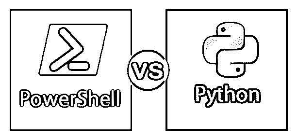
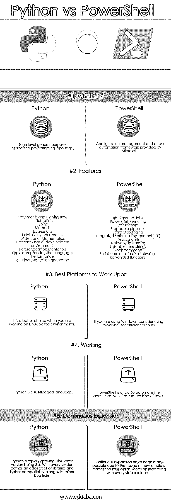

# PowerShell vs Python

> 原文：<https://www.educba.com/powershell-vs-python/>

## PowerShell 与 Python 的区别

微软今天声称，Linux 在微软 Azure 上运行起来就像一个初级公民。.net score 已经是开源的，在 Linux 上的移植已经完成，PowerShell 正在跟进。Powershell 在 CentOS 和 Ubuntu、Mac OS X 和 RedHat Linux 上运行得非常好。使用 Python 或 PowerShell 可以执行相同的操作，并实现相同级别的自动化。管理员通常通过使用脚本来自动化常规流程。当你谈到 PowerShell 时，有些功能只能在 Windows 操作系统上实现。然而，必须注意的是，PowerShell 并不是市场上唯一流行的脚本语言，python 也是广泛使用的脚本语言之一。

几乎所有的 Linux 用户和管理员都会执行。py 脚本有时在某个地方。Python 现在也可以以二进制形式开源。它是一种广泛使用的解释性编程语言，不仅用于编写脚本，还可以支持所有高级语言支持的主要特性和功能。它所包含的主要特性是面向对象技术，提供将程序动态地、任意地分割成模块，使用异常条件、迭代和条件语句，扩展编程语言的选项。与大多数编程语言不同，变量和参数声明不是必需的，因此快速编程过于简化，很少会导致歧义。

<small>Hadoop、数据科学、统计学&其他</small>

对于微软来说，PowerShell 在所有基于 windows 的系统的命令行中充当中央界面。这是作为 Windows 8 中的一个窗口功能推出的，并且以 Office 365 和 Azure 为中心的云应用和 Exchange Server 等其他一些产品的集成得到了大量不断增长的 PowerShell cmdlets 的支持。Windows 命令行，俗称命令提示符，是 Windows 10 电源菜单中的一个主要功能，可以很容易地替换为 PowerShell(在系统设置中可以找到)。在较新版本的 Windows 10 中，PowerShell 是电源菜单中的默认命令行。

用 Python 编写的代码可读性高，效率高，因此可循环使用，不像许多其他语言的语法那样使用括号和分号。缩进的特性是大多数编程语言都没有的独特特性。Python 可以在许多不同的操作系统上使用。

[PowerShell 解释型](https://www.educba.com/what-is-powershell/)处理代码，与面向对象相关的特性也是常见的。它还可以使用管道链接进程和命令。经典的 UNIX shells 也支持这种技术；以面向对象的方式使用它提供了大量的可能性。例如，负责创建 windows 服务的诸如 Get-Service 之类的 cmdlet 将它找到的服务作为对象返回。在管道字段之后编写的命令用于列出详细信息。PowerShell 的实力是巨大的，没有第二个疑问。它简化了 It 专业人员在其 Windows 系统上自动执行任务的方式。处理文件和文件夹的可能性远远不止这些。

### PowerShell 和 Python 的正面比较(信息图表)

以下是 PowerShell 和 Python 之间的五大区别:

### PowerShell 和 Python 之间的主要区别

PowerShell vs Python 都是市场上的热门选择；让我们讨论一下 PowerShell 和 Python 之间的一些主要区别:

Python 是一种高级语言，它扩展了其作为脚本语言的功能，并通过提供迭代结构、条件语句和易于使用的语法向前迈进了一步，而 PowerShell 不仅仅是一种语言，因此广泛利用了 the.Net 风格的基础架构功能。并非所有语言都能够支持基础设施功能。Posh 就是这样一种语言，它从 Perl 借用了这种管道，但它更侧重于面向对象的工作方法，与 Perl 相比，这种方法更简洁。

当您谈到提供一个足够高效的工具来取代 Windows 机器上的 BAT 和 CMD 脚本时，Python 是一个很好的选择，此外，它还可以用于在您提供的 Linux 机器上运行脚本。因此，本质上，它是一种灵活的语言，能够在需要时同时处理许多任务，而 PowerShell 更适合于管理目的。这是一个高效和多功能的监控工具，用于跟踪所有的窗口框。它吸收了强大的 of.Net 以及许多 MS 产品功能，如 Exchange、Active Directory 等。这也是使用 PowerShell 成为首选的主要原因之一。PowerShell 已预装在今天的大多数 MS 版本中。

### PowerShell 和 Python 对照表

下面是 PowerShell 和 Python 之间的 5 个最重要的比较。

| 【PowerShell 与 Python 的对比基础 | **Python** | **PowerShell** |
| **什么事？** | 高级通用解释程序设计语言 | 微软提供的配置管理和任务自动化框架 |
| **特性** | Statements and Control flow Indentation打字方法公式

大量的图书馆

数学的广泛应用

不同种类的开发环境

参考实现

跨编译器到其他语言

表演

API 文档生成器

 | Background JobsPowerShell 远程处理处理可步进管道

脚本调试

集成脚本环境(ISE)

新 cmdlets

网络文件传输

此处可嵌套-字符串

阻止评论

脚本 cmdlets 也称为高级函数

 |
| **最佳工作平台** | 当您在基于 Linux 的环境中工作时，这是一个更好的选择 | 如果您正在使用 Windows，请考虑使用 PowerShell 以获得高效的输出 |
| **工作** | Python 是一种成熟的语言 | PowerShell 是一个自动化管理基础设施类任务的工具 |
| **持续扩张** | Python 正在快速成长。最新版本是 3.4。每个版本都增加了一组库，兼容性更好，并修复了一些小错误 | 由于使用了新的 cmdlets(命令小程序),持续扩展已经成为可能，并且随着每个稳定版本的发布而不断增加 |

### 结论

PowerShell vs Python 在很多方面都没有做苹果和苹果的比较。Python 是一种解释型高级编程语言，而 PowerShell 为 Windows 提供了一个 Shell 脚本环境，如果您选择在 Windows 平台上自动化任务，它会更适合。选择哪一个取决于你使用的环境，因为使用 Python 你可以在 Windows 操作系统上工作。请继续关注我们的博客，获取更多文章。

### 推荐文章

这是 PowerShell 和 Python 之间最大区别的指南。在这里，我们讨论了 PowerShell 与 Python 的直接比较、关键差异以及信息图和比较表。你也可以看看下面的文章来了解更多。

1.  [PowerShell 与 Bash 的最大差异](https://www.educba.com/powershell-vs-bash/)
2.  [Python 与 Groovy——惊人的对比](https://www.educba.com/python-vs-groovy/)
3.  [休眠模式与睡眠模式的主要区别](https://www.educba.com/hibernate-vs-sleep-mode/)
4.  [Java 性能 vs Python](https://www.educba.com/java-performance-vs-python/)
5.  [Python 编译器(不同类型)](https://www.educba.com/python-compilers/)
6.  [PowerShell 与命令提示符的主要区别](https://www.educba.com/powershell-vs-command-prompt/)
7.  [PowerShell vs PowerShell ISE | 7 强](https://www.educba.com/powershell-vs-powershell-ise/)

