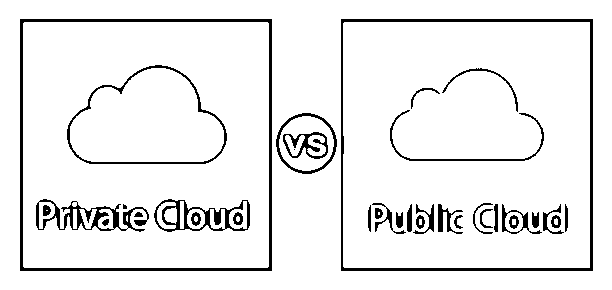

# 私有云与公共云

> 原文：<https://www.educba.com/private-cloud-vs-public-cloud/>

## 私有云与公共云的区别

在本文中，我们将看到私有云与公共云的概要。[云计算](https://www.educba.com/what-is-cloud-computing/)已经成为当今商业不可或缺的一部分。因此，一个成长中的组织必须学习和理解云计算环境中可用的结构和设施。

公共云和私有云是这种变革性网络计算模式的两个流行类别。云计算通常分为两类，即部署模型和服务模型，公共云、私有云以及混合云是目前可用的部署模型。越来越多的公司正在整合云计算的成果，这些成果令人不知所措。私有云是通过内部网提供的专有架构，专门用于满足单个组织的需求和目标。只有一组人可以在防火墙内访问它。

<small>Hadoop、数据科学、统计学&其他</small>

公共云是由第三方提供商通过公共互联网提供的计算服务，让任何想要购买的人都可以使用。根据 CPU 使用周期、带宽或存储，它可能是免费的，也可能是出售的。比如亚马逊弹性计算云(EC2)、谷歌云引擎、亚马逊 AWS、微软 365。公共云和私有云都有各自的属性基础架构、所有权、安全性、位置和数据中心、定制、成本和升级以及管理。根据业务需求和规范，个人或组织需要在公共云或私有云之间做出选择。

### 私有云与公共云的面对面比较(信息图表)

下面是私有云与公共云之间的 7 大比较:

### 私有云与公共云的主要区别

让我们从以下几点来讨论私有云与公共云之间的一些关键差异:

#### 私有云

私有云是由单个组织专用的基础架构；它可以位于其现场数据中心，也可以由第三方服务提供商托管。但是，在私有云中，基础架构和服务是在私有网络上维护的，硬件和软件是您公司专用的。

*   私有云最适合要求高数据隐私性、延迟、安全性和高度监管的公司，这些公司需要高级私有和安全的数据托管。
*   需要高性能访问文件系统的公司。
*   能够支持与运行下一代云数据中心相关的支出。
*   托管关键业务数据和应用。
*   需要高级可配置性、适应性和灵活性的组织。

#### 公共云

公共云是指存储和服务器等云资源由第三方服务提供商运营和托管，并通过互联网交付的地方。例如，由于第三方服务提供商拥有它，微软 Azure 需要与订阅了相同云服务提供商的其他公司共享硬件和网络设备。

*   公共云最适合数据存储和归档。
*   应用程序托管和按需托管，适用于微型网站和应用程序、不容忍延迟和任务关键型 web 层。
*   大型应用程序的自动扩展环境。
*   公司需要一个基础架构来支持大量客户。
*   从事项目工作的人包括许多实体，如研究机构和非政府组织。

公共云服务的提供是一场封闭的俱乐部竞赛，下面的技术巨头之间的争斗不断。

*   **亚马逊网络服务:**它是公共云服务领域无可争议的市场领导者；该公司提供完整的 IaaS 和 PaaS 服务。其中最著名的是弹性计算云、弹性豆茎、简单存储服务、弹性块存储、冰川服务、关系数据库服务等。
*   微软 Azure: 在增加了“智能云”后，微软提供的云服务比亚马逊还多。除了 Azure IaaS、PaaS 产品，it [还提供 SaaS](https://www.educba.com/what-is-software-as-a-service-saas/) ，包括 office 365 产品。

IBM Cloud 和 Google cloud platforms 是其他提供公共云服务的科技巨头。

### 私有云与公共云对比表

下表总结了私有云与公共云之间的比较:

|  **属性** |  **私有云** | 

**公有云**

 |
| **基础设施** | 专用硬件和网络。数据存储在专用的基础设施中。 | 共享硬件和网络。数据存储在共享的基础架构中。 |
| **所有权** | 由一个或一组相关组织拥有的。 | 由多个互不相关的组织拥有。 |
| **安全** | 高度安全，因为所有者可以实现更高级别的认证。 | 它提供了标准的安全性，不能根据业务模型进行更改或定制。 |
| **Location of the Data Center** | 可选，位于服务提供商基础架构的内部或专用位置。 | 数据中心公共云基础架构的位置。 |
| **定制** | 提供[根据特定业务需求和要求定制云基础设施](https://www.educba.com/cloud-infrastructure/)。 | 仅提供标准定制工具。 |
| **成本** | 成本更高，因为建立私有云需要额外的硬件和明确的管理。 | 成本更低，因为不需要额外的硬件和管理。 |
| **升级和管理** | 需要专门的管理员来管理升级和安装。 | 服务提供商执行管理并推出更新。 |

### 结论

当前的业务场景和可预见的需求必然会导致混合云的出现。这种云是一种或多种当前部署模式的组合，如私有、公共和社区模式。在这种情况下，组织管理一些内部资源和一些虚拟机上的资源。许多商业大亨都选择了这种方式，因为它提供了公共云和私有云的优势。

### 推荐文章

这是私有云与公共云之间最大差异的指南。在这里，我们还将讨论信息图和比较表的主要区别。您也可以看看以下文章，了解更多信息–

1.  [云计算 vs 网格计算](https://www.educba.com/cloud-computing-vs-grid-computing/)
2.  [云计算技术](https://www.educba.com/cloud-computing-technologies/)
3.  [云计算面试问题](https://www.educba.com/cloud-computing-interview-questions/)
4.  [十大云安全工具](https://www.educba.com/cloud-security-tools/)

