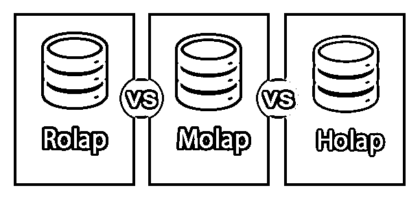
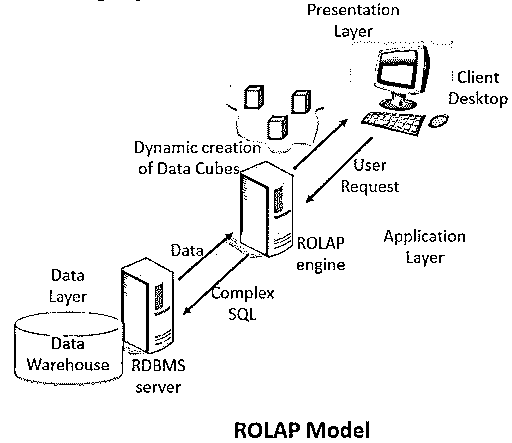
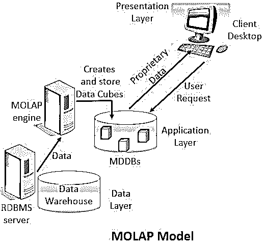

# ROLAP vs MOLAP vs HOLAP

> 原文：<https://www.educba.com/rolap-vs-molap-vs-holap/>

## 【ROLAP vs MOLAP vs HOLAP 的区别

ROLAP vs MOLAP vs HOLAP 是表示逻辑数据模型的数据仓库的相关术语。ROLAP 的意思是关系数据的关系在线分析处理。MOLAP 被称为多维在线分析处理，它通过多个数据维度来实现。HOLAP 被称为混合在线分析处理，适用于 ROLAP 和 MOLAP 概念。数据仓库中的数据存储和数据安排、设计的视图访问根据 OLAP 实现的类型而变化。ROLAP SQL 是查询技术，而 MOLAP 使用稀疏矩阵，HOLAP 同时使用 SQL 和稀疏矩阵技术。

### ROLAP 与 MOLAP 和 HOLAP 的面对面比较(信息图表)

以下是 ROLAP vs MOLAP vs HOLAP 的 8 大对比:

<small>Hadoop、数据科学、统计学&其他</small>

### ROLAP 与 MOLAP 和 HOLAP 的主要区别

让我们讨论一下 ROLAP、MOLAP 和 HOLAP 之间的一些主要区别:

*   ROLAP 是关系 OLAP，其中数据以传统方法排列，如数据仓库中的行和列。它以多维形式对用户可见和可访问。为了将其显示为多维视图，数据被设计为支持数据收集和存储的相关元数据层。它在处理复杂查询时是动态的。它比 MOLAP 慢，而 ROLAP 处理大量数据的速度更快。

*   MOLAP 是一个多维 OLAP，在注册的系统上分析数据。数据在多维数组中排列[。在数据库管理中加载数据时，该数组会携带预定义的数据。MOLAP 系统在应用层实现，当用户发送任何请求时，它以最短的响应时间获取数据。](https://www.educba.com/multidimensional-array-in-c/)

*   关系模型的表达能力不包括创建特定数据类型的维度和度量的主题。基本元素包括完整性、属性、关系，主要应用于星型模式。
*   ROLAP 使用 SQL 作为其功能语言来获取数据并对其进行处理，而 MOLAP 使用稀疏矩阵技术以多维数据立方体的形式从多维数组中获取数据。
*   ROLAP 响应时间慢，因为它显示任何数据的多维形式，但是 MOLAP 非常快，因为它不显示任何多维视图。
*   ROLAP 和 MOLAP 都能处理复杂的查询，有其独特的性能。如果用户想要任何快速响应系统，他可以采用 MOLAP
*   ROLAP 和 MOLAP 致力于优化技术，并因其稀疏性而产生。
*   在这里，中间结构 HOLAP 结合了 MOLAP 和 ROLAP 的优点。大量的数据处理能力来自 ROLAP，查询速度方法来自 MOLAP，MOLAP 提供给 HOLAP，HOLAP 是一个标准化的模型。HOLAP 依靠其庞大的数据应该保存在关系数据库管理系统中，以摆脱稀疏性和多维引擎所带来的缺陷，只存储用户需要的信息并提供给他们频繁的访问。但是如果用户请求更多的相关数据来解决任何复杂的查询，它提供了对关系数据库的这一部分的透明访问。这种 HOLAP 技术被流行的 MicroStrategy 采用，以提高他们与其他已经在其业务中实现了这种解决方案的供应商的合作伙伴的平台性能。
*   但是在这种设计中，要获得高性能，需要克服的困难很少。
*   应当提高过程的质量，以满足客户的要求。从初始阶段到结束阶段，数据仓库的质量应该是一致的。应该考虑质量的几个主要方面是定义面积、测量面积和最大化零件。
*   重要的质量是准确性、更新的数据、完整的数据、一致性、可追溯性、可用性和清晰性。
*   在准确性方面，数据应该具有正确和真实的值，因为在 ETL 时[丢失值的可能性很高，并且应该避免给任何属性赋予非标准值](https://www.educba.com/what-is-etl/)
*   数据应定期更新，不应包含任何旧数据
*   不应遗漏数据立方体。因为每个数据集代表唯一的主键，所有的值应该从上到下存储，并且应该作为完整的数据可用
*   数据的表示应该以有序的方式进行适当的排列，从而为用户提供高一致性的性能。
*   数据应该在任何时候都容易被用户获得和访问
*   数据池应该有关于数据源的正确导航，这样用户就可以很容易地找到那部分数据，而不会浪费时间
*   数据要有很高的清晰度，要容易理解。

### ROLAP vs MOLAP vs HOLAP 对比表

下表总结了 ROLAP、MOLAP 和 HOLAP 之间的比较:

| **比较基础** | **ROLAP** | 莫拉普 | **HOLAP** |
| **缩写** | 关系联机分析处理 | 多维在线分析处理 | 混合在线分析处理 |
| **储存方式** | 数据存储在主数据仓库中 | 数据存储在注册的 MDDB 数据库中 | 数据存储在关系数据库中 |
| **抓取方法** | 从主存储库中获取数据 | 从专有数据库中提取数据 | 数据从关系数据库中提取 |
| **数据排列** | 数据以包含行和列的表格形式排列和保存 | 数据以数据立方体的形式排列和存储 | 数据以多维形式排列 |
| **体积** | 大量的数据被处理 | 处理专有的有限数据 | 可以处理大量数据 |
| **技术** | 它与 SQL 一起工作 | 它使用稀疏矩阵技术 | 它同时使用了稀疏矩阵技术和 SQL |
| **设计视图** | 它可以动态访问 | 它有一个静态访问 | 它可以动态访问 |
| **响应时间** | 它有最大的响应时间 | 它的响应时间最短 | 它需要最短的响应时间 |

### 结论

此处应讨论的主要话题是信息安全，信息安全应从开发阶段持续到实施阶段，并在其维护时间内执行。安全性是数据仓库的一个关键要素，因为它是解决关键问题的地方，也是完成大量数据事务和处理的地方。对于数据仓库来说，管理及其审计系统与安全系统一样重要。企业利用这个在线分析处理系统，并根据需求进行暗示。

### 推荐文章

这是 ROLAP vs MOLAP vs HOLAP 的指南。在这里，我们还将讨论信息图和比较表的主要区别。你也可以看看下面的文章来了解更多-

1.  [CFA vs CFP——最大差距](https://www.educba.com/cfa-vs-cfp/)
2.  [物理地址对逻辑地址](https://www.educba.com/physical-address-vs-logical-address/)
3.  [列表与集合–有用的比较](https://www.educba.com/list-vs-set/)
4.  [传统营销 vs 数字营销](https://www.educba.com/traditional-marketing-vs-digital-marketing/)

