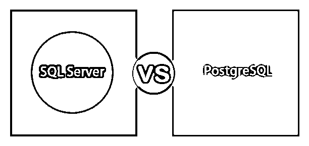

# SQL Server 与 PostgreSQL

> 原文：<https://www.educba.com/sql-server-vs-postgresql/>

## SQL Server 和 PostgreSQL 的区别

这两种都是 SQL 的类型，可能会产生一个问题，SQL Server 和 PostgreSQL 之间有什么区别。Microsoft SQL server 是一个数据库管理和分析系统，主要用于电子商务、业务线和不同的数据仓库解决方案。另一方面，PostgreSQL 是一个高级的对象关系数据库管理系统，它支持 SQL 标准的扩展子集，包括不同的事务、外键、子查询、触发器以及不同的用户定义类型和函数。

### SQL Server 和 PostgreSQL 之间的直接比较(信息图表)

以下是 SQL Server 与 PostgreSQL 之间的 8 大区别

<small>Hadoop、数据科学、统计学&其他</small>

### SQL Server 和 PostgreSQL 的主要区别

两者都是市场上的热门选择；让我们讨论一些主要的区别:

*   CSV 支持: Postgres 在 CSV 支持方面处于领先地位。它提供了不同的命令，如“复制到”和“复制自”，这有助于快速处理数据。它还提供了有用的错误消息。如果导入有一点小问题，它会抛出一个错误，并立即停止导入。另一方面，SQL server 既不支持导入数据，也不支持导出数据。
*   跨平台:在当今世界，一种语言或任何程序能够跨平台是非常重要的。随着技术和 IT 行业的出现，通过 Linux 和 UNIX 访问变得非常重要，因为它们是开源系统。SQL server 是 Microsoft 产品，由供应商锁定，只能在 Microsoft 系统上运行。Postgres 可以在 Linux、BSD、Solaris 以及 Windows 上使用。
*   **过程语言特性:** PL/PGSQL 是 Postgres 提供的一种原生过程语言，具有不同的现代特性。它支持 JSON 数据类型，因此在一个包中包含了强大的功能和大量的灵活性。除此之外，用户可以轻松地使用 Python、Perl、R、Java、PHP 和 SQL，因为它们在 Postgres 中被支持为过程语言。MS SQL server 还提供过程语言支持作为内置特性。但是这个功能有点乱，速度慢，功能差。它也有小错误，不同的错误总是发生。
*   **正则表达式:** Postgres 提供了大量的正则表达式作为分析工作的基础。另一方面，SQL server 有 like、substring、patindex，与 Postgres 提供的表达式相比，它们没有那么好。

### SQL Server 与 PostgreSQL 比较表

以下是一些比较:

| **比较的基础** | **SQL 服务器** | **PostgreSQL** |
| **基本差异** | SQL server 是一个数据库管理系统，主要用于电子商务，提供不同的数据仓库解决方案。 | PostgreSQL 是 SQL 的高级版本，它支持 SQL 的不同函数，如外键、子查询、触发器以及不同的用户定义类型和函数。 |
| **可更新视图** | 即使更新了两个表视图，视图也可以更新。如果这些表有不同的键，并且 update 语句不涉及多个表，那么它将被自动更新。用户还可以利用触发器来更新复杂的视图。 | 与 SQL server 不同，PostgreSQL 中的视图可以更新，但不能自动更新。用户必须针对不同的视图编写规则来更新它们。此外，可以轻松创建复杂的视图。 |
| **计算列** | SQL server 确实提供了计算列，但是视图比计算列更受欢迎。计算列的用途非常有限，因为它们不能保存不同的汇总。 | PostgreSQL 不提供计算列。另一方面，PostgreSQL 有函数索引，它就像一个视图一样工作。 |
| **复制** | SQL server 可以复制各种数据。这可以是日志传送、镜像、快照、事务和合并等。甚至可以拥有非基于 SQL Server windows 的订阅服务器。 | Postgres 中的复制是以报告的形式出现的，并且被认为是最不完美的。虽然有不同的第三方选项可以从免费和不免费的选项中选择。PostgreSQL 8.4 或更高版本可以内置复制功能。 |
| **支持不同语言的存储过程和存储函数** | SQL server 不支持此功能。它可以用任何符合 CLR 的语言来完成，如 VB、C#、Python 等。要成功完成这项工作，用户必须首先将代码编译成 all。 | 这里没有必要创造一个沉闷的第一。创建了代码的用户可以很容易地看到代码在做什么。处于劣势的服务器必须托管环境使用的语言。 |
| **SQL 中的动态动作** | SQL server 不支持此功能。但是用户可以使用存储过程并从 select 语句中调用它们，因此它比 PostgreSQL 有更多的限制。 | PostgreSQL 确实提供了这一特性，用户只需使用 select 语句就可以轻松地执行所有操作、检索和完成所有其他工作。 |
| **物化视图** | 是的，它提供了运行物化视图的工具。但是其功能会根据查询运行的位置而有所不同。可以是 SQL Express、Workgroup 等。 | Postgres 不提供运行物化视图的工具。取而代之的是，他们有一个叫做 mat views 的模块，可以帮助重建任何物化视图。 |
| **区分大小写** | 默认情况下，SQL server 是不区分大小写的，但是如果用户想要更改大小写，他们可以通过下到列级别来实现。 | 默认情况下，PostgreSQL 是区分大小写的，很难做到不区分大小写。可以对它进行修改，但它们不会暴露出来，也不符合 ANSI 标准，因此在 MS Access、PHP Gallery 等上使用它是一件疯狂的工作。其中 SQL 被视为不区分大小写。 |

### 结论

在这篇 SQL Server 与 PostgreSQL 的文章中，我们看到了 SQL Server 与 PostgreSQL 都是数据库管理工具。它们有助于正确有效地管理所有数据。但是当谈到不同的特性时，PostgreSQL 总是占上风。它是 SQL 的高级版本，因此提供了许多附加功能。所有这些功能都是免费的，不像 SQL server。此外，它是跨平台的，可以用于任何操作系统。

### 推荐文章

这是 SQL Server 与 PostgreSQL 之间最大区别的指南。在这里，我们还将讨论 SQL Server 与 PostgreSQL 的主要区别，包括信息图表和比较表。你也可以看看下面的文章来了解更多

1.  [SQL server](https://www.educba.com/mongodb-vs-sql-server/)[vs MongoDB](https://www.educba.com/mongodb-vs-sql-server/)
2.  [MS SQL 与 MYSQL |主要差异](https://www.educba.com/mysql-vs-mssql/)
3.  [MySQL vs SQL Server](https://www.educba.com/mysql-vs-sql-server/)
4.  [Oracle 与 PostgreSQL 的区别](https://www.educba.com/oracle-vs-postgresql/)
5.  [Java 中的正则表达式](https://www.educba.com/regular-expressions-in-java/)

