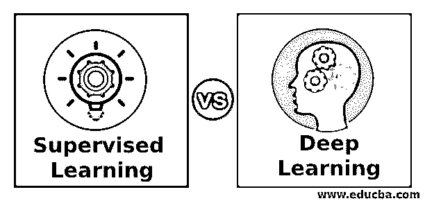

# 监督学习 vs 深度学习

> 原文：<https://www.educba.com/supervised-learning-vs-deep-learning/>

## 监督学习与深度学习的区别

在监督学习中，输入算法的训练数据包括所需的解决方案，称为标签。典型的监督学习任务是分类。垃圾邮件过滤器就是一个很好的例子:它用许多示例电子邮件及其类别(垃圾邮件或业余爱好者邮件)进行训练，它必须学会如何对新电子邮件进行分类。

深度学习是一种模仿新皮层神经元层活动的尝试，新皮层约占大脑中思维发生的 80%(在人脑中，约有 1000 亿个神经元和 100 ~ 1000 万亿个突触)。它之所以被称为 deep，是因为它有不止一个隐藏的神经元层，这有助于具有多种状态的非线性特征转换。

<small>Hadoop、数据科学、统计学&其他</small>

### 监督学习和深度学习的面对面比较(信息图)

下面是监督学习和深度学习之间的前 5 名比较:

### 监督学习和深度学习的主要区别

监督学习 vs 深度学习都是市场上的热门选择；让我们讨论一下监督学习和深度学习之间的一些主要区别:

*   **主要车型**

重要的监督模型是

k-最近邻:用于分类和回归

线性回归:用于预测/回归

逻辑回归:用于分类

支持向量机:用于分类和回归

决策树和随机森林:分类和回归任务

**最流行的深度神经网络:**

*   **多层感知器(MLP)–**最基本的类型。该网络通常是构建其他更复杂的深度网络的开始阶段，并且可以用于任何监督回归或分类问题
*   **自动编码器(AE)–**网络具有无监督学习算法，用于特征学习、降维和异常值检测
*   **卷积神经网络(CNN)–**特别适用于使用多维神经元结构的空间数据、对象识别和图像分析。深度学习最近流行的一个主要原因是由于 CNN 的。
*   **递归神经网络(RNN)–**递归神经网络用于时序数据分析，如时间序列、情感分析、自然语言处理、语言翻译、语音识别、图像字幕。最常见的一种 RNN 模型是长短期记忆(LSTM)网络。
*   **训练数据—**如前所述，监督模型需要带标签的训练数据。但是深度学习可以处理有标签或者没有标签的数据。一些神经网络架构可以是无人监管的，例如自动编码器和受限的玻尔兹曼机器
*   **特征选择—**一些监督模型能够分析特征和特征的选择子集，以确定目标。但大多数情况下，这必须在数据准备阶段处理。但是在深度神经网络中，随着学习的进展，新的特征出现，不需要的特征被丢弃。
*   **数据表示–**在传统的监督模型中，没有创建输入特征的高级抽象。最终模型试图通过对输入要素的子集应用数学变换来预测输出。
    但是在深度神经网络中，输入特征的抽象是在内部形成的。例如，在翻译文本时，神经网络首先将输入文本转换为内部编码，然后将抽象表示转换为目标语言。
*   **框架—**监督式 ML 模型得到了许多跨不同语言的通用 ML 框架的支持——Apache Mahout、Scikit Learn、Spark ML 就是其中的一些。深度学习框架提供了一种开发人员友好的抽象，可以轻松创建网络，负责分布式计算，并支持 GPU。Caffe，Caffe2，Theano，Torch，Keras，CNTK，TensorFlow 都是比较流行的框架。来自 Google 的 Tensorflow 现在在社区的积极支持下被广泛使用。

### 监督学习和深度学习对照表

下面是监督学习和深度学习之间的一些关键比较。

| **监督学习与深度学习的比较基础** | **监督学习** | **深度学习** |
| **模特培训** | 训练中的主要任务—

*   Iterate training examples, mainly in small batches, and update the weights applied to features.
*   One direction of updating weight (increasing or decreasing) is determined by some indicators, such as the gradient of the weight of the error function w.r.t
*   Finally, the target is formulated as the weighted sum of the subset features.

 | 训练中的主要任务-

*   If there are more hidden layers, the number of weights that need to be updated will be larger.
*   Firstly, the error in the target value is calculated and propagated back to each layer.
*   Find out the partial derivative of the weight of the error function w.r.t, and update the weight to reduce the error.

 |
| **系统电位** | 用于解决相对简单的任务，其中与输入特征和目标的关系是人类可检测的，并且特征工程是直接的。例如:

*   Binomial or multi-category classification, such as classifying customers according to the way they interact with the website.
*   Use the collected similar data to predict the value of real estate.

 | 深度学习可以做真正智能的任务比如

*   Image classification close to human level
*   Speech recognition close to human level
*   Handwritten transcription close to human level
*   Improved machine translation
*   Digital assistants such as Google Now and Amazon Alexa

 |
| **灵活性** | 模型更加灵活，这有助于轻松地微调 ML 模型。有明确定义的方法，如交叉验证的网格搜索，以找到正确的超参数 | 灵活性较差，因为有许多超参数需要调整，如层数、每层的神经元数量、每层中使用的激活函数类型、权重初始化逻辑等等。 |
| **特征表示** | 要显式创建的派生或抽象特征。例如多项式特征作为线性回归模型的输入 | 隐藏层中自动生成的抽象数据表示。这就是为什么一个经过训练的 CNN 神经网络可以在图像中检测出一只猫。 |
| **生成模型** | 不可能生成任何原创的东西，因为自动抽象数据表示没有发生 | Once trained, a specific type of deep neural network can generate say new images, songs, or texts. Those are called GNN(Generative neural network) or GAN(Generative Adversarial Networks)这种类型的网络的一些实现被用于创建甚至新的时尚设计 |

### 结论

在过去的几年里，DNN(深度神经网络)的准确性和能力有了很大的提高。这就是为什么现在 DNNs 是一个活跃的研究领域，我们相信，它有潜力开发一个通用的智能系统。同时，很难解释为什么 DNN 会给出特定的输出，这使得微调网络变得非常困难。因此，如果一个问题可以使用简单的 ML 模型来解决，强烈建议使用它。由于这一事实，即使使用 DNNs 开发通用智能系统，简单的线性回归也具有相关性。

### 推荐文章

这是指导监督学习与深度学习之间的主要差异的指南。在这里，我们讨论了监督学习与深度学习的直接比较、关键差异以及信息图和比较表。您也可以看看以下文章——

1.  [监督学习 vs 强化学习](https://www.educba.com/supervised-learning-vs-reinforcement-learning/)
2.  [监督学习 vs 非监督学习](https://www.educba.com/supervised-learning-vs-unsupervised-learning/)
3.  [神经网络 vs 深度学习](https://www.educba.com/neural-networks-vs-deep-learning/)
4.  [机器学习与预测分析](https://www.educba.com/machine-learning-vs-predictive-analytics/)
5.  [TensorFlow vs Caffe:有什么区别](https://www.educba.com/tensorflow-vs-caffe/)
6.  什么是监督学习？
7.  [什么是强化学习？](https://www.educba.com/what-is-reinforcement-learning/)
8.  [CNN 与 RNN 的六大对比](https://www.educba.com/cnn-vs-rnn/)

