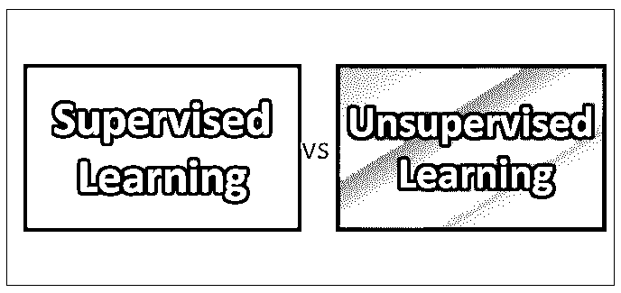

# 监督学习与非监督学习

> 原文：<https://www.educba.com/supervised-learning-vs-unsupervised-learning/>

## 监督学习与非监督学习简介

监督学习和非监督学习都是机器学习任务。
[监督学习](https://www.educba.com/supervised-learning-vs-reinforcement-learning/)简单来说就是从训练数据集学习[算法](https://www.educba.com/algorithm-interview-questions/)的过程。[监督学习是](https://www.educba.com/what-is-supervised-learning/)，其中你有输入变量和输出变量，你使用一种算法来学习从输入到输出的映射函数。目的是近似映射函数，以便当我们有新的输入数据时，我们可以预测该数据的输出变量。

无监督学习是对数据中潜在的或隐藏的结构或分布进行建模，以便了解更多关于数据的信息。无监督学习就是你只有输入数据，没有对应的输出变量。

<small>Hadoop、数据科学、统计学&其他</small>

训练数据集:一组用于学习的示例，其中目标值是已知的。

### 监督学习和非监督学习的面对面比较(信息图)

以下是监督学习和非监督学习之间的 7 大比较:

### 监督学习和非监督学习的主要区别

以下是要点列表，描述了监督学习和非监督学习之间的主要区别

1.机器学习算法在[大数据](https://www.educba.com/big-data-concepts/)中发现模式。这些不同的算法可以根据它们“学习”数据以进行预测的方式分为两类。那些是有监督和无监督的学习。

2.在监督学习中，科学家充当向导，教导算法应该得出什么结论或预测。在无监督学习中，没有正确的答案，没有老师，算法被留给自己去发现和呈现数据中有趣的隐藏结构。

3.监督学习模型将使用训练数据来学习输入和输出之间的联系。

4.无监督学习不使用输出数据。在无监督学习中，它们不会是任何有标签的先验知识，而在有监督学习中，它们可以访问标签，并具有关于数据集的先验知识

5.监督学习:这个想法是训练可以被一般化，并且这个模型可以以一定的准确度用于新的数据。

6.监督学习算法:支持向量机、线性和逻辑回归、神经网络、分类树和[随机森林](https://www.educba.com/random-forest-algorithm/)等。

7.无监督算法可以分为不同的类别:聚类算法、K-means、[层次聚类](https://www.educba.com/hierarchical-clustering-algorithm/)、维数约简算法、异常检测等。

8.分类和回归领域是监督学习中广泛使用的算法。[支持向量机(SVM)](https://www.educba.com/svm-algorithm/) 是有监督的[机器学习](https://www.educba.com/machine-learning-vs-predictive-analytics/)模型，具有相关的学习算法，可用于分类和回归目的，但主要用于分类问题。

9.在 SVM 模型中，我们将每个数据项绘制为 n 维空间中的一个点，(其中 n 是我们拥有的特征)，每个特征的值是特定坐标的值。然后通过找到区分两个类别的超平面来执行分类。

10.回归算法的主要目标是预测离散值或连续值。在某些情况下，预测值可用于确定属性之间的线性关系。基于这个问题，可以使用差分回归算法。一些基本的回归算法有线性回归、[多项式回归](https://www.educba.com/polynomial-regression/)等。

11.聚类广泛应用于无监督学习。聚类的任务是将数据点分成若干组，使得相同特征的点以聚类的形式聚集在一起。有更多的聚类算法；其中很少是连通性模型、质心模型、分布模型和密度模型。

12.层次聚类属于无监督学习。[层次聚类](https://www.educba.com/hierarchical-clustering-in-r/)，顾名思义就是构建聚类层次的算法。该算法从分配给它们自己的聚类的所有数据点开始。然后将两个最近的聚类合并成同一个聚类。最后，当只剩下一个簇时，该算法终止。

13.KMeans 属于无监督聚类方法。数据将根据其特征被划分成 k 个簇。每个聚类由其质心表示，质心定义为聚类中点的中心。KMeans 简单快速，但每次运行不会产生相同的结果。

14.为了更好地理解监督学习和非监督学习，让我们举一个真实的例子。监督学习:让我们以 Gmail 的一个功能为例，它是一个垃圾邮件。基于过去关于垃圾邮件的信息，过滤出新收到的邮件到收件箱文件夹或垃圾文件夹。在这种情况下，Gmail 被建模为一个映射函数，以根据关于邮件的先验知识来隔离收到的邮件，这是一种监督学习。

15.无监督学习:让我们假设一个朋友邀请你参加她的聚会，在那里你会认识新朋友。现在，您将使用无先验知识(无监督学习)对它们进行分类，这种分类可以基于任何特征。它可以是年龄组，性别，穿着，教育资格或任何你喜欢的方式。由于你没有使用任何关于人的先验知识并对他们进行分类，所以它属于无监督学习。

### 监督学习和非监督学习对照表

以下是要点列表，描述了监督学习和非监督学习之间的比较:

| **比较依据** | **监督学习** | **无监督学习** |
|  **方法** | 将给出输入变量和输出变量。 | 将只给出输入数据 |
|  **目标** | 监督学习的目标是很好地确定函数，使得当给定新的输入数据集时，可以预测输出。 | 无监督学习的目标是对给定输入数据中的隐藏模式或底层结构进行建模，以便了解数据。 |
|  **类** | 机器学习问题，数据挖掘和神经网络， | 机器学习、数据挖掘、问题和神经网络 |
|  

**例题**

 | 

*   classify
*   return
*   Linear regression
*   support vector machine

 | 

*   cluster
*   be related
*   K- mean
*   be related

 |
| **谁使用** | 数据科学家 | 数据科学家 |
|  **生态系统** |  大数据处理、[数据挖掘](https://www.educba.com/what-is-data-mining/)等 | 大数据处理、数据挖掘等 |
|  **用途** |  监督学习常用于图像识别、语音识别、预测、金融分析以及训练神经网络和决策树等输出系统 | 无监督学习算法用于在探索性分析过程中预处理数据，或者预训练监督学习算法。 |

### 结论

选择使用监督的还是[非监督的机器学习](https://www.educba.com/unsupervised-machine-learning/)算法通常取决于与数据的结构和容量以及用例相关的因素。事实上，大多数时候，数据科学家同时使用监督学习和非监督学习方法来解决用例。

### 推荐文章

这是监督学习和非监督学习的指南。在这里，我们讨论了监督学习与非监督学习的直接比较、关键差异以及信息图和比较表。您也可以阅读以下文章，了解更多信息——

1.  [监督学习与强化学习的最佳对比](https://www.educba.com/supervised-learning-vs-reinforcement-learning/)
2.  [数据科学与机器学习的 5 个最有用的区别](https://www.educba.com/data-science-vs-machine-learning/)
3.  [了解 Map Reduce 与 Yarn 的 10 大区别](https://www.educba.com/mapreduce-vs-yarn/)
4.  [什么是强化学习？](https://www.educba.com/what-is-reinforcement-learning/)

