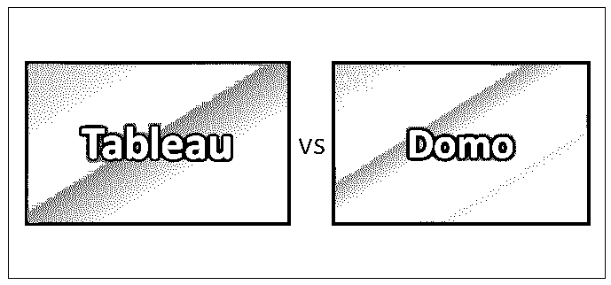

# 表 vs Domo

> 原文：<https://www.educba.com/tableau-vs-domo/>

**

** 

## Tableau 和 Domo 的区别

Tableau 是数据可视化领域的佼佼者，拥有自助式数据发现功能。 [Tableau 涵盖了](https://www.educba.com/what-is-tableau/)数据发现、数据可视化、调查分析、时序分析、社交分析等分析功能。为了提供移动 BI 解决方案，tableau 还集成了 R 统计编程语言。Domo 分析并清理来自任何来源的客户数据。它使提取转换和加载过程分别变得更容易，因此您可以在没有任何 SQL 培训的情况下分析数据。它具有数据融合功能，可以合并来自多个数据源的数据。Domo 是一个基于云的仪表板，以较低的价格提供各种可视化。因此，domo 证明了自己是 Tableau 的有力竞争者。

让我们根据这两个系统的特点和功能对它们进行比较。

<small>Hadoop、数据科学、统计学&其他</small>

### Tableau 和 Domo 的正面对比(信息图)

以下是 Tableau 和 Domo 之间的 9 大区别:

### Tableau 和 Domo 的主要区别

Tableau 和 Domo 都是市场上的热门选择；让我们讨论一下 Tableau 和 Domo 之间的一些主要区别:

#### 1.仪表盘

Tableau 提供定制过滤器和拖放功能等特性，帮助用户创建交互式仪表板，并在 Tableau online 或服务器的帮助下共享它们。一些用户发现 tableau 界面不那么直观。

Domo 提供了一个更加愉快的用户体验，它有许多预构建的页面，这些页面可以根据数据输入进行自我组装，或者用户可以根据需要拖放页面。

#### 2.分析能力

Tableau 提供了采用本地处理能力和快速同步数据的功能。这也称为内存和数据库内分析架构。它还涵盖了数据发现、数据可视化、调查分析、时间序列分析、社交分析等分析功能。

Domo 具有数据融合特性，可以合并来自多个数据源的数据。Domo 通过从任何数据源收集数据，在云中完成所有处理。Domo 有能力分析和清理来自任何来源的客户数据。它还使提取、转换和加载过程变得更加容易，因为您可以在没有任何 SQL 培训的情况下分析数据。

#### 3.数据连接器

Tableau 和 Domo 都提供数据连接器来连接多个数据源，因此不需要执行任何定制配置或编写任何代码。

#### 4.操作系统

就 c 而言，Tableau 可以在 Windows 和 Macintosh OS 环境下工作。

Domo 也支持这两者，包括 Windows mobile。

#### 5.沟通

Tableau 以两种方式提供通信:本地通信以及基于 Tableau 桌面和 Tableau 云的通信。

Domo 不提供内部通信。

#### 6.离线分析

Tableau 在不需要互联网连接时提供离线分析功能。

Domo 不提供离线分析。

#### 7.数据源

Tableau 支持从各种数据源提取数据。

Domo 为分析从各种数据源获得的数据提供了很好的支持。

#### 8.数据析取

数据提取过程是非常容易的表格。

用 Domo 提取数据有点麻烦。

#### 9.速度

Tableau 提供了两种数据收集方式:内存连接和实时连接，从而具有快速数据分析的能力。

另一方面，Domo 提供了一键式应用程序和工作台，无需 IT 人员的任何帮助即可连接不同的内部工具并上传数据。

#### 10.实时分析

Tableau 创建了一个到动态数据源的链接，用于实时分析。

Domo 还执行实时分析，它也有良好的社交媒体协作。

### Tableau 和 Domo 比较表

以下是要点列表，描述了 Tableau 和 Domo 之间的比较。

| **比较的基础** | 表 | **Domo** |
| **历史** | 2003 年在加州山景城成立 | 成立于 2010 年，Tableau 六年后 |
| **客户** | Tableau 拥有大约 57000 多名客户，包括德勤、可口可乐、戴尔、思杰等 | Domo 在业内拥有 1000 多家客户，其中一些著名的客户包括易贝、万事达卡、国家地理等。 |
| **定价** | 基于订阅的定价，个人套餐费用约为每月 35 美元/用户，专业套餐费用约为每月 70 美元/用户。也有免费试用版。 | 定价约为每月 83 美元/用户。可以免费试用。 |
| **产品详情** | Products are divided into three tiers: 1\. Tableau Desktop Edition: to visualize and analyze data and create reports2.Tableau 服务器版:编辑和分发 BI 资产。3.Tableau 网络版:Tableau 服务器版的托管版本 | Product tiers in Domo are cloud-based and are divided into three categories:1.Domo 入门版:适用于小型团队2.Domo professional Edition:适用于管理控制的大型团队3.Domo 企业版:带所有控件 |
| **好的** | 简单的拖放功能，用户可以通过分析数据轻松创建报告，并在整个组织内共享这些报告。 | 能够通过 300 多个连接器将数据与以云为中心的系统连接起来，从而提供一个在线平台 |
| **坏** | 对小型企业来说很贵 | 提取数据的难度 |
| **部署** | 内部部署 | 基于云的移动和内部部署 |
| **学习** | 易于学习和使用 | Domo 比 Tableau 更难学习和使用 |
| **实施** | 它为企业级部署提供各种实施服务和课堂培训。它还为中小型组织提供了一个快速起步的平台。 | Domo 提供了基于客户需求和资源的实现。他们为在线培训视频、基于网络的培训和在客户所在地进行的讲师指导培训提供了培训选项。 |

### 结论

考虑到 Tableau 和 Domo 的所有特性，我们可以说这两种工具都支持相同的任务，即挖掘业务数据和数据可视化，以便更好地进行分析和决策。两者都提供了许多用于横向集成的数据连接器，并且具有带有直观特性的用户友好的仪表板。Tableau 和 Domo 也都提供手机应用。然而，最大的区别是在定价方面。如果您想使用基于云的应用程序，并在整个团队中共享访问权限，请选择 Domo。在成本上比 Tableau 更实惠。如果您想为少数高级用户提供桌面访问，您可以选择 tableau。

在比较中没有赢家，因为这两种工具都足以提供任何组织所需的服务。因此，根据您的需要，您可以通过考虑这两种商业智能工具的功能来做出选择。

### 推荐文章

这是 Tableau 和 Domo 之间差异的指南。在这里，我们还将讨论 Tableau 与 Domo 的直接比较、主要差异以及信息图和比较表。您也可以阅读以下文章，了解更多信息——

1.  [什么是在 Excel 中使用数据输入(案例分析)](https://www.educba.com/excel-tutorial-data-inputs/)
2.  表格 vs QlikView
3.  [视觉分析 vs Tableau–了解重要差异(信息图表)](https://www.educba.com/visual-analytics-vs-tableau/)
4.  [Excel vs Tableau——它们是不同的](https://www.educba.com/excel-vs-tableau/)

