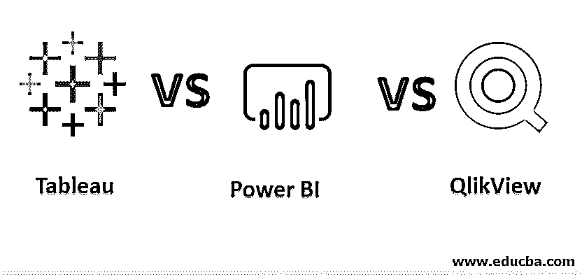

# Tableau vs Power BI vs QlikView

> 原文：<https://www.educba.com/tableau-vs-power-bi-vs-qlikview/>

## **Tableau vs Power BI vs QlikView 的差异**

在文章 Tableau vs Power BI vs QlikView 中，BI 工具是一个现成的选项，有助于快速生成洞察力，从而做出有效的决策。由于市场上有多种 BI 和分析工具，工具的选择受到各种因素的制约，如组织的偏好、员工的技术专业水平、预算等。从表面上看，所有工具似乎都在提供相似的功能，但是仔细研究它们，我们会发现它们之间存在着细微的差别，这些差别构成了它们的核心能力。这些工具不断更新，以克服已发现的缺点或限制，并加入新功能。

### Tableau 与 Power BI 和 QlikView 的直接对比(信息图)

以下是 Tableau 与 Power BI 和 QlikView 之间的 13 大对比:

<small>Hadoop、数据科学、统计学&其他</small>

### Tableau 与 Power BI 和 QlikView 的主要区别

我们来讨论一下 Tableau 与 Power BI 和 QlikView 的顶级对比:

1.  Tableau 的使用不需要任何预先的技术知识。简单的拖放界面使这成为可能。与此相反，为了有效地使用 Power BI，需要了解 Excel 和 DAX(数据分析和表达)。QlikView 很难操作，因为必须掌握脚本知识并熟悉数据建模。
2.  Tableau 是一个纯粹的可视化工具。如果唯一的目的是为分析生成可视化，那么 Tableau 最适合这个目的。Power BI 不仅仅是一个可视化工具，因为它还提供了出色的预测建模和 BI 功能。QlikView 的独特之处在于其深入功能，让我们将数据发现的见解融入可视化分析中。
3.  Tableau 为高级分析提供了某些内置功能，如时间序列建模。它还支持与外部工具的集成。然而，在高级分析方面，Power BI 超越了其他 BI 工具。另一方面，QlikView 在此参数上无法与这两种工具相匹配。
4.  在性能方面，Tableau 的简单用户界面支持快速开发。Power BI 虽然相对较新，但它提供了无缝选项来生成各种高级分析，因此就性能而言，BI 工具已迅速成为最受欢迎的工具。QlikView 在 BI 方面高于 Tableau，但低于 Power BI，在可视化方面则相反。
5.  在数据连接和提取的上下文中，Tableau 使用了 cubing 技术并拥有自己的数据仓库。Power BI 不需要额外的模型，因此可以与数据建立直接连接。QlikView 根据内存技术原理处理数据。
6.  Tableau 根据用户要求提供各种选项。它拥有庞大的用户群，因此这导致它提出了各种各样的选择。定价因版本而异，而且定价结构很复杂。Power BI 仅提供两种选择，即。Power BI Pro 和 Power BI Premium。Power BI 的定价相对较低。QlikView 相对来说是一个老工具，它主要为小型企业和大型企业提供两种选择。某些版本的价格是固定的，而其他版本的价格则根据销售情况而变化。
7.  Tableau 有效地集成了像 R 这样的外部统计包，可视化可以集成到工具中。然而，Power BI 是集成的最佳工具，也留下了 Tableau。它集成了许多外部资源，如 MS Excel、XML、JSON、SQL、Google Analytics、Marketo、脸书、Hadoop、R、Spark、Python 等。与 Tableau 和 Power BI 相比，QlikView 在集成方面较弱。
8.  Tableau 最适合在其领域工作中需要 BI 工具的用户，例如研究人员。Power BI 非常适合仪表板开发，因为它集成了高级统计和可视化分析功能的几个特性。QlikView 允许共享分析，其数据发现功能最适合大型企业的内部团队。
9.  谈到每种工具的优势，Tableau 提供了比任何其他 BI 工具都出色的视觉功能。Power BI 除了提供各种功能外，价格也相对较低。QlikView 有一个发展良好的社区，因此获得了很高的评价。

### Tableau 与 Power BI 和 QlikView 的对比表

下表总结了 Tableau 与 Power BI 和 QlikView 之间的比较:

| **标准** | 表 | **功率 BI** | **QlikView** |
| **易用性** | 它提供了一个简单易用的拖放界面。 | 有效使用需要微软 Excel 和 DAX 的知识。 | 不了解脚本和数据模型很难使用 |
| **匕劲** | 它提供了出色的可视化能力。 | 它允许在导入数据之前进行数据操作。 | 便于数据发现的深入查看功能 |
| **高级分析能力** | 附带某些高级分析功能，并支持外部集成 | 预测建模和分析是核心能力，并与 R 和 Python 集成。 | 它不提供任何高级分析功能，与外部工具集成的范围也非常有限。 |
| **性能** | 提供易于使用的机制和用户友好的布局。 | 它允许用户生成高级分析和可视化。 | 就 BI 而言，它高于 Tableau，但低于 Power BI，在可视化的情况下则相反。 |
| **与数据的连接** | Tableau 有自己的仓库，并采用立体技术。 | 它不需要额外的模型，直接与数据交互。 | 它不需要数据仓库，并且使用内存技术。 |
| **选项** | Tableau 提供了多个选项，包括 Tableau Creator 和 Tableau Desktop。 | Power BI 仅提供两个选项，即。Power BI Pro 和 Power BI Premium。 | QlikView 提供两个选项，即。Qlik Sense Business 和 Qlik Sense Enterprise 以及更多集成和开发选项。 |
| **定价** | Tableau 中的多种选择让定价变得相当复杂。 | 与 Tableau 和 QlikView 相比，Power BI 的定价较低。 | 一些产品的价格是固定的，而另一些产品的价格是可变的。 |
| **免费版** | Tableau 桌面仅提供 14 天免费试用。 | Power BI Desktop 是一款免费应用。 | QlikView 个人版是免费的，但有一些限制。 |
| **整合** | 它可以有效地与外部工具集成，但没有 Power BI 那么好。 | Power BI 在集成度方面更胜一筹。它集成了各种类型的不同数据源。 | 它不提供任何与外部工具集成的强大功能。 |
| **存储限制** | 提供 100 GB 限制的云存储工作簿和摘录。 | 允许所有用户使用最大 10 GB 的云存储空间。 | 提供的总云存储空间为 500 GB。最大应用大小为 250 MB。 |
| **适宜性** | 它最适合商业用户，研究人员，学者。 | 它是仪表板开发的最佳工具。 | QlikView 非常适合内部分析团队。 |
| **实施** | 与 Power BI 相比，Tableau 具有灵活的选项，便于轻松快速地实施。 | Power BI 虽然提供了一种简单快速的实现机制，但仅作为 SaaS 模式提供。 | 与 Tableau 和 Power BI 相比，QlikView 环境中的实施速度非常慢。 |
| **积极方面** | Tableau 在可视化方面有很高的排名。 | Power BI 的价格相对较低，并提供可扩展性。 | 作为一个相对较老的 BI 工具，它有一个发展良好的社区。 |

### 结论

Tableau、Power BI 和 QlikView 都是功能强大的 BI 工具。他们每个人都擅长某些参数。这些工具会根据竞争对手的工具评估和用户需求不断更新。每个工具都有一个独特的销售主张，可以吸引相似的用户。

### 推荐文章

这是 Tableau 与 Power BI 和 QlikView 之间最大差异的指南。在这里，我们还将讨论信息图和比较表的主要区别。您也可以看看以下文章，了解更多信息–

1.  [Perl 与 Python 的主要区别](https://www.educba.com/perl-vs-python/)
2.  [Tableau 的使用|前 10 个使用](https://www.educba.com/uses-of-tableau/)
3.  [抽象与封装|前 6 名比较](https://www.educba.com/abstraction-vs-encapsulation/)
4.  [电力 Bi 面试问题介绍](https://www.educba.com/power-bi-interview-questions/)
5.  [如何在 Power BI 中使用日历 DAX 功能？](https://www.educba.com/power-bi-calendar/)
6.  [如何在 Power BI 中使用滤镜 DAX 功能？](https://www.educba.com/power-bi-filter/)

