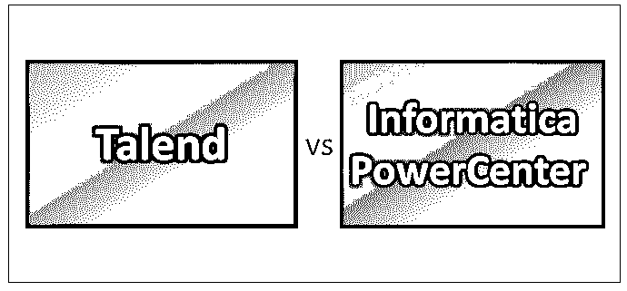

# 讲英语的美国 powercenter

> 原文：<https://www.educba.com/talend-vs-informatica-powercenter/>

## Talend 和 Informatica PowerCenter 的区别

有几种新兴的数据集成技术允许来自不同来源的数据相互通信。提取-转换-加载(ETL)是一种数据集成，从源中读取数据，使用预定义的逻辑进行转换，然后以其他形式加载到目标中。

ETL 工具提供了连接器，可以轻松、一致地跨各种数据源实现数据转换。在这些 ETL 工具中，用于过滤、排序、连接、合并、聚合和其他操作的连接器是现成可用的。Informatica PowerCenter 和 Talend 是最流行的内部运行的 ETL 工具。

<small>Hadoop、数据科学、统计学&其他</small>

Talend 和 Informatica PowerCenter 都为我们提供了一个用户友好的图形用户界面，并且都将数据从源移动到目标，但是它们的实现是不同的。

因此，让我们在这篇文章中详细研究一下 Talend 和 Informatica PowerCenter。

### Talend 和 Informatica PowerCenter 的面对面比较(信息图表)

以下是 Talend 与 Informatica PowerCenter 的 12 大对比

### Talend 和 Informatica 的主要区别

让我们详细了解一下 PowerCenter 的概念及其等效技术

1.Repository/项目存储库:
power center 中的存储库或 Talend 中的项目存储库是包含与所有技术项目相关的数据的存储位置，您可以使用这些数据来描述业务模型或设计作业/工作流。像作业、上下文和数据库连接等元数据对象存储在存储库中。

2.文件夹:
存在于两个工具中，用于组织不同类别/项目的作业。Talend 允许文件夹中包含子文件夹，而 Informatica 不支持子文件夹。

3.Workflow/工作:信息工作或 Talend 工作中的工作流是一个图形化的设计，由一个或多个组件连接在一起。它允许您设置和运行数据流。

4.Transformation/组件:Informatica 中的转换或 Talend 中的组件提供了实现数据流的特定功能。这些是用于执行数据集成操作的预配置连接器。

5.源&目标定义&连接/存储库元数据:
源&目标定义&power center 中的连接或 Talend 中的存储库元数据用于存储模式定义。

6.PowerCenter workspace/Design Area:
信息中的 power center workspace 或 Talend 中的 Design Area 用于设计作业/工艺流程。

7.Palette/变换工具栏:
Informatica 中的调色板或 Talend 中的变换工具栏是所有组件的库。构件根据其用途分组到族中，并显示在选项板中。

8.工作流或可重用会话/工作流:
这些是可重用的任务集。

### Talend 与 Informatica PowerCenter 对比表

以下是对比:

| **比较的基础** | **演讲** | **计算机** |
| 商业或开源 | Talend 为数据集成提供了多种解决方案，包括开源版本和商业版本 | Informatica 只提供商业数据集成 |
| 历史 | 大约始于 2006 年 10 月 | 成立于 1993 年 |
| 定价 | 开源版是免费的 | 适用于单/多用户许可的费用 |
| 流行 | 最流行的开源 ETL 工具 | 市场上最成熟的 ETL 产品 |
| 平台 | Talend 生成本地 Java 代码，允许您在任何支持 Java 的平台上运行它 | Informatica 生成存储在 RDBMS 存储库中的元数据；它不生成任何代码 |
| 自定义代码 | 可以高效地编写定制代码 | 使用 Java 转换集成定制代码并不那么有效 |
| 学问 | 需要 Java 知识 | 知识有限，易于学习和使用该工具。即使是业务用户也能理解所应用的映射和逻辑 |
| 部署 | 易于部署 | 部署自动化需要改进 |
| 可重用性 | 可以生成可重用的组件 | 转换是可重用的 |
| 行程安排 | 开源版本不支持作业调度，但是商业版支持 TAC (Talend 管理控制台) | 可以使用服务器管理器来计划作业 |
| 平行 | Talend 支持商业版的并行性，但不支持开源 | 支持并行性，可以在同一台服务器上执行多个映射会话 |
| 备份和恢复 | 开源中没有这样的特性 | 备份和恢复可以通过存储库管理器来完成。 |

### Talend 与 Informatica PowerCenter 的主要优势和劣势

#### 说得好

*   Talend 最大的优点是易于使用/调试和部署。
*   在幕后，它使用 Java 编码，所以无论你在界面中做什么，都可以很容易地在代码下看到。
*   代码的打包和部署在任何兼容 Java 版本的环境(Windows、Mac 或 Linux)中也很容易。
*   Talend 管理控制台(TAC)是安排和监控您的工作的好地方。
*   由于它是开源的，您可以从 Talend 网站下载并随时开始探索它。
*   Talend 只需要 JVM 来运行它的代码。在云世界中，人们希望他们的 Web 解决方案将 DB、应用程序和 ETL 放在同一个服务器上，以避免网络延迟和流量。这让 Talend 前途一片光明。

强项

1.  性价比高
2.  易于定制
3.  许多内置适配器很容易获得
4.  易于部署
5.  提供数据质量特性，并允许我们编写定制的查询

弱点

1.  开源版没有调度功能
2.  备份和恢复功能不可用

#### 信息

*   它是使用最广泛的工具，能够连接和获取不同来源的数据。
*   有三种不同的版本:标准版、高级版和高级版
*   在 Gartner 魔力象限列表中，它是数据集成产品的领导者
*   提供高度可靠、无缺陷的解决方案。
*   动态分区可以使用 Informatica 来完成

强项

1.  高效可靠的工具
2.  易于扩展
3.  稳定的
4.  支持大多数行业标准数据类型
5.  高效处理复杂的查找转换
6.  支持多用户客户端-服务器开发接口
7.  易于使用和学习

弱点

1.  不具备数据质量的特性，它需要以编程方式进行处理。
2.  没有任何 web 集成功能。
3.  PowerCenter 不生成代码，所有开发的映射都是 GUI 界面的形式

### 结论

考虑到 Talend 和 Informatica PowerCenter 的所有特性，我们可以说这两种工具都支持相同的转换和数据集成任务。然而，Informatica 在 ETL 和数据集成方面非常专业。它是 ETL 领域的市场领导者。但是，如果你想去开源，并且你熟悉 Java，那么去 Talend。在成本、培训和资源分配方面，它比 Informatica 更实惠。此外，它是最新的大数据技术，如 Spark、Hive、AWS 等。

### 推荐文章

这是一本关于 Talend 和 Informatica PowerCenter 的指南，包括它们的含义、直接比较、主要区别、对照表和结论。您也可以阅读以下文章，了解更多信息——

1.  [关于 Informatica 开发者工具的所有重要事情](https://www.educba.com/all-about-informatica-developer-tool/)
2.  [找出小数据与大数据的 10 大区别](https://www.educba.com/small-data-vs-big-data/)
3.  [10 种流行的数据仓库工具和技术](https://www.educba.com/10-popular-data-warehouse-tools/)
4.  [成为成功市场领导者的 7 种流行有效技巧](https://www.educba.com/market-leader/)

