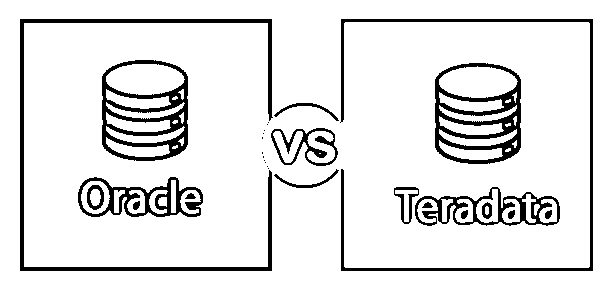

# TeraData vs Oracle

> 原文：<https://www.educba.com/teradata-vs-oracle/>

## Teradata 和 Oracle 的区别

Teradata vs Oracle 是两个非常流行的 RDBMS 系统。对于 Oracle，RDBMS 变体是一个对象关系数据库管理系统(ORDBMS)。RDBMS 就像一个关系模型，它使用我们所说的索引、主键和外键来维护表之间的关系。因此，与旧的 DBMS 系统相比，获取和存储数据的速度更快。Oracle 面向对象的数据库模型利用数据库模式和查询语言支持的对象和类。Oracle 在 70 年代第一个将 RDBMS 商业化，当时 Teradata 只是在为第一个数据仓库打基础。后来，Teradata 的能力使其最适合大数据、[商业智能工具](https://www.educba.com/business-intelligence-tool/)以及物联网。

### Teradata 和 Oracle 之间的直接比较(信息图表)

以下是 Teradata 与 Oracle 之间的 29 大差异

<small>Hadoop、数据科学、统计学&其他</small>

### Teradata 和 Oracle 的主要区别

Teradata vs Oracle 都是市场上的热门选择；让我们讨论一些主要的区别:

*   Oracle 是为事务处理量身定制的系统，因为它具有很大的架构灵活性，而 Teradata 的 OLAP 非常强大，可以对数据进行切片和切块以供分析。
*   Oracle 主要用作在线后端应用程序。它管理事务中的插入、更新和删除，而 Teradata 是数据仓库应用程序，用于维护大数据以进行分析。Teradata 中没有实时事务这种东西。
*   Teradata 可以被视为硬件和软件之间的良好结合，从而产生了高端企业数据库设备。但是甲骨文在 2008 年推出了它的 OLAP 数据库云服务器，相比之下，这是相当晚的。
*   Teradata 是基于无共享架构，另一方面 Oracle 有共享一切架构。无共享体系结构是指多处理器数据库管理系统，在该系统中，处理器之间不共享内存和硬盘存储，仅共享网络带宽用于数据传输。
*   对于 Teradata，数据存储在服务器上，并在一组服务器上进行分区，其中每台服务器只负责自己的数据。就 Oracle 而言，该架构意味着任何机器都可以访问任何数据。这一根本区别使得 Teradata 非常适合数据仓库，而 Oracle 适合 OTLP。
*   Teradata 作为一个设备非常适合数据聚合。因为它是一种电器，所以获得更多存储或更大功率的唯一方法是购买更多电器。Teradata 的实现要求投资回报不能强迫。
*   Teradata 缺少一个好的、复杂的数据抽象层。这就让人把它当成了只读数据源。如果有一个简单的数据仓库应用程序，只需要生成报告之类的东西，这仍然很好。此外，Teradata 没有最智能的优化器来处理它。它可以完美地处理一些模型。有时，基于查询的性质，复杂的星型模式可能会导致混淆并花费大量时间。规模递归模型超出预期。
*   相反，甲骨文是任何东西，如果有人有能力创造，那么就能做到。对于为几千兆字节的企业信息工厂设置做数据基础的应用服务器来说，这是一个非常便宜的选择。它可以在从 SAN 到操作系统或数据库甚至抽象层的每个级别进行定制。通常，任何对 RDBMS 有意义的模型都可以与任何复杂的优化器一起工作。一个缺点是 Oracle 对于不知道如何正确使用它的人来说很难，这是因为有太多的定制选项用于太多不同的用例，这需要很长的学习曲线。如果事情不按照神谕的方式去做，就不会顺利。Oracle 也存在可扩展性问题，如果数据量用完了可用的存储空间，就需要购买更多的硬件，从而导致巨大的成本。

### Teradata 与 Oracle 对比表

下面是 Teradata 与 Oracle 之间的最高对比

| **比较的基础** | **甲骨文** | **Teradata** |
| **描述** | 它是使用最广泛的 RDBMS 系统之一。 | 这个数据库管理系统主要用于数据分析 |
| **数据库的主要模型** | 这是一个关系数据库管理系统。 | 它也是一个关系数据库管理系统。 |
| **二级数据库模型** | 1.文档库
2。图形数据库管理系统
3。键值存储
4。RDF 存储 | 1.键值存储 |
| **d b-引擎排名** | 在一次调查中得分:-1301.11 | 调查得分:- 79.31 |
| **初始发布** | 在 1980 年 | 在 1984 年 |
| **当前发布版本** | 18.1 截至 2018 年 2 月 | Thirteen |
| **许可证类型** | 商业的 | 商业的 |
| **它仅基于云吗？** | 不 | 不 |
| **执行语言** | C 和 C++ | — |
| **服务器运行**支持哪些系统 | AIX HP-UX Solaris Linux OS X Windows zOS | Linux 操作系统 |
| **数据方案可用？** | 是 | 是 |
| **打字可用？** | 是 | 是 |
| **给出了 XML 支持？** | 是 | 是 |
| **二级指标可用？** | 是 | 是 |
| **SQL 可用？** | 是 | 是 |
| 支持哪些 API 和其他访问方法？ | ODP.NET
甲骨文调用接口(OCI)，ODBC，JDBC | .NET 客户端 API，JMS 适配器，ODBC，HTTP REST，JDBC，OLE DB |
| 支持哪些编程语言？ | C，C#，C++，Fortran，Groovy，Haskell
Java，JavaScript，Lisp，Perl，PHP，Python R，Ruby，Scala，Visual Basic 等等 | C，C++，Cobol，Java (JDBC-ODBC)，Perl，Python，R，Ruby 等等 |
| **支持服务器端脚本？** | PL/SQL | 是 |
| **触发器可用？** | 是 | 是 |
| **允许的分区方法和分区类型** | 支持水平分区 | 切碎 |
| **复制方法类型** | 主-主复制和
主-从复制 | 主从复制以及
主从复制 |
| **支持 MapReduce？** | 不 | 不 |
| **支持一致性概念？** | 即时一致性 | 即时一致性 |
| **外键可用？** | 是 | 是 |
| 有哪些类型的交易概念？ | 酸 | 酸 |
| **并发可用？** | 是 | 是 |
| **有耐久性吗？** | 是 | 是 |
| 提供了内存功能？ | 是 | 是 |
| **有哪些用户概念？** | 根据 SQL 标准，细粒度的访问权限是可用的 | 根据 SQL 标准，存在细粒度的访问权限 |

### 结论

最后，我们可以说 Teradata 和 Oracle 系统都存在可伸缩性问题。Teradata 的一个问题是，对于数据频繁更新的大规模系统，保持更新变得非常昂贵。因此，Teradata 和 Oracle 系统都需要某种策略来解决可伸缩性问题。除此之外，这些系统都为客户提供了巨大的好处。

### 推荐文章

这是 Teradata 与 Oracle 之间最大差异的指南。在这里，我们还将讨论信息图和比较表的主要区别。你也可以看看下面的文章来了解更多。

1.  [PowerShell vs CMD](https://www.educba.com/powershell-vs-cmd/)
2.  Oracle 和 SQL Server 哪个更好？
3.  [Hadoop 与 Teradata 的 11 大差异](https://www.educba.com/hadoop-vs-teradata/)
4.  [PowerShell vs 命令提示符| 14 大差异](https://www.educba.com/powershell-vs-command-prompt/)

