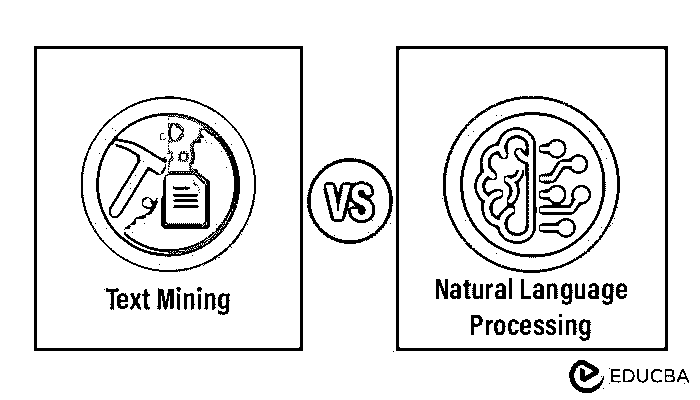

# 文本挖掘与自然语言处理

> 原文：<https://www.educba.com/important-text-mining-vs-natural-language-processing/>

## 文本挖掘与自然语言处理的区别

术语“[文本挖掘](https://www.educba.com/text-mining/)用于自动化机器学习和用于此目的的统计方法。它用于从非结构化和结构化文本中提取高质量的信息。可以在文本或匹配结构中模式化信息，但是不考虑文本中的语义。自然语言是我们用来交流的。处理这些数据以理解潜在含义的技术统称为自然语言处理(NLP)。数据可以是语音、文本甚至是图像，方法包括对数据应用机器学习(ML)技术，以构建涉及分类、提取结构、总结和翻译数据的应用。NLP 试图处理人类语言的所有复杂性，如语法和语义结构、情感分析等。

### 文本挖掘和自然语言处理之间的直接比较(信息图表)

以下是文本挖掘和自然语言处理之间的五大比较:

<small>Hadoop、数据科学、统计学&其他</small>

### 

### 文本挖掘和自然语言处理的主要区别

下面是文本挖掘和自然语言处理的区别:

*   **应用**–NLP 的概念用于以下基本系统:
    *   语音识别系统
    *   问答系统
    *   从一种特定语言到另一种特定语言的翻译
    *   文本摘要
    *   [情感分析](https://www.educba.com/sentiment-analysis-social-media/)
    *   基于模板的聊天机器人
    *   文本分类
    *   话题分割

高级应用程序包括以下内容:

*   理解自然语言命令的人类机器人，用自然语言与人类互动。
*   建立一个通用的机器翻译系统是 NLP 领域的长期目标
*   它为给定的文档生成逻辑标题。
*   为特定主题或给定图像生成有意义的文本。
*   高级聊天机器人，为人类生成个性化文本，并忽略人类写作中的错误

文本挖掘的流行应用:

*   上下文广告
*   内容丰富
*   [社交媒体](https://www.educba.com/social-media-strategy-plan/)数据分析
*   垃圾邮件过滤
*   通过索赔调查检测欺诈

*   **开发生命周期**--

为了开发一个 NLP 系统，一般的开发过程包括以下步骤

*   理解问题陈述。
*   决定你需要什么样的数据或语料库来解决问题。数据收集是解决问题的基本活动。
*   分析收集的语料库。语料库的质量和数量如何？根据数据和问题陈述的质量，需要做预处理。
*   一旦完成了预处理，就从特征工程的过程开始。特征工程是 NLP 和数据科学相关应用的最重要的方面。不同的技术，如解析，语义树，都被用于此。
*   在决定了从原始预处理数据中提取的特征之后，你要决定使用哪种计算技术来解决你的问题陈述，例如，你想应用机器学习技术还是基于规则的技术？.对于现代 NLP 系统，几乎所有的时间先进的 ML 模型都是基于深度神经网络的。
*   现在，根据您将要使用的技术，您应该阅读您将要作为决策[算法](https://www.educba.com/software-development/courses/java-course/)的输入提供的特征文件。
*   运行模型，测试并微调。
*   重复上述步骤，以获得所需的精度

对于文本挖掘应用程序，定义问题等基本步骤与 NLP 中的相同。但是也有一些不同的方面，如下所列

*   大多数情况下，文本挖掘分析文本本身，而不像 NLP 那样需要参考语料库。在数据收集部分，外部语料库的需求很少。
*   文本挖掘和自然语言处理的基本特征工程。像 n-grams、TF–IDF、余弦相似度、Levenshtein 距离、特征散列等技术在文本挖掘中是最流行的。使用深度学习的 NLP 依赖于专门的神经网络调用自动编码器来获得文本的高级抽象。
*   文本挖掘中使用的模型可以是基于规则的统计模型或相对简单的 ML 模型
*   正如我们前面提到的，系统精度在这里显然是可测量的，因此在文本挖掘中运行、测试、微调模型的迭代是相对容易的。
*   与 NLP 系统不同，在文本挖掘系统中将有一个表示层来呈现挖掘结果。这与其说是工程，不如说是艺术。

*   **未来工作**–随着互联网使用的增加，文本挖掘变得越来越重要。网络挖掘和生物信息学等新的专业领域正在出现。到目前为止，大部分的数据挖掘工作都是在数据清理和数据准备阶段，这些工作效率较低。使用机器学习来自动化这些工作的积极研究正在发生。

自然语言处理一天比一天好，但是机器很难处理自然语言。我们很容易表达笑话、讽刺和各种情绪，每个人都能理解。我们正试图使用深度神经网络的集合来解决这个问题。目前，许多 [NLP 研究人员](https://www.educba.com/introduction-to-nlp/)正专注于使用无监督模型的自动机器翻译。自然语言理解(NLU)是另一个感兴趣的领域，它对聊天机器人和人类可以理解的机器人有着巨大的影响。

### 文本挖掘和自然语言处理对照表

以下是要点列表，描述了文本挖掘和自然语言处理之间的比较。

| **比较的基础** | **文本挖掘** | **NLP** |
| **目标** | 从非结构化和结构化的文本中提取高质量的信息。可以在文本或匹配结构中模式化信息，但是不考虑文本中的语义。 | 试图理解人类用自然语言表达的东西——可能是文本，也可能是语音。分析语义和语法结构。 |
| **工具** | 

*   Text processing languages such as Perl
*   statistical model
*   ML model

 | 

*   Advanced ML model
*   Deep neural network
*   Like [T0】 NLTK 【T1] in Python toolkit

 |
| **范围** | 

*   The data source is a documented collection.
*   Extracting representative features for natural language documents
*   Input for corpus-based computational linguistics

 | 

*   数据源可以是任何形式的自然人类交流方法，如文本、语音、广告牌等
*   从输入中提取语义和语法结构
*   让人类与机器的各种互动更加自然

 |
| **结果** | 使用类似
1 的统计指标解释文本。词频
2。单词模式
3。词内关联 | 像
1 一样理解通过文本或讲话传达的内容。传达的情绪
2。文本的语义，以便它能被翻译成其他语言
3。语法结构 |
| **系统精度** | 业绩衡量是直接和相对简单的。这里我们有清晰可测量的数学概念。测量可以自动化 | 很难测量机器的系统精度。大多数时候都需要人工干预。例如，考虑一个从英语翻译成印地语的 NLP 系统。自动测量系统翻译的准确性是很困难的。 |

### 结论

文本挖掘和自然语言处理都试图从非结构化数据中提取信息。文本挖掘集中在文本文档上，并且主要依赖于统计和概率模型来导出文档的表示。NLP 试图从人类自然交流的所有方式中获取语义，如文本、语音甚至图像。NLP 有可能彻底改变人类与机器的交互方式。AWS Echo 和 [Google Home](https://en.wikipedia.org/wiki/Google_Home) 就是一些例子。

### 推荐文章

这是文本挖掘和自然语言处理的指南。在这里，我们讨论了文本挖掘与自然语言处理的直接比较、关键差异以及信息图和比较表。您也可以阅读以下文章，了解更多信息——

1.  [关于数据挖掘和文本挖掘，最值得学习的 3 件事](https://www.educba.com/data-mining-vs-text-mining/)
2.  关于文本挖掘如何工作的权威指南
3.  [成功企业的 8 项重要数据挖掘技术](https://www.educba.com/data-mining-techniques/)
4.  [数据挖掘与数据仓库——哪一个更有用](https://www.educba.com/data-warehousing-vs-data-mining/)

