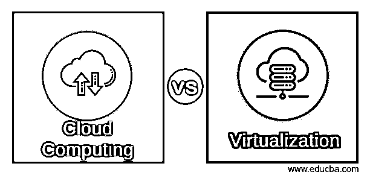
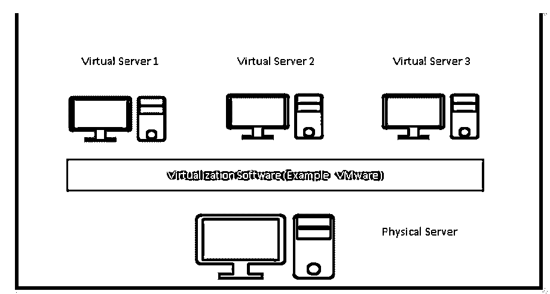

# 云计算与虚拟化

> 原文：<https://www.educba.com/cloud-computing-vs-virtualization/>

## 云计算与虚拟化的区别

云计算是一种支持对可配置计算资源(例如，网络、服务器、存储、应用程序和服务)的共享池进行便捷的按需网络访问的模式，可通过最少的管理工作或服务提供商交互来快速供应和释放这些资源。虚拟化是在同一台机器上创建“分离的”多个硬件和软件映像的软件。这使得在同一台物理机上安装多个操作系统、多个软件和多个应用成为可能。云适合公共使用，另一方面，IT 公司使用虚拟化来构建经济高效的数据中心。

### 云计算

<small>Hadoop、数据科学、统计学&其他</small>

图 1，云架构及其布局( [Pic Credit](https://www.slideshare.net/Agarwaljay/cloud-computing-simple-ppt-41561620) )

在图 1 中，各种应用程序、存储和基础架构服务器都运行在云上，所有类型的设备都可以访问它们，比如手机、电脑等。根据权限，可以通过互联网访问云。云对于外部用户访问非常有用。亚马逊网络服务、谷歌云、Dropbox 是云技术的几个例子。

### 虚拟化

使用虚拟化，软件可以降低硬件成本，并提高基础架构的利用率、可访问性和效率。虚拟化在物理服务器的硬件之上工作，并将其硬件分成多个部分(仅虚拟地)，然后在这些部分安装虚拟机。

**图 2** ，使用虚拟化软件将单个物理机分成多个虚拟机。

在图 2 中，VMware 软件将物理服务器划分/拆分为多台机器，所有虚拟机都驻留在同一台物理服务器上。

**云计算的优势**

所有用户(适当的凭证)都可以不受任何限制地访问它。

将云用于应用程序是经济高效的。

由于不依赖于单个机器，访问失败的可能性最小。

云为您提供了对机器访问的独立性。URL 将让您随时访问您的基础设施。

[实时](https://www.educba.com/real-time-analytics/)用户访问。多个用户可以访问同一个应用程序并在其上工作(例如——Google Doc)

云对于备份和恢复是可靠的，因为数据存储不是特定于服务器的。

[云计算](https://www.educba.com/benefits-of-cloud-computing/)是在全球展示您的应用/软件的最佳平台。用户可以使用一个链接访问您的应用程序&。

从任何地方访问它的灵活性使它在用户和服务提供行业中很受欢迎。

**虚拟化的优势**

服务器虚拟化是其成功背后的首要原因。

IT 行业使用虚拟化技术设置数千台服务器。

尽管依赖于操作系统，但可以在一台物理机上安装多个应用程序。

安装成本非常低。虚拟化可以在个人电脑上完成。

桌面虚拟化功能提供了灵活性，只需一次点击即可虚拟化整个系统。

虚拟基础架构适用于低速网络访问。

虚拟化降低了 IT 行业的硬件成本，因为一台服务器可以充当多台机器。

虚拟化是即插即用服务；不用花太多时间，就可以制造出数千台机器并投入使用。虚拟化软件可以虚拟化物理服务器，无需花费太多时间。

### 云计算和虚拟化之间的直接比较(信息图表)

以下是云计算和虚拟化的十大对比:

### 云计算和虚拟化的主要区别

以下是云计算和虚拟化的区别:

*   虚拟化是将您的硬件虚拟化为多个机器的软件，而云计算是多个硬件设备的组合。
*   在虚拟化中，用户获得专用硬件，而在云计算中，多个硬件设备为用户提供一个登录环境。
*   云计算最好从办公室网络外部访问，而虚拟化意味着只能从办公室访问。

云环境可以通过 URL 访问，因此可以在工作场所之外访问(取决于权限)。

*   虚拟化不依赖于云计算环境，而没有虚拟化，云计算就无法存在。
*   云计算基于 IaaS(基础设施即服务)，而虚拟化基于 SaaS(软件即服务)。
*   软件和硬件等共享计算资源为您提供了一个云计算环境，而虚拟化是在机器/硬件操作之后出现的。
*   云计算为您提供了灵活性，如按需付费、自助服务等。而访问虚拟化环境不允许您使用这些功能。
*   云计算有利于向外部用户销售您的服务/软件，而虚拟化最适合在公司网络/基础架构内建立数据中心。
*   在云网络中，存储容量是无限的，而在虚拟化中，存储容量取决于物理服务器容量。
*   单台机器故障不会影响云基础架构，而在虚拟化中，单个节点故障会影响数百台虚拟机(如果物理硬件/机器未配置为高可用性)

### 云计算和虚拟化对照表

下面是云计算和虚拟化的对比表。

| **要点** | **云计算** | **虚拟化** |
| **可扩展性** | 云可以任意扩展。 | 虚拟机配置限制了其可扩展性。 |
| **快速设置** | 建立云是一项非常繁琐的任务。 | 建立虚拟环境非常简单。 |
| **灵活性** | 用户访问非常灵活。用户可以通过互联网从任何位置访问其云(取决于许可)。 | 在访问虚拟机之前，需要进行适当的身份认证。 |
| **服务类型** |  IaaS |  SaaS |
| 

**专用硬件**

 | 多种硬件创造了云计算 | 多个虚拟机需要专用硬件 |
| **整合** | 云集成允许用户、应用程序等的未来扩展。 | 虚拟化集成允许在同一基础架构内扩展新机器。 |
| **依赖关系** | 多个用户可以使用同一条链路访问网络。 | 一台服务器/计算机上可以安装多个操作系统 |
| **可访问性** | 它可以从世界各地访问。(基于互联网的云) | 从网络外部访问需要适当的权限。 |
| **灾难恢复** | 不要依赖一台机器。 | 单台机器故障会导致多台虚拟机瘫痪。 |
| **类型** | 私有云与公共云 | 硬件虚拟化和应用虚拟化。 |

### 结论

没有虚拟化的帮助，就无法建立云基础架构。它是[云网](https://www.educba.com/cloud-networking/)的基础。在 IT 基础设施中，云计算和虚拟化一起用于构建云基础设施。

虚拟化将硬件与物理机分开，以便在同一台服务器上创建多个虚拟机，而云是使用多个虚拟基础架构构建的，这些虚拟基础架构将多个虚拟化应用程序/软件/服务器结合起来，为用户的每个应用程序或软件或服务器创建一个实例。

谷歌文档是云计算的最好例子

### 推荐文章

这是云计算与虚拟化的对比指南。在这里，我们讨论了云计算与虚拟化的直接比较、主要差异以及信息图和比较表。您也可以阅读以下文章，了解更多信息——

1.  [云计算特性](https://www.educba.com/cloud-computing-features/)
2.  [云计算或虚拟化技术](https://www.educba.com/cloud-computing-or-virtualization-techniques/)
3.  [15 个潜伏在云中的恶魔](https://www.educba.com/cloud-services/)
4.  [OpenStack 与虚拟化](https://www.educba.com/openstack-vs-virtualization/)

