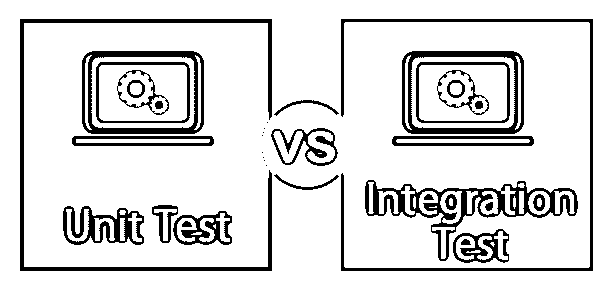

# 单元测试与集成测试

> 原文：<https://www.educba.com/unit-test-vs-integration-test/>

## 单元测试和集成测试的区别

单元测试是一个测试过程，通过它来测试源代码的每个单元，以确定它是否可以使用，而集成测试则监控软件模块之间的集成。这有助于降低错误修复的成本，因为错误是在生命周期的早期阶段发现的。它是一种软件测试方法，将系统的单个单元作为一个组进行集成和度量。对于集成测试，测试存根和测试驱动程序用于集成测试。通常采用自顶向下和自底向上的方法进行集成测试。

#### 单元测试

它基本上是测试一小段代码或一个函数/方法，以检查它是否工作正常。单元测试也称为组件或模块测试。它不涉及与网络、其他软件组件、数据库等依赖项的任何交互。这些单元测试范围窄，简单，通常由开发人员或编写同一段代码的人编写。编写这些代码是为了检查代码或编写的函数是否按预期运行。单元测试是测试的第一级，它有助于减少测试人员和开发人员在测试后期提交和修复 bug 的时间。

<small>Hadoop、数据科学、统计学&其他</small>

单元测试从检查代码的基本功能开始，然后是非功能和覆盖问题。对于单元测试中发现的问题，没有记录任何错误。它是测试的支柱，一个好的单元测试不仅能防止错误，还能帮助好的代码设计。

#### 集成测试

它基本上是测试一个应用程序的不同部分如何协同工作。它检查应用程序不同模块之间的接口和交互。顾名思义，集成测试将应用程序的各个部分集成在一起，然后将它们作为一个整体进行测试。在真实的场景中，集成测试在单元测试之后。当一个应用程序的不同模块经过单元测试并且运行良好时，就要对它们进行集成测试，以检查它们是否如预期的那样一起工作，以及是否使用网络、数据库、硬件等真正的依赖项相互之间进行了适当的交互。

集成测试相当复杂和困难，因为它需要大量的设置。这就是集成测试比单元测试更难编写和测试的原因。这种测试非常重要，因为整个集成系统/软件是交付给客户的，而不是交付给小单元(代码片段)。它揭示了许多错误，因为很多时候单个组件工作正常，但在相互交互时会遇到问题，如数据交换、函数调用、硬件问题。

### 单元测试和集成测试之间的直接比较(信息图)

下面是单元测试和集成测试的 9 大对比 **:**

**

** 

### 单元测试和集成测试的主要区别

以下是要点列表，描述了单元测试和集成测试之间的主要区别

1.  单元测试揭示了单个功能或特定模块中的问题，而集成测试揭示了由于两个模块或应用程序整体的交互而产生的错误。
2.  开发人员可以立即修复单元测试中发现的问题，因为问题出现在特定的模块或特定的代码中，但是集成测试中发现的问题需要花费大量的时间和成本来修复，因为不同的模块由不同的开发人员开发，所以很难找到错误出现的确切位置。
3.  在单元测试中发现并修复问题是非常划算的，而在集成测试中修复 bug 是非常昂贵的。
4.  单元测试从模块规格开始，而集成测试从接口规格开始。
5.  单元测试的方法是测试驱动开发，其中首先创建测试用例，然后根据测试用例进行开发，而集成测试的方法是大爆炸方法、自顶向下方法、自底向上方法和混合方法。
6.  对于单元测试，需要代码的可访问性，因为它测试编写的代码，而在集成测试中，不需要代码访问，因为它测试模块之间的交互和接口。
7.  单元测试的测试基础是组件需求、代码和详细设计，而集成测试的测试基础是软件和系统设计的详细系统架构和工作流/用例。

### 单元测试与集成测试对照表

下面是单元测试和集成测试之间最重要的比较

| **比较的基础** | **单元测试** | **集成测试** |
| 功能 | 在单元测试中，测试应用程序的小模块或一段代码 | 在集成测试中，单个模块组合在一起，作为一个组进行测试 |
| 速度 | 编写和执行单元测试更快 | 集成测试执行起来相对较慢 |
| 复杂性 | 编写和执行单元测试不太复杂 | 集成测试的编写和执行更加复杂 |
| 依赖关系的参与 | 单元测试不需要任何外部依赖的参与，如数据库、网络等 | 集成测试需要使用真实的依赖关系来执行测试，如测试数据库、硬件等 |
| 测试导体 | 单元测试通常由开发人员或编写特定代码的人来进行 | 集成测试由独立的测试团队进行 |
| 测试顺序 | 单元测试是在单个模块或一段代码开发完成后的开始阶段进行的 | 集成测试在单个模块的单元测试完成后、系统测试开始前进行 |
| 维护 | 单元测试的维护成本非常低 | 集成测试的维护成本非常高 |
| 范围 | 单元测试的范围非常窄，因为它只覆盖了一段代码/应用程序的一部分 | 集成测试的范围更广，因为它覆盖了整个应用程序 |
| 守则的知识 | 进行单元测试的人对代码和内部功能有全面的了解，因此被称为白盒测试 | 从事集成测试的人不了解代码，但了解预期的输出和整体功能，因此被称为黑盒测试 |

### 结论

我认为以上几点清楚地表明了单元测试和集成测试的区别。我们不能说任何人的测试都比其他人更重要、更有用。这两种测试都服务于它们的目的，并且是相互关联的。在向客户交付任何软件之前，重要的是软件的每个模块都工作良好，并且软件作为一个整体应该按预期工作。例如，在电子商务网站的情况下，登录、添加到购物车、支付模块单独应该工作良好，并且电子商务网站的所有模块需要与数据库和支付模块正确交互。因此，为了降低失败的风险，这两项测试都应该严格、准时地进行，不应该延迟。

### 推荐文章

这是一个单元测试和集成测试之间最大区别的指南。这里我们讨论了信息图和比较表的主要区别。您也可以看看以下文章，了解更多信息–

1.  [CentOS 与 Debian 的差异](https://www.educba.com/centos-vs-debian/)
2.  [Ubuntu 与 Centos 的最大差异](https://www.educba.com/centos-vs-ubuntu/)
3.  [Linux 与 FreeBSD–有用的比较](https://www.educba.com/linux-vs-freebsd/)
4.  RedHat 和 Debian 哪个更好？
5.  [单元测试与功能测试的区别](https://www.educba.com/unit-test-vs-functional-test/)
6.  [系统测试与集成测试|主要差异](https://www.educba.com/system-testing-vs-integration-testing/)

