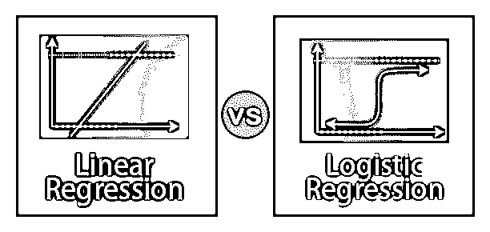
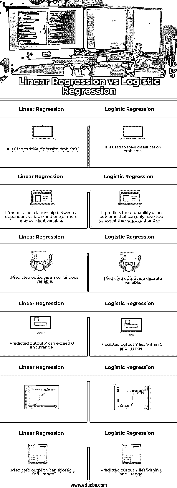
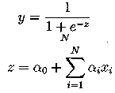
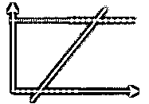
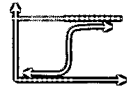

# 线性回归与逻辑回归

> 原文：<https://www.educba.com/linear-regression-vs-logistic-regression/>

## 线性回归和逻辑回归的区别

线性回归是一种基于机器学习的监督学习领域的算法。它继承了其输入变量和单个输出变量之间的线性关系，其中输出变量本质上是连续的。它用于从输入值(比如说 x)预测输出值(比如说 Y)。当只考虑单个输入时，它被称为简单线性回归。逻辑回归是一种回归形式，它允许通过连续和离散预测因子的混合来预测离散变量。它导致因变量的独特变换，不仅影响估计过程，而且影响自变量的系数。它解决了与多元回归相同的问题，但没有预测因子的分布假设。在逻辑回归中，结果变量是二元的。分析的目的是评估多个解释变量的影响，这些变量可以是数字或分类变量，也可以是数字和分类变量。

### 线性回归的类别

它可以分为两大类:

<small>Hadoop、数据科学、统计学&其他</small>

#### 1.简单回归

运算原理:主要目标是找出最符合采样数据的直线方程。这个方程用代数方法描述了两个变量之间的关系。最佳拟合直线称为回归线。

`Y = β0 + β1 X`

在哪里，

β代表特性

β 0 代表截距

β 1 代表特征 X 的系数

#### 2.多变量回归

它用于预测多个自变量和一个因变量之间的相关性。具有两个以上自变量的回归是基于将形状拟合到多维图上的数据星座。回归的形状应该使形状与每个数据点的距离最小化。

线性关系模型可以用数学方法表示如下:

`Y = β0 + β1 X1 **+** β2X2 + β3X3 **+ ....... +** βnXn `

在哪里，

β代表特性

β 0 代表截距

β 1 代表特征 X 的系数 1

β n 代表特征 X 的系数 n

#### 线性回归的优点和缺点

下面给出了优点和缺点:

**优势**

*   由于其简单性，它被广泛用于预测和推理的建模。
*   它[侧重于数据分析](https://www.educba.com/what-is-data-analysis/)和数据预处理。因此，它可以处理不同的数据，而不需要考虑模型的细节。

**缺点**

*   当数据呈正态分布时，它的工作效率很高。因此，为了有效地建模，必须避免共线性。

### 逻辑回归的类型

下面是两种类型的逻辑回归:

**1。二元逻辑回归**

当因变量为二分变量时使用，如一棵树有两个分支。当因变量是非参数变量时使用。

**在**时使用

*   如果没有线性
*   因变量只有两个层次。
*   如果多元正态性存疑。

**2。多项式逻辑回归**

多项逻辑回归分析要求自变量为公制或二分法。它不对独立变量的线性、正态性和方差齐性做出任何假设。

当因变量有两个以上的类别时使用。它用于分析非度量因变量与度量或二分自变量之间的关系，然后通过二元逻辑回归的组合来比较多个组。最后，它为两次比较中的每一次提供了一组系数。参考组的系数被视为全零。最后，基于最高的结果概率进行预测。

**逻辑回归的优势:**它是一种非常高效且广泛使用的技术，因为它不需要很多计算资源，也不需要任何调整。

**logistic 回归的缺点:**不能用于解决非线性问题。

### 线性回归和逻辑回归的直接比较(信息图表)

以下是线性回归和逻辑回归之间的 6 大区别

### 线性回归和逻辑回归的主要区别

让我们讨论一下线性回归和逻辑回归之间的一些主要区别

#### 线性回归

*   这是一种线性方法
*   它使用一条直线
*   它不能接受分类变量
*   它必须忽略缺少数值独立变量的观察值
*   输出 Y 由下式给出

*   x 增加 1 个单位，Y 增加α

**应用程序**

*   预测产品的价格
*   预测比赛分数

#### 逻辑回归

*   这是一种统计方法
*   它使用了一个 sigmoid 函数
*   它可以接受分类变量
*   即使存在缺失值的观察值，它也可以做出决定
*   输出 Y 为，其中 z 为

*   x 增加 1 个单位，Y 增加α的对数几率
*   如果 P 是事件发生的概率，那么(1-P)是事件不发生的概率。成功的几率= P / 1-P

**应用程序**

*   预测今天是否会下雨。
*   预测电子邮件是否是垃圾邮件。

### 线性回归与逻辑回归对照表

让我们讨论一下线性回归和逻辑回归之间的主要比较

| **线性回归** | **逻辑回归** |
| 它用于解决回归问题 | 它用于解决分类问题 |
| 它模拟因变量和一个或多个自变量之间的关系 | 它预测在输出端只有两个值 0 或 1 的结果的概率 |
| 预测输出是一个连续变量 | 预测输出是一个离散变量 |
| 预测输出 Y 可以超过 0 和 1 的范围 | 预测输出 Y 位于 0 和 1 范围内 |
| 

 | 

 |
| 预测输出 Y 可以超过 0 和 1 的范围 | 预测产量 |

### 结论

如果特征对预测没有贡献，或者如果它们彼此非常相关，那么它会向模型添加噪声。因此，对模型贡献不足的特征必须被移除。如果独立变量高度相关，可能会导致多重共线性问题，这可以通过对每个独立变量运行单独的模型来解决。

### 推荐文章

这是线性回归和逻辑回归的指南。在这里，我们讨论线性回归与逻辑回归的关键区别，并提供信息图表和比较表。您也可以看看以下文章，了解更多信息–

1.  [数据科学 vs 数据可视化](https://www.educba.com/data-science-vs-data-visualization/)
2.  [机器学习 vs 神经网络](https://www.educba.com/machine-learning-vs-neural-network/)
3.  [监督学习 vs 深度学习](https://www.educba.com/supervised-learning-vs-deep-learning/)
4.  [R 中的逻辑回归](https://www.educba.com/logistic-regression-in-r/)

