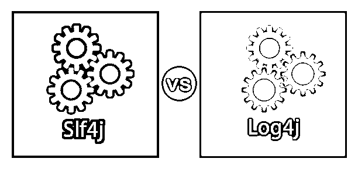
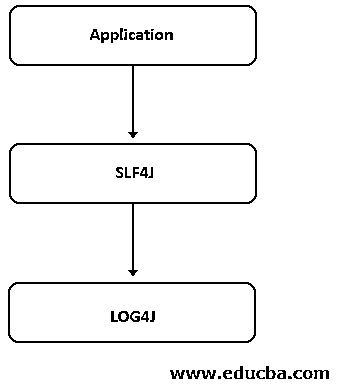

# Slf4j vs Log4j

> 原文：<https://www.educba.com/slf4j-vs-log4j/>

## Slf4j 和 Log4j 的区别

如果你是一名开发人员，那么在你的职业生涯中，你经常写日志记录语句。在本文中，我们已经介绍了两种最常用的日志机制——Log4j 和 Slf4j。在我们开始之前，最好了解一些关于日志记录的“是什么”和“为什么”部分的基础知识。在这个话题中，我们将学习 Slf4j 和 Log4j。

**SLF4J:** 它是 Java 的简单日志外观的缩写，使用户能够在部署软件应用程序期间插入所需的日志系统。还请注意，我们使用了术语“外观模式”,它只不过是 OOP 中常用的一种软件设计模式。

<small>Hadoop、数据科学、统计学&其他</small>

Log4J: 这是一个可靠、灵活&快速的日志框架(即半构建应用程序)。日志可以分为不同的级别，如跟踪、调试、信息、错误、致命和其他几种模式。这些日志详细信息可以在不同的平台上共享，如其他数据库和文件控制台。

**WHAT–**日志文件可以被视为所有活动及其结果的跟踪历史。它们还保存用户与系统的各种交互细节，可以是交易细节、信息，也可以是是否出错(我的意思是说特定活动是否没有执行)。

**WHY—**我们需要跟踪问题、关于函数加载的声明、我们已传递的参数类型、警告消息或通知，以便在开发阶段更好地理解应用程序，并可用于将来参考。

### Slf4j 和 Log4j 的面对面比较(信息图)

以下是 Slf4j 与 Log4j 之间的 5 大区别

### Slf4j 和 Log4j 的主要区别

让我们讨论一下 Slf4j 与 Log4j 之间的一些主要差异:

1.Ssl4j 只是一个抽象，或者说它提供了一个抽象层，我们没有使用它，而 Log4j 是一个日志框架，有不同的实现。

2.谈到这两个 Sl4j 中的组件，它没有任何组件，但它有一个实施列表，如 logback 或 NOPloggers 等，而在 log4j 中，它有 3 个主要组件，即

*   记录器:它们在运行时捕获日志信息
*   Appenders:在将日志信息发布到不同的目的地时，它们充当输出。
*   布局:它们提供了各种样式的格式选项。

3.谈到首选项，我们想说的是 ssl4j 和 log4j 之间没有直接的比较，但是可以根据特定的情况以及何时使用它们中的任何一个来选择首选项，如下所示

*   Ssl4j 作为 API 易于使用，简单明了
*   Ssl4j 支持所有重要的日志框架
*   Ssl4j 发行版附带了针对不同记录器的绑定，如简单记录器、NOPlogger、Log4jloggeradapter、JDK14loggeradapter 和 JCLLoggerAdapter。
*   Ssl4j 管理 Maven 依赖项
*   它之所以被广泛使用，是因为它完美地记录了所有如果和但是的考虑
*   Ssl4j 支持诊断上下文映射，同时存储上下文信息
*   对于测井实践，Log4j 被认为是安全的
*   它针对性能进行了高度优化
*   Log4j 支持每个记录器有多个 appender(log4j 的一个组件)
*   它在整个行业中被广泛使用，并设置内部化参数。
*   Log4j 支持多种日志级别，如 WARN、INFO 和 ERROR。
*   通过更改布局类和实现 appender 接口，可以很容易地改变日志格式和目的地。

4.Slf4j 可以配置为使用 Log4j 作为日志后端来协同工作，但是后面的转换是不可能的。

### Slf4j 与 Log4j 对比表

让我们看看 Slf4j 与 Log4j 之间的更多差异

| **Title** | **Slf4j** | **Log4j** |
| 移民 | Slf4j 与之前的所有版本兼容。用户可以轻松地从 slf4j 迁移到任何版本，没有任何问题。 | 有几个障碍，因为人们必须注意迁移，谈到 Log4j2，向后兼容是不可能的。 |
| 最新版本 | Ssl4j 发布了他们最新的稳定版本 1.7 | 2.0.8 版是最新版本。 |
| 偏好的选择 | 库和嵌入式组件应该优先选择 ssl4j 来满足它们的日志记录需求，因为这些库不能为最终用户选择日志记录框架。 | 每当您需要一种更动态、更灵活的方法来提供更多功能时。 |
| 先决条件 | 首先，先决条件因版本而异。与新版本相比，新版本有一些不同的要求。让我们来看看其中的一些需求——

*   slf4j-nop:JDK 1.5
*   slf4j-简单:JDK 1.5
*   Slf4j-log4j 12:JDK 1.5, and any other library dependencies required by the log4j appender in use.
*   Slf4j-jdk14: JDK 1.5 or higher
*   经典版:JDK 1.5 或更高版本

 | 根据需求有几个依赖项，但下面提到了几个重要的和通常考虑的——

*   Log4j 1\. 2\. 8 and previous versions are compatible with JDK 1.1.x, while newer versions of log4j 1.2 are compatible with JDK 1.2 and later.
*   Log4j test depends on JUnit test framework.
*   org。啊哈。log4j 需要 JMS API 和 JNDI

 |
| API 的 | 一些常见的 slf4j API 有-

*   JCL-over-slf4j
*   7 月至 6 月 4 日(用于 Java。util。记录)
*   Log4j-over-slf4j(与 Log4j 兼容的 API)

 | 一些 log4j API 是-

*   类别。获取父级()
*   类别。设置级别()
*   类别。设置优先级()
*   类别。获取可加性()
*   类别。设置可加性()
*   类别。getresourcebundle()
*   基本配置器。配置()

 |

### 结论

日志记录是应用程序故障排除的一个重要部分，它是在开发周期中发现问题的一个开发参数。关于日志，我们见证了 CLF4J 和 LOG4J 这两个至关重要的玩家。我们也看到了什么是 SLF4J 和 LOG4J，它们拥有什么样的可能性以及如何使用它们。本质上，它们是由开发人员用于日志记录的，并且有一些特定的使用指南

我们已经列出了这两者在日志场景中的适用框图——

### 推荐文章

这是 Slf4j vs Log4j 的指南。这里我们讨论信息图和比较表的主要区别。您也可以看看以下文章，了解更多信息–

1.  [天使 vs 木偶](https://www.educba.com/ansible-vs-puppet/)
2.  [Ansible vs 木偶 vs 厨师](https://www.educba.com/ansible-vs-puppet-vs-chef/)
3.  [Debian vs Arch](https://www.educba.com/debian-vs-arch/)
4.  [立方 vs 码头](https://www.educba.com/kubernetes-vs-docker/)

