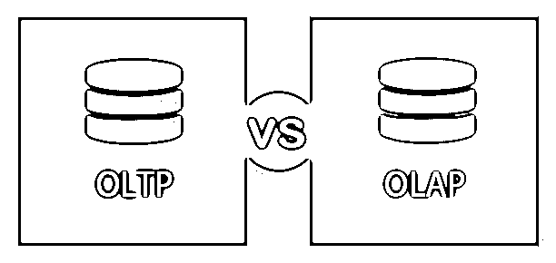
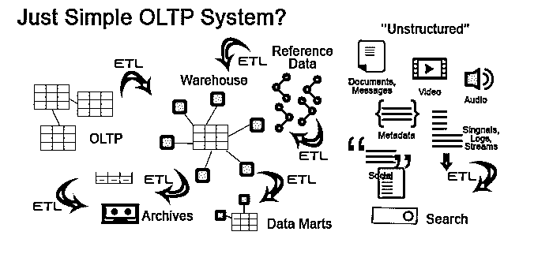
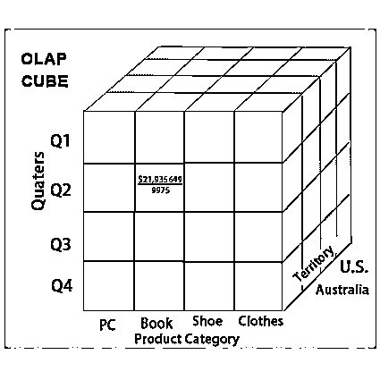

# OLTP 与 OLAP

> 原文：<https://www.educba.com/oltp-vs-olap/>

## OLTP 和 OLAP 的区别

OLTP 扩展为在线事务处理，OLAP 扩展为在线分析处理。顾名思义，OLTP 是管理和更新数据库中事务的过程，而 OLAP 是从数据库中检索所需数据以用于分析操作的过程。因此，OLTP 通常很简单，涉及系统中毫不费力的查询，而 OLAP 是一个具有大量数据的复杂系统，因此需要复杂的查询。

### 在线事务处理(OLTP)

为了让大中型公司执行其管理/业务或销售任务，必须部署 OLTP 系统来处理每天发生的大量事务。

<small>Hadoop、数据科学、统计学&其他</small>

#### 例子

大型杂货店就是 OLTP 系统的一个例子。例如，一个人购买了 15 件产品，然后去柜台结账。现在，OLTP 系统将负责处理将要发生的事务。让我们数一数可能发生的交易数量。

*   第一个应该是将生成并存储在 DB 中的账单的发票。
*   第二个事务可能是根据发票在数据库中插入产品信息。
*   如果顾客有任何积分卡，并且他使用这些卡，将会发生一个交易，该交易将会从他的卡中扣除积分，并且将会更新他的卡的新积分。
*   其他交易是从产品总数中减去客户购买的产品数量。例如，如果超级商店有 3489 包凝乳包，并且顾客购买了其中的 2 包，则交易将发生，这将把总计数更新为 3489 减 2，即 3487。类似的交易也会发生在其他产品上。

OLTP 系统的几个例子是:

*   异步传输模式
*   班克斯
*   多角度激光散射仪
*   网上预订火车和航班
*   电子商务

### 在线分析处理(OLAP)

在 OLAP 级别发生的交易非常少，它们有助于企业做出更好的决策。OLAP 系统允许用户分析来自不止一个数据库的数据；ETL 作为来自不同数据库的数据以不同的格式被强制执行的原因。因此，在将它们存储到数据仓库之前，需要进行 ETL。

#### 例子

一家电子商务公司想要比较其二月和三月的销售数字，并且还想要查看地区销售情况，然后是州销售情况，时间销售情况，最后是国家销售情况。

为了实现这一点，应该有一个系统将来自不同 OLTP 数据库的数据插入到数据仓库中，并应用 ETL 过程。然后，OLAP 开发人员将从 OLAP 系统获取数据，并根据业务需求创建不同类型的报告和图表。OLAP 软件的例子有——SAP BI/BO/BOBJ、微软的 Power BI、Tableau、Spotify、SAS、Python 和 R、Excel、Apache Spark、Splunk、Google Analytics。

### OLTP 和 OLAP 的面对面比较(信息图)

以下是 OLTP 与 OLAP 的 12 大对比:

### OLTP 和 OLAP 的优缺点:

以下是 OLTP 与 OLAP 的优缺点:

#### 联机事务处理

以下是 OLTP 的优点和缺点

**优势**

*   它通过提供一个健壮的机制来处理和存储事务性数据，极大地简化了组织的事务性事件。
*   OLTP 系统非常快速和即时。
*   它们通过简化单个流程来增加组织的客户数量

**缺点**

*   几乎没有[对数据分析的洞察力](https://www.educba.com/careers-in-data-analytics/)。
*   在服务器故障的情况下，事务可能会导致延迟，并且在某些情况下，可能会导致数据丢失。
*   更容易被黑客攻击。

#### OLAP

以下是 OLAP 提到的以下优点和缺点

**优势**

*   针对来自不同来源的数据进行分析的单一平台。
*   来自不同来源的数据被存储在一个集中的位置，从而能够更容易地访问大量信息。
*   精确而快速的计算。
*   高级别的安全措施。

**缺点**

*   由于许可和高价软件，实施 OLAP 的成本很高。
*   OLAP 系统的完整端到端监控、实施和升级依赖于该领域的专业 IT 专家。
*   由于从 OLTP 到 OLAP 系统的数据插入可能涉及不止一个数据库，因此与所有数据库团队保持一致可能会带来挑战。

【OLTP 与 OLAP 系统对比表

| **比较的基础** | **OLTP(在线交易处理系统)** | **OLAP(在线交易分析系统)** |
| 过程 | 它用于管理每天发生的事务和更新数据库。 | 它用于从 OLTP 系统中检索数据，并对数据进行分析。 |
| 数据源 | 在这里，OLTP 系统本身就是数据源。 | OLAP 的数据来自不同的 OLTP 数据库。 |
| 需要 | 无缝运营业务。 | 分析和预测业务，找出业务中的不足和发展领域，并采取相应的行动。 |
| 插入和更新 | 快速而简短地插入和更新用户数据。 | 通常，长时间运行的批处理作业负责数据插入。 |
| 问题 | 负责数据处理的小型简单查询 | 相对较大和复杂的查询 |
| 方法 | 它利用传统的数据库管理系统 | 它利用了数据仓库 |
| 响应时间 | OLTP 系统的响应时间以毫秒为单位。 | OLAP 系统的响应时间更长，可能从几秒到几分钟甚至几小时不等。 |
| 数据库表规范化 | OLTP 表是高度规范化的 | OLAP 系统通常是非规范化的 |
| 接近 | 允许读和写两种访问 | 大多数情况下允许读访问，很少允许写访问。 |
| 完整 | OLTP 系统需要维护数据完整性。 | 由于 OLAP 系统不经常修改，因此数据完整性不是强制性的。 |
| 备份和恢复 | 由于数据可用性在 OLTP 系统中非常重要，因此需要对所有数据库进行完整的备份。 | OLAP 系统的备份是及时的，而不是定期的。 |
| 目标受众 | 主要是为了市场洞察力。 | 这是为了洞察客户。 |

### 结论

在本文中，我们通过实际例子了解了 OLTP 和 OLAP 系统的定义，知道了这两种系统之间的区别以及它们的使用和实现位置。现在，您可以区分任何 OLTP 和 OLAP 软件及其功能了。

### 推荐文章

这是 OLTP 与 OLAP 之间最大区别的指南。在这里，我们还将通过信息图和比较表来讨论 OLTP 与 OLAP 的主要区别。您也可以看看以下文章，了解更多信息–

1.  [数据仓库 vs 数据集市](https://www.educba.com/data-warehouse-vs-data-mart/)
2.  什么是 OLAP？
3.  [什么是 OLTP？](https://www.educba.com/what-is-oltp/)
4.  [OLAP 的种类](https://www.educba.com/types-of-olap/)

