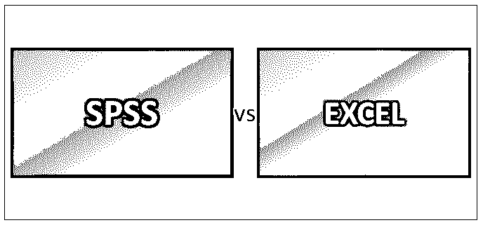

# SPSS 与 EXCEL

> 原文：<https://www.educba.com/spss-vs-excel/>

## SPSS 与 EXCEL 的区别

SPSS 被称为社会科学的统计软件包。[就统计打包工具而言，SPSS 是主要的](https://www.educba.com/what-is-spss/)市场占有者，这些工具可以有效地用作数据处理和存储的衍生工具。就交互式批处理和非交互式批处理而言，它基本上用于批处理。

它是由 SPSS Inc .孵化的产品，然后在 2009 年被 IBM 收购，归入旗下，并在 2015 年版本中被重新命名为 IBM SPSS Statistics。目前，它有一个稳定的 V-2015 版本。

<small>Hadoop、数据科学、统计学&其他</small>

SPSS 带有一个名为 PSPP 的开源版本。它很好地服务于统计过程和数据操作技术的制定，只有极少数例外，它们正被用于大型数据块的专业操作。它有一个非常好的开源版本属性，它不会在将来过期，你可以在你想使用的时候继续使用。

SPSS 提供了具有更多分析特征的图形。在 SPSS 中创建了标准图形后，您可以突出显示数据或范围等。SPSS 还允许你输出图形为 HTML5 /。mht 文件。这使得它们可以通过网络浏览器访问。

Excel 允许用户以表格格式存储信息，并以无数种方式与数据交互。最常见的是对数据进行排序和过滤，以及使用公式和数据透视表来操纵数据以创建新的见解。

Excel 还允许多种导入和导出数据的方法，从而允许将数据集成到工作流中。它还拥有自己的编程能力，可以自动执行步骤或创建自己的自定义功能，即 VBA。

Excel 是用于数据输入和创建记录的工具，可以根据用户需求进一步使用和操作，无论是操作还是管理数据，它都是一个非常可行的工具。它还提供了使用外部数据库进行分析、制作报告等的灵活性。因此节省了大量时间。最新版本的 Excel 拥有高级图形工具和可视化技术。

### SPSS 与 EXCEL 的比较

下面是 SPSS 和 EXCEL 的 8 大区别:

### SPSS 和 EXCEL 的主要区别

以下是要点列表，描述了 SPSS 和 EXCEL 之间的主要区别:

1.SPSS 是用于计算的工具，包括不同的主题，如数据存储和数据格式。，而 Excel 也包含数学概念，如统计、代数、微积分、高级统计等。,

2.SPSS 让我们了解如何批量构建进程，如何工作，以及编程区域的内存管理。Excel 向我们展示了如何使用数据来研究如何存储、处理和操作数据，以减少冗余并使其对进一步使用有意义。

3.SPSS 使我们对计算存储的利用和存储系统的效率有了详细的了解。Excel 揭示了如何从各种格式的数据中提取信息和知识。

4.SPSS 子领域包括计算、概率理论、推理、离散结构和数据库。Excel 包含了更加公式化和简单的数学运算和分析。

5.SPSS 是主要的批处理和统计工具，而 Excel 是标准的数据处理应用程序。

6.SPSS 完全是关于有效地使用数据操作技术来获取好的结果，而 Excel 是关于安全地处理和存储数据。

7.SPSS 是完全批处理的统计，而 Excel 是数据计算和公式技术。

8.SPSS 正随着先进的概念和更高效、更先进的算法在 IBM 下发展。Excel 每天都在快速增长，这使得高效处理和维护它变得更加复杂，但仍然需要更多的改进。

9.SPSS 处理统计算法，更侧重于数据操作。Excel 是数学和多种格式的数据存储的结合。

### SPSS 和 EXCEL 对照表

下面是 SPSS 和 EXCEL 的对照表。

| **BASIS FOR**

**比较**

 | **SPSS** | **EXCEL** |
| **定义** | 社会科学统计软件包，为数据的统计分析而设计的工具。 | 微软的产品，用于数据输入和数据操作，以存储一些信息。 |
| **用途** | 按照 IBM 指南进行统计计算和数据处理。 | 使用微软定义的公式化操作管理和存储数据。 |
| **好处** | 速度和性能 | 减少数据冗余 |
| **实时使用量** | 使用先进的超高速设备，如超级计算机 | 维护和处理大量客户数据 |
| **学术界** | 存在于 1980 年，多年来一直在 SPSS 的保护下，现在在 IBM 的保护下 | 随着科学技术的发展而存在和发展 |
| **行业** | 数据科学家/分析师是在这个领域学习后要成为的职业 | 数据科学家/分析师是在这个领域学习后要成为的职业 |
| **应用程序** | 适用于所有技术行业和大型公司 | 适用于需要管理大规模敏感数据的公司 |
| **字段** | 涵盖整个技术领域，是数据科学的超集 | 计算机科学的一个分支，使用不同的方法和技术研究数据 |

### 结论

最后得出结论，SPSS 和 Excel 之间存在巨大的差异。Excel 是电子表格软件，SPSS 是统计分析软件。

在 Excel 中，您可以执行一些统计分析，但 SPSS 更强大。SPSS 有内置的数据操作工具，如重新编码，转换变量，在 Excel 中，如果你想做那个工作，你有很多工作。

SPSS 允许您执行复杂的分析，如因子分析、逻辑回归、聚类分析等。等等。

在 SPSS 中，每一列都是一个变量，Excel 不会以这种方式处理列和行(在处理卷和行时，SPSS 更类似于 Access，而不是 Excel)。

Excel 不会给你一个可以轻松复制你所采取的确切步骤的书面记录。当变量和观察值的数量开始变得非常大时，它也开始变得难以使用。

但是 SPSS 和 EXCEL 在各自的领域都非常好地为你服务。所以，SPSS vs EXCEL 都是各自领域的王者。

### 推荐文章

这是 SPSS 与 EXCEL 之间差异的指南。在这里，我们讨论了 SPSS 与 EXCEL 的直接比较、关键差异以及信息图和比较表。您也可以阅读以下文章，了解更多信息——

1.  [了解 H](https://www.educba.com/html5-vs-flash/) [TML5 vs Flash](https://www.educba.com/html5-vs-flash/) 的 10 个最佳区别
2.  [监督学习与深度学习——5 个最有用的对比](https://www.educba.com/supervised-learning-vs-deep-learning/)
3.  [Java 与 Python——你必须了解的 9 大重要对比](https://www.educba.com/java-vs-python/)
4.  [Hadoop vs Cassandra——找出 17 个惊人的差异](https://www.educba.com/hadoop-vs-cassandra/)
5.  [预测分析与描述分析——哪个更好](https://www.educba.com/predictive-analytics-vs-descriptive-analytics/)

