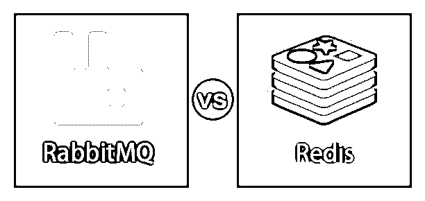

# rabbitmq vs 雷耶斯

> 原文:# t0]https://www . educba . com/rabbitq-vs-redis/

## RabbitMQ 和 Redis 的区别

RabbitMQ 是使用最广泛的开源消息代理之一。它最初实现了高级消息队列协议(AMQP ),但已经扩展到支持面向流文本的消息协议(STOMP)、消息队列遥测传输(MQTT)和其他协议。它是用 Erlang 写的。Redis 是一个开源的内存数据源，它可以充当消息代理、数据库和缓存。它支持各种数据结构，如字符串、哈希、列表、集合、带范围查询的排序集合、位图、超对数、带 radius 查询的地理空间索引和流。它速度很快，重量很轻。在这里，我们将讨论 RabbitMQ 与 Redis 之间的 9 大区别，并详细解释。

### RabbitMQ 和 Redis 的面对面比较(信息图表)

以下是 RabbitMQ 与 Redis 的 9 大区别:

<small>Hadoop、数据科学、统计学&其他</small>

### RabbitMQ 和 Redis 的主要区别

让我们看看 RabbitMQ 和 Redis 之间的主要区别如下:

1.Redis 是一个可以用作消息代理的数据库。另一方面，RabbitMQ 被设计成一个专用的消息代理。在大多数情况下，RabbitMQ 作为消息代理比 Redis 表现得更好。RabbitMQ 保证消息传递。这是通过以下方式实现的:

*   **消息持久性:**消息一旦存储在 RabbitMQ 中就不会丢失。
*   **消息确认:**消费者在成功消费消息后向生产者发送确认。

2.Redis 在使用其发布/订阅机制时不保证消息传递。如果订阅者不活跃，它将不会收到它订阅的信息。RabbitMQ 除了支持转换消息之外，还支持持久消息。RabbitMQ 持久层是为了在大多数没有配置的情况下提供合理的高吞吐量。

*   持久层由两个组件组成:队列索引和消息存储。队列索引负责维护关于给定消息在队列中的位置以及它是否已被传递和确认的信息。因此，每个队列有一个队列索引。
*   消息存储是消息的键值存储，由服务器中的所有队列共享。消息(正文和任何元数据字段:属性和/或头)可以直接存储在队列索引中，也可以写入消息存储。从技术上讲，有两个消息存储库(一个用于临时消息，一个用于持久消息)，但它们通常被一起视为“消息存储库”。

Redis 不支持持久消息，因为它是内存中的数据存储。

3.RabbitMQ 通过使用 SSL 证书来加密数据，允许您使用额外的安全层。安全套接字层(SSL)是在服务器和客户端之间建立加密连接的最流行的安全技术之一。另一方面，Redis 本身不支持 SSL，为了启用 SSL，您必须选择付费服务。

Redis 建议使用 Spiped 来加密消息。Spiped 是一种工具，用于在套接字地址之间创建对称加密和认证的管道，这将使我们能够连接到一个地址(例如，本地主机上的 UNIX 套接字)并透明地建立到另一个地址的连接(例如，不同系统上的 UNIX 套接字)。

4.不同之处在于消息流经代理的方式。

**RabbitMQ:**

*   生产者向交易所发布消息。创建交换时必须指定类型。
*   交换机接收消息，现在负责路由它。交换将各种消息属性作为路由关键字考虑在内，这取决于交换类型。
*   现在，必须创建从 exchange 到队列的绑定。交换将根据消息属性将消息路由到队列中。
*   消息将留在队列中，直到被消费者使用。
*   消费者成功处理消息，然后从队列中删除这些消息。

**再说一遍:**

*   制作人向 Redis 频道发布消息。Redis 支持两种通道:文字通道和模式匹配通道。
*   订户表达了对一个或多个频道的兴趣。
*   消息从一个通道发送到订阅该通道的所有订户，这里没有基于消息属性的路由概念。

### rabbitmq 与 Redis 的比较表

下表总结了 RabbitMQ 与 Redis 之间的比较:

| **RabbitMQ** | **再说一遍** |
| 它是一个专用的消息代理。它广泛应用于高度集中和分布式系统的实现中。 | 它可以充当消息代理、数据库和缓存。它非常快且轻量级，因此吸引了全球开发者的注意。 |
| 它可以扩展到每秒发送大约 5 万条消息。 | 它可以扩展到每秒发送大约一百万条信息。 |
| 它支持强大的消息路由。当我们需要在特定的服务器、服务器组或所有服务器上运行相同的作业时，这很有用。应用程序发送一条消息，交换将根据路由关键字进行路由。 | 它支持消息代理的基本操作。对于强大的消息路由，人们不会选择 Redis。 |
| 它可以很容易地配置为使用 SSL，从而提供了一个额外的安全层。 | 你必须单独选择 SSL，这是一项付费服务。 |
| 它支持持久消息和瞬时消息。如果开发人员需要存储消息以备失败时重新处理，他们会更喜欢 RabbitMQ。 | 它只支持瞬时消息。对于实时应用程序，开发人员更喜欢 Redis 而不是 RabbitMQ。 |
| 它本质上支持集群，并且在这方面优于 Redis。 | Redis 3.0 中引入了集群。 |
| 它支持点对点和发布-订阅消息技术。 | 它只支持发布-订阅机制。 |
| RabbitMQ 比 Redis 更好地处理大型消息。 | 它更适合较小的消息。对于较大的消息(> 1 MB)，延迟非常高 |
| 它保证了消息的传递，因此在您无法承受消息丢失的情况下更为可取。 | 它不保证每封邮件都能送达。 |

### 结论

根据您的用例选择消息代理非常重要。由于 Redis 提供了极快的服务和内存中的能力，在持久性不太重要的情况下，您应该更喜欢用它来短期保留消息。另一方面，当需要复杂的路由时，您会更喜欢 RabbitMQ。

### 推荐文章

这是 RabbitMQ vs Redis 的指南。在这里，我们讨论 RabbitMQ 与 Redis 的介绍，信息图和比较表的主要区别。您也可以浏览我们推荐的其他文章，了解更多信息——

1.  [主键 vs 外键](https://www.educba.com/primary-key-vs-foreign-key/)
2.  [Go vs Ruby 对比表](https://www.educba.com/go-vs-ruby/)
3.  [RabbitMQ vs SQS |最大差异](https://www.educba.com/rabbitmq-vs-sqs/)
4.  [hazel cast 与 Redis 的主要差异](https://www.educba.com/hazelcast-vs-redis/)

