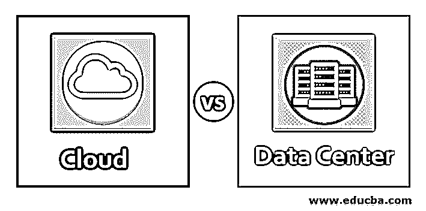

# 云与数据中心

> 原文：<https://www.educba.com/cloud-vs-data-center/>

## 云与数据中心的区别

当数据在线存储在互联网上，以便用户可以随时在线访问它被称为云。有不同类型的云，如私有云、公共云和混合云。这些提供不同模式的软件，它们的安全性是不同的。我们可以将云称为异地服务。数据中心也称为本地服务，软件和应用程序存储在本地系统中。资源在组织内部使用，与云相比，数据中心提供的安全性更高。由于应用程序存在于组织附近，因此称为本地计算。

### 云与数据中心的直接比较(信息图表)

以下是云与数据中心的 19 大对比:

<small>Hadoop、数据科学、统计学&其他</small>

### 云与数据中心的主要区别

一些主要的关键差异如下所述:

*   数据中心和云的主要区别在于，应用程序是在本地提供的，用户可以在需要时随时访问，无需连接互联网。在云中，应用程序是在线的，需要网络连接才能访问。
*   数据存储在云中的公共存储库中，而数据存储在数据中心的本地存储库中。存储库由云中的服务提供商负责，而那些由数据中心的开发人员负责。
*   数据中心需要投资来建立和维护存储库。小公司和初创公司可能会觉得很难找到投资。云不需要大量投资，因为它是一种订阅，公司可以很容易地找到资金投入云部署。
*   大型组织开始使用数据中心。小公司和初创公司采用云部署。预算和资源的减少迫使这些公司采用第三方服务提供的云服务。组织发现投资存储库和瞄准资源比冒安全风险更容易。
*   组织在从数据中心恢复数据或应用程序时感到艰难和懊悔，因为这需要很长时间，而且数据没有完全恢复。如果出现问题，从云中恢复数据并不难。数据分布在几个远程服务器上，至少调用一次就可以轻松恢复。
*   云的基础设施可以根据需要随时扩展，因此额外的存储对于使用云的公司来说不是负担。然而，当数据中心需要额外的存储时，这意味着扩展本地服务器，这又会导致巨额投资。
*   云比数据中心更快。这是因为所有的数据都存储在不同的服务器上，在使用应用程序时不会产生任何杂音。数据中心的速度取决于组织的网络和服务器中存储的数据量。
*   就像我们的应用在手机或系统中更新一样，云更新了公司的软件。这不会在数据中心自动发生，开发人员需要注意这一点。
*   安全性是大公司关心的问题，因此他们将应用程序存储在内部。这导致了数据中心。由于应用程序存储在云中(可能是公共的)，安全性不能作为云中的一项优势来提供，尽管服务提供商也提供了同样的优势。

### 云与数据中心对比表

让我们讨论一下云与数据中心之间的主要比较:

| **云** | **数据中心** |
| 云易于扩展，并且只需要少量投资。 | 数据中心不容易扩展，因此需要大量的服务器投资。 |
| 云意味着一个简单且容易理解的环境，即使是非专业人士也能理解。 | 数据中心的架构并不简单，维护方式只有开发人员才能理解。 |
| 成本更少。 | 成本高。 |
| 云中的服务提供商做维护。 | 管理组织数据库的开发人员做维护工作。 |
| 第三方提供商控制着组织的计算环境。这对本组织的完整性构成了严重威胁。 | 同一组织的开发人员或资源控制着该组织的计算环境，因此它将一直得到维护。 |
| 性能和可靠性在很大程度上取决于云提供商。 | 性能和可靠性取决于组织。 |
| 不建议在云中运行关键项目。 | 关键项目最好在数据中心运行。 |
| 容量可以根据公司在云方面的需求进行扩展。 | 数据中心的容量有限。 |
| 云不容易定制。 | 数据中心很容易定制。 |
| 任何人只要有适当的凭证，就可以从任何地方通过互联网访问数据。这给数据带来了安全威胁。 | 任何地方的任何人都无法访问数据。只有具有适当凭证的授权人员才能从组织访问服务。 |
| 云与组织或其网络没有物理连接。 | 数据中心在物理上与组织或其网络相连。 |
| 订阅后立即提供云服务。 | 数据中心需要时间来建立，并且在订阅后不容易使用。 |
| 数据是从互联网上收集的。 | 数据是从组织的网络中收集的。 |
| 云需要资源来存储网络中的服务器。 | 服务器存储在数据中心。 |
| 如果使用公共云，资源将与其他方共享。 | 这些资源不会与第三方共享，在组织内部是完全安全的。 |
| 使用云可以轻松存储大量数据。 | 最好在数据中心存储少量数据，因为存储大量数据需要时间。 |
| 云是一种虚拟基础设施。应用程序运行在任何虚拟服务器上，并存储在服务器的任何位置。 | 数据中心是物理基础设施。应用程序只在指定的服务器上运行。 |
| 云服务仅按需提供。 | 数据中心始终可用。 |
| 云是容错的，被认为是一个可行的选择。 | 数据中心不具备容错能力，可能会出现相关故障。 |

### 结论

可以将云和数据中心结合起来，在一个组织中共同工作，其中云负责不太重要和重复的项目，而数据中心负责关键任务。组织应该权衡选项和好处，并考虑公司的计算方法。

### 推荐文章

这是云与数据中心的指南。在这里，我们通过信息图和比较表来讨论云与数据中心的主要区别。您也可以浏览我们推荐的其他文章，了解更多信息——

1.  [数据分析 vs 数据分析](https://www.educba.com/data-analytics-vs-data-analysis/)
2.  [数据科学 vs 数据可视化](https://www.educba.com/data-science-vs-data-visualization/)
3.  [数据科学家 vs 数据挖掘](https://www.educba.com/data-scientist-vs-data-mining/)
4.  [私有云 vs 公有云](https://www.educba.com/private-cloud-vs-public-cloud/)

