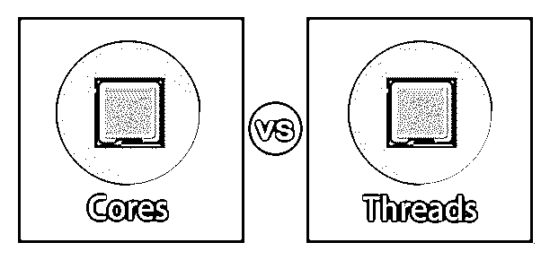

# 核心与线程

> 原文：<https://www.educba.com/cores-vs-threads/>

## 内核与线程的区别

在本文中，我们将了解内核与线程。核心是对其特征或存在很重要的东西的一部分。通常，CPU 被表示为计算机系统的核心。单核处理器和多核处理器是两种不同类型的处理器。线程被定义为并行编程的执行单元。多线程使 CPU 能够在一个进程上同时运行多个任务。也可以在资源共享时单独执行。但两者对彼此都很重要。

### 内核与线程之间的直接比较(信息图)

以下是内核与线程之间的 9 大对比:

<small>Hadoop、数据科学、统计学&其他</small>

### 内核与线程的主要区别

让我们讨论一下内核与线程之间的一些主要区别:

#### 1.型芯和螺纹的加工

内核是一个硬件组件，执行并能够一次运行一项任务。但是多核可以支持各种应用的执行，而不会出现任何中断。如果用户计划设置一个游戏，内核的一些部分需要运行游戏，一些需要检查其他后台应用程序，如 skype、chrome、脸书等。但是 CPU 应该支持多线程来有效地执行这些，以便在最短的响应时间内从应用程序中获取相关信息。多线程只是使进程快速而有条理，并转化为更好的性能。它会增加功耗，但很少会导致温度升高。因为这些特性已经内置在支持多线程的芯片中。如果用户想升级他的系统，这取决于应用程序的类型，因为同时运行许多软件会提高系统的性能。如果用户想玩高端游戏，那么他应该更喜欢多线程处理器。

#### 2.处理器的多任务处理

内核支持并行执行或多核进行多任务处理。单个任务被细分为同时精确执行的多个任务。一旦开始，所有的进程都在执行。但是进程的细分任务是并行执行的。因此，这是一个在商业处理器中发现和应用的实时过程。

缓存未命中是指处理器尝试读取 CPU 缓存中加载的内存。如果处理器无法管理来自不同内存模块组件(如永久存储器或 RAM)的信息，则会导致延迟，从而降低 CPU 的性能。执行并行线程使处理器能够获取并行线程中列出的信息，并减少空闲时间。无论何种类型的应用程序，它都能提高性能。超线程使处理器能够共享数据，并通过在内核之间分配资源来加速解码方法。

多核在同一位置构建两个或更多内核，通过将时钟速度保持在高效水平来增强处理器的能力。双核处理器以与单核处理器相同的速度处理程序，从而以高效的速度运行。如果时钟速度提高一倍，那么多核处理器消耗的能量最少。

#### 3.关于处理器的重要说明

今天，更新的 CPU 支持多线程处理，它可以用来在一个内核中的多个线程中执行一个共同的任务。超线程是由英特尔开发的，用于支持最终用户的个人电脑中的并行执行。操作系统的并发性被描述为系统在重叠的时间间隔内执行许多程序的能力。单核处理器的问题是它的计算速度和增加的时钟时间。因此，多核被开发来纠正这一问题，通过在同一部分开发两个内核来增加操作功率并保持时钟水平的有效速度。多核允许用户根据喜好创建许多晶体管。

核心提高特定时期完成的工作总量，线程提高 GUI 的[响应、运行速度和吞吐量。内核利用内容切换，线程使用大量 CPU 来管理大量任务。](https://www.educba.com/what-is-gui/)

### 对照表

让我们来看看内核与线程之间的主要对比。看完这张表后，你会对这个软件的特性有更多的了解。

| **关键属性** | **核心** | **线程** |
| **定义** | 核心被定义为供给 CPU 执行其动作的任务。核心是不同的物理组件 | 线程支持内核以有效的方式完成任务。线程是处理内核任务的虚拟组件。 |
| **工作方法** | 核心是基于重型起重过程。一次可以执行的任务数量限制为一个。在游戏方面，它支持多核。如果前一个线程不可靠或者包含的数据不足以管理任务，它只考虑下一个线程 | 线程被应用于核心以有效地管理其任务并处理它们的 CPU 调度。 |
| **部署** | 它可以通过交错操作来实现。 | 通过利用多个 CPU 的处理器来执行线程 |
| **处理单元** | 甚至单个处理单元也成为可能 | 它需要多个处理单元来执行任务并将任务分配给内核 |
| **例子** | 同时执行许多应用程序 | 通过网络爬虫在集群上执行。 |
| **优点** | 给出已完成任务的增加计数。 | 该过程提高了计算速度和吞吐量，最大限度地降低了部署成本，并提高了 GUI 响应速度 |
| **限制** | 在负载增加时，它需要更多的功耗。 | 如果有许多进程要同时执行，那么操作系统、内核和线程之间就有机会进行协调 |
| **应用程序** | 当内核和线程协同工作时，产量可能会增加。所以它主要应用在游戏中 | 在与 core 的结合中，它被广泛应用于基于面向生产力的软件中，例如用于客户级处理器的视频编辑 |
| **属性** | 它支持并行执行或多核。该任务被细分为许多部分，每个部分完成其分配的任务。但是它只能在用于商业目的的多核进程中执行。 | 多线程是在内核中执行多个线程来运行一个共同任务的独特功能。智能手机给出了多线程的一个活生生的例子。要打开一个应用程序，它从互联网上提取数据，并将其呈现给 GUI 以显示所需的内容。 |

### 推荐文章

这是核心与线程的指南。在这里，我们通过信息图和比较表来讨论内核与线程的主要区别。您也可以浏览我们的其他相关文章，了解更多信息——

1.  [大数据 vs 数据仓库](https://www.educba.com/big-data-vs-data-warehouse/)
2.  [数据科学 vs 数据可视化](https://www.educba.com/data-science-vs-data-visualization/)
3.  [人工智能 vs 商业智能](https://www.educba.com/artificial-intelligence-vs-business-intelligence/)
4.  [云计算 vs 雾计算](https://www.educba.com/cloud-computing-vs-fog-computing/)

