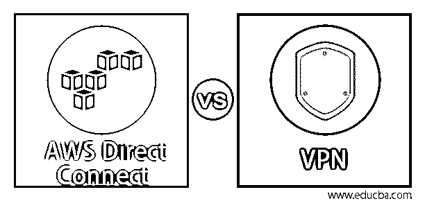

# AWS 直连与 VPN

> 原文：<https://www.educba.com/aws-direct-connect-vs-vpn/>

## AWS 直连与 VPN 的区别

在内部服务和 AWS 云服务之间建立连接的云服务解决方案称为 AWS Direct Connect。这是由云提供的专用网络解决方案，因此可以在任何一个网络位置和网络之间创建连接。在虚拟专用网络中，专用网络扩展到公共网络，以便用户可以从共享或已知网络发送和接收数据，就像从自己的专用网络接收数据一样。用户从 VPN 中选择服务器，因此数据从 VPN 而不是从计算机传输。

### AWS 直连与 VPN 的直接比较(信息图表)

以下是 AWS Direct Connect 和 VPN 之间的主要比较:

<small>Hadoop、数据科学、统计学&其他</small>

### AWS 直连与 VPN 的主要区别

让我们讨论一些主要的关键差异:

*   AWS 直接连接到虚拟私有云需要两个端口连接，而 AWS 管理的 VPN 只需要一个 VPN 连接到 VPC。
*   当与直接连接比较时，VPN 的性能被测量到 4GB 或更少。直接连接的性能从 1GB 开始，并根据链路聚合组连接扩展到 40GB。
*   基于连通性，在基于 VPN 的云中只能有两个 VPN 隧道。在直接连接中，连接覆盖整个 AWS 区域。
*   与 AWS Direct Connect 相比，VPN 的成本非常低。此外，还有一个按连接小时定价的 VPN 选项，这是 Direct Connect 不提供的。
*   Direct Connect 中的加密连接是在用户路由器和 AWS Direct Connect 路由器之间创建的。在 VPN 中，连接是用户网络与 VPN 网络之间的连接。
*   由于 VPN 连接到公共网络，因此安全性问题更加突出。直连提供了更高的安全性，是需要更高工作安全性的企业的首选。
*   在 Direct Connect 中提供了对所有 AWS 区域的访问，以便可以很好地利用 VPC 和其他亚马逊服务。在 VPN 中，不提供对区域的访问，并且性能并不总是可预测的。
*   开始使用 AWS 的企业可以使用 VPN，因为它易于设置，并且安装比直接连接更快完成。而要求更高安全性并需要访问其他亚马逊服务的成熟企业可以使用 Direct Connect。安装需要有经验的人员在场，并且设置不像 VPN 那样容易。
*   VPN 的网络性能很差，但它似乎比亚马逊直接连接的 VPN 好得多。
*   直接连接中的连接是通过以太网光缆，而 VPN 中的连接是通过加密连接。

### AWS 直连与 VPN 的比较表

让我们看看 AWS Direct Connect 和 VPN 之间的主要比较:

| **AWS 直接连接** | **虚拟专用网** |
| 客户可以轻松访问 AWS 环境，因为连接是通过光纤网络完成的。 | AWS 环境不容易在 VPN 中访问，因为它是加密连接。 |
| 从全球网络到任何数据中心或任何 AWS 区域的私有连接都可以实现，因为它在业务中更加安全和可信。 | 没有建立私有连接，传输的数据通过公共或共享网络共享，因此共享的数据在企业中不可信。 |
| AWS 直连的成本更高，性能无法与 VPN 相比。 | VPN 提供了与网络和 AWS 的低成本连接，但性能不如 AWS 直接连接。 |
| 带宽吞吐量更大，因为直连的性能和效率更高。 | VPN 中的带宽吞吐量以及网络的效率和性能更低。 |
| 网络不会波动，并且在整个网络连接过程中以及在传输数据时提供一致的体验。 | 由于网络是由共享网络和公共网络连接而成的，因此网络总是在波动，在网络波动时数据传输并不容易。 |
| 它不依赖于互联网和网络，因为光缆将内部服务与 AWS 服务连接起来。 | VPN 依赖于互联网和网络，网络上的波动意味着数据无法正常传输。不使用电缆来连接内部服务和网络服务。 |
| 在 AWS 直连网络中可以建立一个或多个专用网络连接，云服务可以得到最大程度的利用。 | 专用网络连接在 VPN 中受到限制。所有的亚马逊服务都无法使用，因为连接是不安全的，并且在网络内。 |
| 链路聚合组可用于直接连接，将各种连接连接成一个连接，并有效地管理连接。 | VPN 中不使用链路聚合组，并且不能在网络中建立多个连接。因此，连接得不到有效管理。 |
| 没有提供不同的路由选项，因为路由不是直接连接中的主要问题。 | 提供动态和静态路由选项，以便网络和用户可以使用灵活的路由配置。 |
| 直接连接的可用性不成问题，因为它根本不使用公共网络或互联网连接。因此没有必要在不同的位置提供不同的数据中心。 | 通过使两个物理上位于不同位置的数据中心可用，VPN 连接的可用性得到了提高，因此 VPN 连接不会中断。 |
| 基于端口速度，除了每 GB 数据传输之外，端口小时费用在 AWS Direct 中计算。直接连接是昂贵的，因为它提供了一个安全的业务。 | 费用按 VPN 连接小时数和每 GB 数据传输量计算。VPN 的成本较低，可以作为开始使用 AWS Direct Connect 的一项举措。这很容易使用和安装。VPN 中不考虑端口小时费，因为 VPN 中没有使用端口。 |

### 结论

AWS Direct Connect 可以与 AWS VPN 结合使用，以便将两者的优势联系起来，并通过使用另一种服务来减轻限制。使用混合连接和 VPN 的优点是降低网络成本、提高效率和增强安全性。企业更喜欢直接连接和 VPN，以获得无缝服务。

### 推荐文章

这是 AWS 直连与 VPN 的对比指南。这里我们讨论信息图和比较表的主要区别。您也可以浏览我们的其他相关文章，了解更多信息——

1.  [vs 兰](https://www.educba.com/vlan-vs-lan/)
2.  [零点零分对卡夫卡](https://www.educba.com/zeromq-vs-kafka/)
3.  [内核对线程](https://www.educba.com/cores-vs-threads/)
4.  [云 vs 数据中心](https://www.educba.com/cloud-vs-data-center/)

