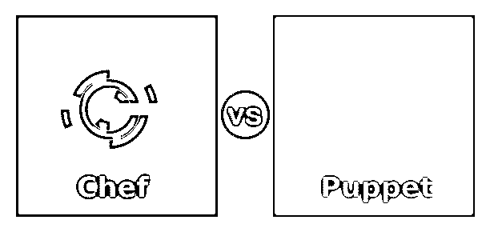

# 厨师大战木偶

> 原文：<https://www.educba.com/chef-vs-puppet/>

## 厨师和木偶的区别

基础设施代码在 Chef 配置工具中定义。它主要通过编写代码来管理基础设施。厨师是由亚当·雅各布在 2009 年开发的。厨师可以与基于云的平台集成。厨师可以配置和维护公司的服务器。Chef 支持 Linux 和 Microsoft Windows。Chef 中使用的语言是 Ruby 和 Erlang。2005 年卢克·卡尼斯创建的木偶实验室开发了一个木偶。Puppet 用于长时间部署。Puppet 的文档很好，可以在很多平台上使用。Puppet 在配置管理方面速度很快。它定义了系统的软件和配置要求。

### 厨师和木偶的面对面比较(信息图)

以下是厨师和木偶的 15 大对比:

<small>Hadoop、数据科学、统计学&其他</small>

### 厨师和木偶的主要区别

因此，让我们来看看主要的区别。

*   chef 可以被认为是对节点进行编程并编写控制节点的代码，而 Puppet 是对配置文件的描述。由于配置文件，系统管理员更喜欢 puppets，而开发人员由于他们的编程和开发背景，更喜欢 Chef。
*   Puppet 是用 Ruby 编写的，支持 Ruby 的领域特定语言。Puppet 中使用的语言是声明性的，类似于 JSON 或 XML。期望的状态应该首先在约束工具使用的 Puppet 中描述。chef 是用 Ruby 用 DSL 写的，有原型编程。在使用 Ruby 的所有特性时，这种语言是必不可少的。
*   chef 是通过 shell 脚本安装的，对代码来说不够安全。Puppet 是通过支持的存储库中的手动指令安装的。Puppet 中的节点编排需要 DNS 设置。对于配置，Puppet 需要客户端系统配置的客户端证书。使用 Puppet DSL 管理配置。在 Chef 中，使用包含所有配置的工作站，将配置传递给主服务器。Ruby DSL 用于管理 Chef 中的配置。第三方可以用来安装木偶和厨师。
*   诸如菜谱和烹饪书之类的配置文件是在 Chef 中创建的，而清单和模块是在 Puppet 中创建的。这些术语解释了配置的资源和一般概念，用户必须熟悉配置文件。所有的烹饪术语都在厨师项目中使用。厨师使用测试厨房进行测试，这也是一个烹饪术语，而木偶则使用 RSpec 和 Cucumber 等标准工具进行测试。
*   在 Puppet 中，有许多用于 Emacs、Vim、Atom、Sublime Text 和 IDEs 的插件。虽然我们在 Chef 中有插件，但是它们并没有在项目中使用，也没有完全配置。
*   厨师和木偶规定 DevOps 工具。Chef automate 被称为 Chef 应用程序自动化供应中的一站式自动化。Puppet automation 被称为 Puppet Enterprise Console，它使用户能够自动化 Puppet 中的应用程序。
*   在 Puppet 中，它检查 Puppet DSL 在 Ruby 上的进度。DevOps 自动化是 Chef 的重点。Puppet 中的 push 方法将配置分发到所有节点。Chef 仅支持拉过程。厨师的价格比木偶还低。Puppet 是所有配置工具中最昂贵的。

### 厨师与木偶对照表

让我们来看看厨师和木偶之间的顶级对比。

| **厨师** | **木偶** |
| 需要一个 Ruby 程序员来管理 Chef 工具。Ruby 语言被用在配置管理的内部和外部，并以更大的方式提供帮助。 | 只有懂 puppet DSL 的人才能和 puppet 一起工作。在 Puppet 配置中不需要其他编程语言。 |
| 大厨确实管理大企业，以可靠著称。 | Puppet 管理大型企业的基础设施，用于长期部署。 |
| 安装过程需要第三方的帮助，因为在安装过程中不会描述错误。 | Puppet 中的安装过程很困难，因为错误不会显示出来。通过 Puppet 中的代码和文档给出手动指令。 |
| 可以更快地学习新的资源和模块。教程说学习可以在一个小时内完成，包括测试文件。 | 学习新的资源和文件需要时间，而且学习速度不如厨师快。完成学习需要三个小时。 |
| 文档结构良好，即使对于初学者也很容易理解。现有的虚拟机系统可以用来理解和学习 Chef。 | 文档很深入，用户应该在工作前先浏览文档。为木偶工具提供了许多课程和培训。 |
| Chef 中没有主节点，只有备份服务器。Chef 也遵循客户机-服务器架构，但是 Chef 中没有主节点和从节点。 | 当主节点出现故障时，该角色由另一个主节点处理。基本上是多主系统。它遵循客户机-服务器体系结构，并且在该体系结构中存在许多主机。 |
| 一个厨师主要是面向开发者的。编写代码来管理用于保护文件和管理配置设置的工具。 | Puppet 基于它的系统管理员。没有需要编写和开发的代码。管理员的角色是配置文件，该工具在此过程中有所帮助。 |
| Chef 遵循过程式编码。有一个主服务器负责文件存储，如果它出现故障，其他服务器会代替它。 | Puppet 具有声明式风格。它遵循 XML 格式，文件采用主从结构。 |
| 厨师比木偶受欢迎，因为它容易理解和学习。服务器系统可以很容易地存储文件，任何主机系统都可以用来学习厨师。 | 由于安装困难和文档，与 Chef 相比，Puppet 并不是很受欢迎。在木偶中工作总是需要额外的训练。 |
| Chef 不执行应用程序部署。没有为此作出规定。此外，在此配置工具中也不进行查询。 | 在 Puppet 中部署应用程序并不容易，但它在一定程度上完成了部署。管理员应该知道应用程序的部署。服务器的查询也很困难，需要仔细的文档记录。 |

### 结论

木偶和厨师主要侧重于配置，两者略有差异。Puppet 和 Chef 主要在 Unix/Linux 上工作，windows 在配置上用的不多。

### 推荐文章

这是厨师大战木偶的指南。在这里，我们用信息图和厨师与木偶的比较表来讨论关键的区别。您也可以浏览我们的其他相关文章，了解更多信息——

1.  [Ansible vs 木偶 vs 厨师](https://www.educba.com/ansible-vs-puppet-vs-chef/)
2.  [Terraform vs Ansible](https://www.educba.com/terraform-vs-ansible/)
3.  [立方 vs 码头](https://www.educba.com/kubernetes-vs-docker/)
4.  [ActiveMQ vs RabbitMQ](https://www.educba.com/activemq-vs-rabbitmq/)

