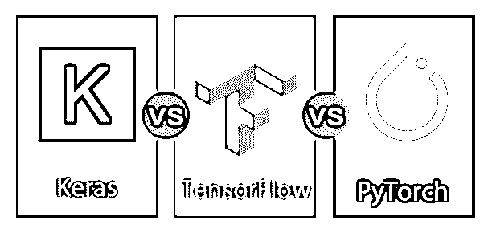

# Keras vs TensorFlow vs PyTorch

> 原文：<https://www.educba.com/keras-vs-tensorflow-vs-pytorch/>

## Keras 与 TensorFlow 和 PyTorch 的区别

数据科学家在深度学习中选择的最上面的三个开源库框架是 PyTorch、TensorFlow 和 Keras。Keras 是一个用 python 编写的神经网络库，可以在 TensorFlow 的顶层执行。它是专为深度神经网络中的稳健执行而设计的。TensorFlow 用于在数据流编程和机器学习应用中执行多项任务。PyTorch 是一个用于自然语言处理的机器学习库。

### Keras 与 TensorFlow 和 PyTorch 的面对面比较(信息图)

以下是 Keras 与 TensorFlow 和 Pytorch 之间的 10 大差异:

<small>Hadoop、数据科学、统计学&其他</small>

### Keras 与 TensorFlow 和 PyTorch 的主要区别

下面列出了 Keras、TensorFlow 和 PyTorch 的主要区别，如架构、功能、编程和各种属性。

*   **API 级别:** Keras 是一个高级 API，可以运行在 Theano、CNTK 和 TensorFlow 的顶层，因其快速开发和语法简单性而受到关注。TensorFlow 适用于低级和高级 API，而 PyTorch 仅适用于低级 API。
*   **框架的架构和性能:**Keras 的架构简单、简洁、可读性强，性能太低。TensorFlow 使用起来很死板，但是支持 Keras 性能更好。PyTorch 的架构很复杂，与 Keras 相比更难理解。但是 TensorFlow 和 PyTorch 的性能是稳定的，这提供了最高的性能，并且在较大的数据集上也提供了高效率。由于 Keras 的性能较低，它只适用于较小的数据集。
*   **调试过程:**简单网络的调试由 Keras 提供，经常需要。但是在 TensorFlow 中，调试是一个非常复杂的过程，而 PyTorch 与 Keras 和 TensorFlow 相比提供了灵活的调试能力。PyTorch 在神经网络中的操作描述了调试工具(如 PyCharm、ipdb 和 pdb)的有效计算时间。但是对于 TensorFlow，有一个叫做 tfdbg 的高级选项，它允许通过浏览所有 tensors 在特定运行时在会话范围内操作。因为它内置了 python 代码，所以不能单独使用 PDB。TensorFlow 的模式比 PyTorch 先进，拥有比 PyTorch 和 Keras 更广泛的社区。
*   **框架的适宜性**。:Keras 在小型数据集中最受青睐，可提供快速原型制作和扩展的大量后端支持，而 TensorFlow 在对象检测方面提供高性能和功能，可在大型数据集中实施。PyTorch 的灵活性和调试能力更强，可以在数据集的最小训练时间内适应。
*   **框架在神经网络中的表现:** PyTorch 具有多层和细胞级的开发递归网络类。图层的对象管理输入数据和单位单元中的一个时间步长，还表示具有双向属性的 RNN。因此，网络的众多层为电池提供了合适的包装，无需进一步优化。TensorFlow 由 dropout wrapper、多个 RNN 单元和单元级类组成，用于实现深度神经网络。Keras 由完全连接的层组成，GRU 和 LSTM 用于创建递归神经网络。

### Keras 与 TensorFlow 和 PyTorch 对比表

下面是 TensorFlow 与 Spark 之间的 10 大差异:

| **框架的行为参数** | **Keras** | **TensorFlow** | **指针** |
| **定义** | 神经网络库是开源的。 | TensorFlow 是一个开源的免费软件库 | 这是一个开源的机器学习库。 |
| **编码语言** | 它是一种编码。所有代码都写在一行中。 | 该库与 C、C++、Java 和其他编码语言紧密结合。通过用小代码对其编程来提高精度。 | 它只由 python 编写。PyTorch 的代码是用更大的线写的。 |
| **应用程序** | 它被设计成在神经网络中执行稳健的实验。 | 它被用来向机器教授多种计算技术 | 它用于构建自然语言处理和神经网络。 |
| **API 的等级** | 它可以在 Theano 和 CNTK 上执行，因为它有高级 API | 它由低级和高级 API 组成 | PyTorch 只关注数组表达式，因为它的 API 比较低级。 |
| **架构** | 它有一个可以理解的语法，可以很容易地解释。 | 它因其在各种平台上的快速计算能力而广受欢迎，但却没有难以解释的复杂体系结构 | 初学者对 PyTorch 的架构感到复杂，但他们对其深度学习应用感兴趣，并且也用于各种学术目的。 |
| **速度** | 它仅以最低速度运行 | 它以最高速度工作，从而提供高性能 | PyTorch 的性能和速度和 TensorFlow 差不多。 |
| **数据集** | 由于执行速度较低，它在较小的数据集中有效地运行。 | 它具有很高的管理大型数据集的能力，因为它具有最高的执行速度 | 它可以管理高维数据集中的高性能任务。 |
| **调试** | 管理员不需要任何频繁的调试过程 | 执行调试具有挑战性。 | 调试能力优于 Keras 和 TensorFlow |
| **人气** | 它广泛用于神经网络，支持卷积层和效用层。 | 它以自动图像捕捉软件和内部使用谷歌而闻名。 | 它之所以受欢迎，是因为它在深度学习网络上的自动微分，并支持具有 NN 模块、优化模块和自动签名模块的高功率 GPU 应用。 |
| **判决一瞥** | 它提供了多个后端支持和健壮的原型。 | 大型数据集上对象检测的高性能和功能。 | Flexibility.训练持续时间短。

有各种各样的调试。

 |

### 结论

PyTorch 简单且用户友好，而 TensorFlow 因其不全面的 API 而备受关注。Keras 和 TensorFlow 有一堵坚固的砖墙，但留下了用于通信的小孔，而 PyTorch 与 Python 紧密绑定，适用于许多应用程序。

### 推荐文章

这是一个 Keras vs TensorFlow vs PyTorch 的指南。在这里，我们讨论 Keras 与 TensorFlow 和 PyTorch 之间的区别，并通过信息图和比较表进行面对面的比较。您也可以浏览我们的其他相关文章，了解更多信息——

1.  [Python vs Groovy](https://www.educba.com/python-vs-groovy/)
2.  [TensorFlow vs Spark](https://www.educba.com/tensorflow-vs-spark/)
3.  [卡夫卡 vs 火花](https://www.educba.com/kafka-vs-spark/)
4.  [阿帕奇卡夫卡 vs 水槽](https://www.educba.com/apache-kafka-vs-flume/)

