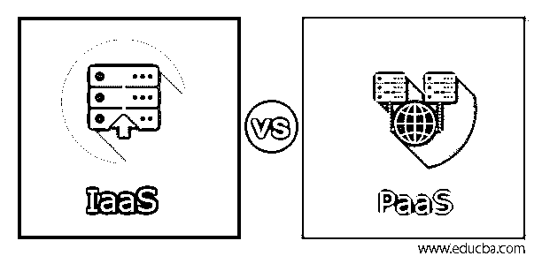
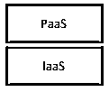

# IaaS vs PaaS

> 原文：<https://www.educba.com/iaas-vs-paas/>

## IaaS 与 PaaS 的区别

在本主题中，我们将了解两种最广泛使用的云服务。IaaS 和 PaaS 是云服务的类型，它们是一些主导因素，由于这些因素，当前的业务随着云体验而越来越受欢迎。在我们继续讨论之前，让我们看看一些有趣的事实

*   2018 年，IaaS 在总云使用率的 12%左右徘徊(2014 年为 6 %)。
*   PaaS 目前享有最受欢迎的云模型的地位，其份额高达 32%左右，预计到这个十年结束时会超过这一数字。

### IaaS 与 PaaS 之间的直接比较(信息图表)

以下是 IaaS 与 PaaS 的 6 大对比 **:**

<small>Hadoop、数据科学、统计学&其他</small>

### IaaS 与 PaaS 的主要区别

让我们从以下几点来讨论 IaaS 与 PaaS 之间的一些关键差异:

**1。**这些首字母缩略词有其含义，IaaS 代表基础设施即服务，而 PaaS 代表平台即服务

**2。**loud 提供商将根据 PaaS 为我们的业务提供各自的工作平台，而在 IaaS 中，云服务提供商将为我们的业务提供各自的基础设施。

**3。** IaaS 是计算的基础层，而 PaaS 是 IaaS 的顶层。让我们看看这些区块是如何排列的，如下图所示

**4。** IaaS 处理虚拟机、存储、服务器、网络负载平衡器，而 PaaS 处理运行时(如 Java。Net 运行时)、数据库(像 MySQL、Oracle) & webservers(像 tomcat 等。).

**5。**这两个类别下有多种操作系统(o/s ),但我们在每个类别下都提出了一些常用的操作系统

*   **IaaS:** Slap OS，Eye OS，vStar cloud OS & Megha OS。
*   **PaaS:** Zero PC，Jolicloud，SilveOS & xOS。

**6。**市场份额是一个更重要的细分市场；让我们看看有哪些数据可供我们使用免责声明–这些数据是由 Gartner 预测的。

*   **总市场份额:**:3830 亿美元
*   **IaaS 市场份额:**:716 亿美元
*   **平台即服务市场份额:**:148 亿美元

**7。**我们出于多种原因使用 IaaS & PaaS，但是在讨论的这一部分列出了一些重要的场景

#### PaaS

1.  因为服务器端组件是由供应商提供的，所以我们减少了开发时间。这让开发人员更少担心配置、维护和升级
2.  需要多种操作系统在语言方面有多种选择，这有利于开发人员从头开始工作并生成最小可行的产品(MVP)。
3.  当需要轻松协作时，PaaS 为远程和分布式环境提供了强大的协作功能。
4.  无需额外员工的高开发人力——无需雇用多人 PaaS 为其用户公司提供完整的开发包，如硬件和软件。

#### IaaS

*   **托管:**借助 EC2 计算云，人们可以轻松运行他们的网站、门户网站
*   **虚拟数据中心的需求:** IaaS 最适合虚拟数据中心
*   **数据分析:**数据分析是对你的企业(正面和负面)的研究；这也以令人难以置信的效率发展了巨大的数据处理。公司通常更喜欢将 IaaS 用于数据挖掘和分析。

**8。** IaaS 比 PaaS 更贵，因为在前一种情况下，我们为业务租用了完整的基础架构。

### IaaS 与 PaaS 对比表

下表总结了 IaaS 与 PaaS 之间的比较 **:**

| **参数** | **IaaS** | **PaaS** |
| **亚马逊** | EC2:弹性计算云是提供给用户的虚拟基础设施，他们可以根据需要使用它。在这一类别中还有其他的，像 S3，EBS，冰川和 VPC。 | Elastic Beanstalk 让您可以访问所有开发人员的工具，如 EC2 根实例，创建自定义 AMI，轻松将应用程序迁移到 Elastic Beanstalk。 |
| **现实生活中的例子** | IaaS 就像租赁一辆汽车/自行车；你可以把车/自行车开到任何你想去的地方，但是车/自行车不是你的。使用后你必须归还。如果你需要升级，那么你可能会选择其他的汽车/自行车。 | PaaS 就像坐出租车或出租车；在这里，我们(指用户)自己不开出租车；而是有专门的司机来做；我们只需要告诉我们的目的地，然后放松。司机什么都做。 |
| **谁使用它** | System administrator:因为他们管理所有的资源，如应用程序、数据和中间件。 | Developers:因为他们可以使用虚拟机和服务器，构建自己的应用程序，并管理自己的数据。 |
| **例题** | 这些类别下的一些常见示例有:

*   AWS EC2
*   Rackspace
*   Google computing engine (GCE)
*   Digital ocean
*   Magento 1 enterprise edition

 | 这些类别下的一些常见示例有:

*   AWS elastic beanstalk
*   Heroku
*   Windows Azure(主要用作 PaaS)
*   Force.com
*   开放班次
*   阿帕奇·斯特拉托斯
*   Magento business cloud

 |
| **利弊** | Pro

*   云提供了架构。
*   增强的可扩展性。
*   支持动态工作负载。
*   灵活的

骗局

*   安全问题
*   服务延迟
*   网络延迟

 | Pro

*   可扩展且经济高效。
*   开发商的好市场。
*   易于部署。
*   提供私有/公共部署。

骗局

*   仅提供语言
*   移民问题
*   供应商锁定

 |
| **特性** | 

*   Highly flexible and scalable.
*   Multiple users access at the same time.
*   Cost-effective.

 | 

*   Multiple users access at the same time.
*   Scalable: Provide a variety of resources according to the size of your business.
*   Create virtualization capabilities.
*   Easy to use, even for users with little management knowledge.

 |

### 结论

现在是我们决定选择哪一个更适合我们组织需求的时候了。在此之前，我们想向我们的读者传达一个正确的信息来结束我们的讨论，即云技术是时代的需要；它为我们的业务发展提供了所有正确的要素。我们需要考虑的是我们的需求和偏好。因此，如果您需要一个可以在以后构建和部署应用程序的平台，那么就选择 PaaS &如果您需要虚拟机来实现业务成功，那么就选择 IaaS。

### 推荐文章

这是 IaaS 与 PaaS 之间最大区别的指南。在这里，我们还将通过信息图和比较表讨论 IaaS 与 PaaS 的主要区别。您也可以看看以下文章，了解更多信息–

1.  [软件即服务(Saas)](https://www.educba.com/what-is-software-as-a-service-saas/)
2.  [什么是微服务？](https://www.educba.com/what-is-microservices/)
3.  [微服务 vs 整体服务](https://www.educba.com/microservice-vs-monolithic/)
4.  [微服务面试问题](https://www.educba.com/microservices-interview-questions/)

