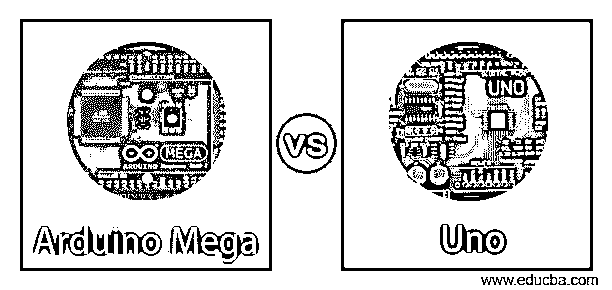

# Arduino Mega vs Uno

> 原文：<https://www.educba.com/arduino-mega-vs-uno/>

## Arduino Mega vs Uno 简介

基于 ATMega2560 的具有 54 个数字输入或输出引脚的微控制器板被称为 Arduino Mega。54 个数字引脚中的 14 个用作 PWM 输出，有 16 个模拟输入、4 个 UARTS、晶体振荡器、USB 连接、电源插孔和复位按钮。Uno 是采用 ATMega328P 的 Arduino 开源微控制器板。有数字和模拟输入或输出引脚，可以与系统中不同的扩展板或电路连接。微控制器 Uno 中有一个在线系统编程头和一个 16MHz 陶瓷谐振器。

### Arduino Mega 与 Uno 的面对面比较(信息图)

以下是 Arduino Mega 与 Uno 的 11 大对比 **:**

<small>Hadoop、数据科学、统计学&其他</small>

### Arduino Mega 与 Uno 的主要区别

让我们从以下几点来讨论 Arduino Mega 与 Uno 之间的一些关键差异:

*   Mega 的尺寸是 4 英寸 x 2.1 英寸，Uno 的尺寸是 2.7 英寸 x 2.1 英寸，比 Mega 小。Uno 的价格在 20-23 美元之间，而 Mega 价格昂贵。它在市场上的价格大约是 36-39 美元。两者都可以使用标准 A/B USB 电缆连接到计算机，该电缆是微控制器系统的一部分。
*   Mega 在这两者之间有大量的引脚。系统中使用了 54 个数字引脚和 16 个模拟引脚。Uno 只有 14 个数字引脚和 6 个模拟引脚。在数字引脚中，15 个在 Mega 中具有 PWM，6 个在 Uno 中具有 PWM。两者都带有一个通孔，以适应系统。
*   Mega 和 Uno 的时钟速度都是 16MHz，但内存和存储空间不同。Mega 的闪存为 256kB，而 Uno 的闪存为 32kB。如果代码很大，由于内存的原因，最好使用 Mega。
*   静态随机存取存储器用于 Arduino 系统。Uno 具有 2kB SRAM 空间，而 Mega 在系统中具有 8kB SRAM 空间。当程序启动并运行时，由于它的 SRAM 空间，变量可以在 Mega 中创建和操作，而在 Uno 中不会发生。
*   Mega 和 Uno 的组件互不相同。Uno 没有 FTDI USB 转串行驱动芯片，因此它使用 ATMega 16U2 作为 USB 转串行转换器。Mega 可以和其他兼容的护盾一起使用，而 Uno 不能和这些护盾兼容。Mega 有一个晶体振荡器，Uno 有一个陶瓷谐振器。
*   需要较少引脚和较低成本电路板的初学者可以选择 Uno，因为它易于操作且引脚较少。这使得理解系统的工作变得容易。而如果项目有很大的代码，并且需要大量的内存空间来存储输入，并且如果用户不是初学者，那么最好在板上使用 Mega。由于 Uno 的规模较小，因此与 Mega 相比，它有助于在系统中创建简单紧凑的项目。
*   所有为 Uno 编写的代码都将与 Mega 一起工作，因为 Mega 中的引脚数量更少且引脚可用。但是为 Mega 编写的代码不能在 Uno 中运行，因为 Uno 中的所有引脚都不能作为 Mega 使用。

### Arduino Mega 与 Uno 对比表

下表总结了 Arduino Mega 与 Uno 的对比 **:**

| **兆** | **Uno** |
| Mega 是由对硬核电子感兴趣的工程师使用的，它不是高度软件兼容的。 | Uno 是流行的 Arduino，因为它的尺寸较小，并且与系统中的软件和硬件兼容。 |
| 尺寸很大，不容易与较小的开发板配合，因此设计人员不能方便地随身携带。它不能用于空间受限的应用。 | 控制器的较小尺寸有助于它轻松地与任何开发板配合，设计人员可以轻松地在主板系统中携带它。 |
| 由于用户界面用得比较多，有大量的界面使得架构很重。 | 没有用户界面，因此使用的界面较少。与 MVP 相比，这个架构是轻量级的。 |
| 如果项目需要更高的 GPIO，最好在系统中使用 Mega。 | Uno 没有更高的 GPIO，但它有一个类似于其他 Arduino 微控制器的更强的 CPU。 |
| 很明显，桌面原型由于其尺寸而无法完成，屏蔽也无法用于此目的。 | 桌面原型可以很容易地在系统中使用屏蔽来完成，因为尺寸小，内存也少。 |
| 根据系统中使用的型号，引导加载程序占用空间为 4kB 或 8kB。 | Bootloader 的内存只有 0.5kB，它不能很好地处理重负载项目。 |
| 如果复杂的程序必须使用以太网屏蔽来编写，并且需要巨大的内存，那么最好使用 Mega。 | 如果应用是简单的传感器、GPS、电机控制或报警，最好使用 Uno 微控制器。 |
| 重置按钮不牢固，不能重置系统中的所有内容。很难一次擦除控制器的所有记忆。 | 重置按钮更强，将控制器带回到它在 Uno 中的起始位置。 |
| 永久存储内存为 4kB EEPROM，系统中增加了工作存储和记忆存储。 | 永久存储器为 1kB EEPROM，还有其他工作存储器和闪存存储器。 |
| 不需要在系统中添加额外的电路，因为 Mega 被设计为在复杂的项目中工作，并且具有以这种方式设计的电路和电源。 | 可以向 Uno 微控制器添加额外的电路，但这会使系统变得复杂，并且不容易像预期的那样与复杂的电路一起工作。 |
| Mega 有四个硬件端口，因此使用不同的端口可以实现更高的速度。 | 不同的端口不可用，但软件可以用来加速系统。 |

### 结论

如果项目中的代码很大，并且需要大量的 I/O 引脚，那么最好使用 Mega 微控制器。但是需要的是原型的东西与屏蔽和较少的价格选项是必需的，Uno 是系统中的选项。

### 推荐文章

这是 Arduino Mega vs Uno 的指南。在这里，我们通过信息图和比较表来讨论 Arduino Mega 与 Uno 的主要区别。您也可以看看以下文章，了解更多信息–

1.  [MongoDB 中的](https://www.educba.com/mongodb-collection/) [集合](https://www.educba.com/mongodb-collection/) [方法是如何工作的？](https://www.educba.com/mongodb-collection/)
2.  [MongoDB 备选方案|前 8 名](https://www.educba.com/mongodb-alternatives/)
3.  [在 MongoDB 中查找特征](https://www.educba.com/lookup-in-mongodb/)
4.  [MongoDB Limit() |如何运作？](https://www.educba.com/mongodb-limit/)

