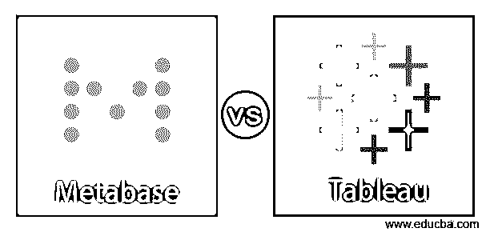

# 元数据库与表格

> 原文：<https://www.educba.com/metabase-vs-tableau/>

## 元数据库和 Tableau 的区别

Metabase 是一个商业智能工具，是一种生成仪表板和图表的开源且简单的方法。它还可以在不使用 SQL 的情况下解决即席查询，并将详细的数据视为数据库中的行。用户可以在五分钟内完成配置，并给他一个单独的平台来回答问题。应用程序分析用户生成的数据，并采取相应的行动。Tableau 帮助用户查看和分析信息。它可以帮助链接数据库，并启用拖放选项来开发可视化效果，并通过单击来共享它们。元数据和表的重要键和主要差异

### 元数据库与 Tableau 之间的直接比较(信息图表)

以下是 Metabase 和 Tableau 之间的 15 大比较:

<small>Hadoop、数据科学、统计学&其他</small>

### 元数据库和 Tableau 的主要区别

Tableau 和 Metabase 都被分离为商业智能组件。Zumba、SoFi 和 avocado 是 Tableau 的几个流行客户端，而 Metabase 的客户端是 Geocodio、Styleshare 和 CircleCI。Tableau 得到了 38 位开发人员的支持，在 67 家企业中得到广泛认可和关注，Metabase 得到了 17 位开发人员的支持，在 84 家企业中得到认可。

#### 1.定义

SQL 的最基本知识是通过定制的查询开发的，并且该部分的大部分对 Tableau 中的用户来说是简单和可靠的。而元数据库是用户友好的，同时它为软件提供了许多有用的功能。Tableau 是直观的，具有惊人的视觉效果。尽管用户会遇到许多工具，但他们觉得 Tableau 更简单，有一个定制的仪表板。它为复杂的数据分析提供了坚实的基础和支持。创建的仪表板很有吸引力，有助于在定制的仪表板上提供快速导航分析。

#### 2.特征

元数据库是一个神奇的可视化工具和商业智能工具。它由 good dashboard 组成，使用大数据作为实际的数据资源。它在管理大数据集方面非常有效。Tableau 的效率和工具的数量给人留下了深刻的印象，它为简化演示文稿和支持用户分析数据提供了一个很好的方法。Tableau 的功能包括过滤视图、关系显示、可视化发现、模拟模型、在线分析流程和定制仪表板创建。

#### 3.集成

Metabase 整合到 GLPI，tableau 整合到 Centercode、克拉丽丝女团文件生成器、cortex、Diffbot、email meter、Fluix、激励解决方案和 Koros marketing。元数据库具有较低的商业智能工具，而 Tableau 中的商业智能功能太高。在 Tableau 中创建一个有吸引力的仪表板是快速和可靠的，在 Tableau 中 Metabase 不能提供一个有吸引力的仪表板。

Tableau 中的数据可视化很有吸引力和探索性，用户在元数据库中没有这样的功能。但是两者在数据分析的比率上差不多相等，这里也出现了 tableau 作为顶部。为这些工具开发了更多的替代工具，如 Domo、Looker、Chartio、Zoho、Grow 和 Sisense。相比之下，元数据库是免费的，使用简单，是自托管的。tableau 的集成包括 Dremio、时标数据库、Apache Kylin、SAP HANA、AtScale 和 Vertica。而 Metabase 的集成是 MongoDB、MySQL、PostgreSQL、Amazon Redshift 和 Microsoft SQL Server。

#### 4.可靠的客户

这些产品的客户数量不多，但对产品的信任度很高。Metabase 的客户有 CircleCI、N26、Mathspace、QR point、Ruangguru 和 ADAC 露营有限公司。Tableau 有前途的客户是 Delivery hero SE、Durstexpress gmbh、Rent the runway、Lime、Agoda 和 picnic technologies。

#### 5.附加功能

Metabase 的产品特性包括关键性能指标、仪表板和可视化分析。鉴于 Tableau 的主要功能是可视化分析、问题指示器、记分卡、战略计划、共享、发布、绩效分析、预测分析、绩效指标、仪表板、基准和特别报告。

基于云的 in 元数据库和内部部署平台适用于各种规模的任何企业，支持 KPI 监控、数据库管理、错误跟踪、调试、记录过滤、构建查询等。而 Tableau 使整个企业的用户能够轻松地实时询问和解决所有信息问题，从而每天做出明智的业务和决策。

#### 6.培养

Metabase 的培训课程可以通过文档进行，而 Tableau 的培训可以通过在线直播、面对面、网络研讨会和文档进行。对元数据库的支持不是通过任何方式完成的，也不包含任何第三方供应商。对 tableau 的支持是 24*7 实时聊天，其他手段是营业时间和在线视频设施。Tableau 和 Metabase 都可以安装在 apple、windows、android、iOS 和 cloud 中。在 Metabase 中，只能显示三个截图，而在 Tableau 中，可以拍摄或查看五个截图。

### 对照表

让我们看看元数据库和 Tableau 之间的主要比较

| **属性** | **元数据库** | 表 |
| 定义 | 元数据库是可视化和商业智能的优秀工具。用户对数据使用的评价可以依靠本能和直觉。它依赖于冷酷的事实。 | 它很简单，有一个优秀的仪表板，可以定制。这里唯一的数据源就是大数据。在管理更高维度的数据集方面是惊人的。这是一种简单的方法，可以美化显示，并支持用户以更吸引人的方式分析数据 |
| 典型客户 | Metabase 的潜在客户是初创企业、中小企业、企业和机构。 | 该平台的主要客户是企业和中小企业。 |
| 支持语言 | 元数据库仅支持英语 | 该画面支持中文、西班牙语、英语、日语、德语和法语 |
| 可用支持 | 这种支持是通过电子邮件服务完成的。 | 通过跟踪、电话和电子邮件服务提供支持。 |
| 支撑平台 | 支持的桌面平台是 Macintosh 和 Windows。移动平台是 iPad、iPhone 和 android | 桌面平台是 WebApp、Macintosh 和 Windows。但是不支持任何移动平台。 |
| 定价 | 它可以用于每月和每年付款 | 它只能用于每月付款。 |

### 推荐文章

这是元数据库与 Tableau 的指南。在这里，我们讨论元数据库和 Tableau 之间的信息图和比较表的主要区别。您也可以浏览我们的其他相关文章，了解更多信息——

1.  [Splunk vs Tableau](https://www.educba.com/splunk-vs-tableau/)
2.  [数据分析与业务分析](https://www.educba.com/data-analytics-vs-business-analytics/?source=leftnav)
3.  [Sqoop Vs Flume](https://www.educba.com/sqoop-vs-flume/?source=leftnav)
4.  [R Vs Python](https://www.educba.com/r-vs-python/?source=leftnav)

