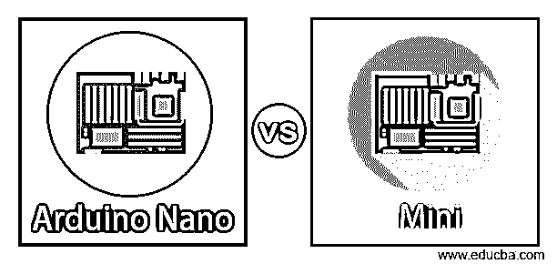

# Arduino Nano vs Mini

> 原文：<https://www.educba.com/arduino-nano-vs-mini/>

## Arduino Nano 与 Mini 的区别

以下文章提供了 Arduino Nano 与 Mini 的概要。Arduino Nano 是用于电子相关项目的 Arduino 板类型。Arduino Nano 电路板使用 ATmega328 处理器，并控制电路板的整体机制。该板有 14 个数字输入和输出引脚，其中 8 个用作模拟输入。Arduino Mini 是另一种类型的 Arduino 板，它采用了适合该板的 ATmega328 微控制器。共有 14 个数字输入和输出引脚，其中 8 个用作模拟输入，6 个用于 PWM。

### Arduino Nano 与 Mini 的面对面对比(信息图)

以下是 Arduino Nano 和 Mini 之间的 9 大区别:

<small>Hadoop、数据科学、统计学&其他</small>

### Arduino Nano 与 Mini 的主要区别

让我们讨论一下 Arduino Nano 和 Mini 之间的一些主要区别:

*   Arduino Nano 板和 Arduino Mini 板的主要区别之一是板的用途。当需要为小型项目选择主板时，Arduino Mini 板优先于 Arduino Nano 板，因为 Arduino Mini 板的尺寸比 Arduino Nano 板小。
*   Arduino Nano 板和 Arduino Mini 板之间的另一个可以考虑的区别是板中 USB 插孔的支持。在 Arduino Nano 板中，有一个微型 USB 端口，可以用来为板提供电源。另一方面，Arduino Mini 板没有内置的 USB 端口支持，板需要使用外部 USB 适配器将其他设备连接到板。
*   两种主板的另一个区别是兼容性。Arduino 板卡设计时需要考虑的主要因素是与其他设备的兼容性。与 Arduino Nano 板相比，Arduino Mini 板具有更高的兼容性。这主要是因为小尺寸的 Arduino 迷你板。Arduino 板的尺寸比 Arduino Nano 板小很多。
*   Arduino Nano 板和 Arduino Mini 板的另一个区别是对内置连接器的支持。与 Arduino Nano 电路板一样，电路板上也有内置连接器。另一方面，Arduino Mini 板不支持内置连接器，这增加了板的灵活性，因为它可以根据项目要求进行连接。Arduino Mini board 中也没有对程序员的内置支持。
*   这两种板的主要区别之一是板中复位按钮的使用。Arduino Nano 板支持用于复位微控制器的复位按钮，所有功能都会复位。而另一方面，Arduino Mini 板设计中没有对复位按钮的支持。
*   这两种板的另一个区别是 Arduino Nano 和 Arduino Mini 板。与 Arduino Nano 板相比，Arduino Mini 板更便宜。成本最低，因为电路板上没有 USB 端口，降低了电路板的总成本。此外，Arduino 迷你板不支持 Wi-Fi，这降低了 Arduino 迷你板的组件和成本。
*   Arduino Nano 板和 Arduino Mini 板的另一个区别是功耗。虽然两块板的电源相同，但 Arduino Mini 板的功耗低于 Arduino Nano 板。这是因为 Arduino Mini 板使用外部 USB 适配器，该适配器不使用来自板的电源，并降低了板的功耗。

### Arduino Nano 与 Mini 对比表

我们来讨论一下 Arduino Nano 与 Mini 的顶级对比:

| **因素** | **Arduino Nano** | **迷你** |
| **处理器** | Arduino Nano 电路板使用 ATmega328p 作为微控制器来控制电路板。 | Arduino Mini 电路板使用 ATmega168p 和 ATmega328p 作为微控制器来控制电路板。 |
| **输入/工作电压** | Arduino 纳米板的工作电压约为 7-9V。Arduino 纳米板的输入电压为 5V。 | Arduino 迷你板的工作电压约为 7-9V。Arduino 迷你板的输入电压为 5V。 |
| **CPU 速度** | Arduino Nano 板的处理器速度约为 16 MHz。该板包含充当晶体振荡器的引脚，频率为 16 MHz。 | Arduino 迷你主板的处理器速度约为 16 MHz。该板包含充当晶体振荡器的引脚，频率为 16 MHz。 |
| **输入/输出模拟** | Arduino Nano 板的模拟输入总数为 6。该板没有模拟输出引脚。 | Arduino 迷你板的模拟输入总数为 8。该板没有模拟输出引脚。 |
| **数字 IO/PWM** | Arduino Nano 板的数字输入和输出引脚总数约为 14，其中 6 个引脚用作板的 PWM。 | Arduino Mini 板的数字输入和输出引脚总数约为 14 个，其中 6 个引脚用作板的 PWM。 |
| **EEPROM (KB)** | Arduino Nano 板的 EEPROM 大小为 1 KB。 | Arduino Mini 板的 EEPROM 大小为 1 KB。 |
| **SRAM (KB)** | Arduino Nano 板的 SRAM 大小为 2 KB。 | Arduino Nano 板的 SRAM 大小为 1 和 2 KB。 |
| **闪光** | Arduino Nano 板的内部闪存大小为 32 KB。 | Arduino Mini 板的内部闪存大小为 16 和 32 KB。 |
| **USB 支持** | Arduino Nano 板在板中具有 USB 支持，并使用 FTDI 作为 USB 连接。 | Arduino 迷你板没有外部 USB 连接。 |

### 结论

Arduino Nano 板和 Arduino Mini 板广泛用于电子项目中，并用于尺寸较小的项目中。由于两种板的尺寸都很小，这些板比其他 Arduino 板更受欢迎。在两个 Arduino 板中选择合适的 Arduino 板完全基于用户需求和项目需求。

### 推荐文章

这是 Arduino Nano vs Mini 的指南。在这里，我们通过信息图和比较表来讨论 Arduino Nano 与 Mini 的主要区别。您也可以看看以下文章，了解更多信息–

1.  [Arduino Mega vs Uno](https://www.educba.com/arduino-mega-vs-uno/)
2.  [Elegoo vs Arduino](https://www.educba.com/elegoo-vs-arduino/)
3.  [Cloudflare vs Akamai](https://www.educba.com/cloudflare-vs-akamai/)
4.  [定性与定量数据](https://www.educba.com/qualitative-vs-quantitative-data/)

