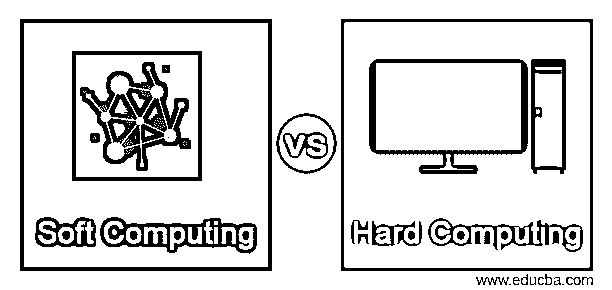

# 软计算与硬计算

> 原文：<https://www.educba.com/soft-computing-vs-hard-computing/>

## 软计算和硬计算的区别

谈到计算，软计算和硬计算是非常热门的话题。软计算是一种范式，它涉及一种可以解决没有适当预测的问题的模型，涉及不确定和不精确的解决方案。另一方面，硬计算涉及一种计算范式，这种范式涉及一种古老的方法，其工作流程中包含正确而精确的结果。结果是恰当的、精确的，并且包含了许多逻辑，以适当的方式满足了计算的模型。硬计算模型被认为不适合现实生活中的预测。

### 软计算与硬计算的直接比较(信息图表)

以下是软计算与硬计算之间的 9 大区别:

<small>Hadoop、数据科学、统计学&其他</small>

### 软计算与硬计算对照表

| **软计算** | **硬计算** |
| 软计算涉及一种可以基于现实生活事件进行判断的计算范式，因此可以构建计算模型。 | 硬计算永远无法处理现实生活中的事件，并且硬计算的模型无法正确构建计算模型。 |
| 软计算涉及逻辑推理，需要概率思维的推理和解决方案。 | 另一方面，硬计算涉及二进制逻辑以及一些适当的计算模型和策略。 |
| 软计算具有近似的适当特征，并且可以容忍在执行计算活动时出现的模糊参数。 | 硬计算涉及特征的计算，特征的计算还涉及特定特征和分类特征的提取。 |
| 软计算使得模型对于执行软计算类型是随机的。 | 另一方面，硬计算使计算过程具有确定性。 |
| 软计算可以很好地适应嘈杂和模糊的数据。 | 硬计算可以很好地适应精确的数据类型，因为它是精确的完美模型。 |
| 软计算出现了，并随着它自己的一套程序发展得很好。 | 随着在控制台上编写程序的需要，硬计算出现并发展。 |
| 它主要涉及整个编程范例，主要是用近似的结果编写的。 | 这种类型的计算涉及整个编程范例，需要编写精确的结果。 |
| 软计算试图执行多值逻辑。 | 而硬计算试图使用双值逻辑来执行计算。 |
| 软计算通过考虑评估的随机值而涉及随机性。 | 硬计算不涉及随机值，而是涉及固定和精确的值。 |

### 软计算与硬计算的主要区别

软计算和硬计算具有可比性，但它确实具有一些需要强调的关键差异，如下所示:

*   软计算从不沉溺于存在准确和适当数据的计算实践，而是涉及存在脏的和有噪声的数据的实践，因此，使得用于计算的整个数据集模糊不清。这意味着它可以很好地适应前所未有或不可预测的情况。
*   当与软计算相比时，硬计算与用于计算的完美且准确的数据集非常兼容，但是根本不能用导致近似的另一数据集进行调整。
*   软计算采用一些逻辑和概率条件来衡量并得出结论，而当涉及到硬计算时，情况正好相反，因为它从不采用近似和概率方法，即不使用逻辑来执行任何任务。
*   应用于软计算的计算模式包括并行计算，而应用于硬计算的计算是顺序的，其中所涉及的数据可以是线性类型。
*   软计算主要试图生成近似数据，而硬计算主要试图生成准确和精确的数据。
*   当涉及到解决与现实生活相关的问题时，软计算范式可以被显著地使用，并且有助于使用一些计算模型或原型来解决人类的问题。
*   硬计算是一种传统方法，用于制造相同的和旧的用于原型和建模的传统方法。
*   软计算可以以适当的方式应用于各种领域，如模糊逻辑、人工智能、遗传算法。
*   硬计算使得硬计算方法更适合支持它的计算活动。
*   遗传算法是一种进化技术，涉及优化和与为遗传算法创建模型相关的问题，需要启发式搜索和与汽车设计、仿生创新等相关的元数据搜索。
*   在软计算中要执行的计算问题可能包括多变量类型的设计和工作，而在硬计算中，它考虑了双值参数，以形成统计和图形。它有助于简化推导计算模型的活动。
*   甚至人工智能领域也与软计算领域融合得很好，因为它完全沉溺于预测和概率相关的查询。分析中呈现的数据形式是有噪声的和不明确的，这是软计算模型创建一种预测模型所需要的。
*   人工智能领域与软计算合作的一个很好的例子是人脸识别，或者使用数据集制作天气或商业预测模式。模型应该能够创建适当的模式，并应涉及任何工作的软计算。
*   由于前面提到的硬计算不能很好地支持模糊和脏数据，因此不建议使用这些类型的数据集来进行计算，而实际上是二进制的数据集，并且具有布尔值形式的答案，如“是”或“否”,应该仅用于制作模型或原型。这将有助于使计算过程对操作有用。

### 结论

与硬计算相比，软计算具有很多优点，但是不能忽视的事实是，当涉及到与线性类型数据集相关的计算时，在这种情况下，它可能只涉及硬计算。因此，软计算和硬计算在计算和模型制作方面都起着重要的作用。

### 推荐文章

这是一个软计算和硬计算的指南。在这里，我们分别用信息图和比较表来讨论软计算和硬计算的主要区别。您也可以看看以下文章，了解更多信息–

1.  [防火墙 vs 代理服务器](https://www.educba.com/firewall-vs-proxy-server/)
2.  [选择排序 vs 冒泡排序](https://www.educba.com/selection-sort-vs-bubble-sort/)
3.  [Xubuntu vs Ubuntu](https://www.educba.com/xubuntu-vs-ubuntu/)
4.  [选择排序与插入排序](https://www.educba.com/selection-sort-vs-insertion-sort/)

