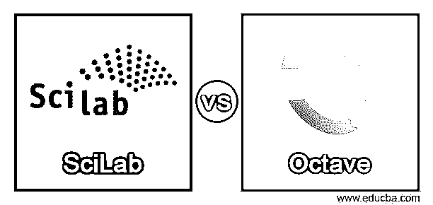

# SciLab 对 Octave

> 原文：<https://www.educba.com/scilab-vs-octave/>

## SciLab vs Octave 简介

SciLab 是一种编程语言，它不是基于函数或对象，而是面向数字的，免费提供，可以跨平台工作，并带有用于更高级工作的附加包。它由 ESI 集团在 2020 年开发，被视为技术计算的保护伞。为技术计算开发的，用 C 语言编写的，带有通用公共许可证的自由软件叫做 Octave。它于 1988 年开发，但在 2021 年 2 月发布了稳定的版本，这使它比其他产品更值得信赖，因为它在 MATLAB 领域中的存在。

### SciLab 与 Octave 的面对面比较(信息图)

以下是 SciLab 与 Octave 之间的 7 大区别:

<small>Hadoop、数据科学、统计学&其他</small>

| **SciLab** | **八度音阶** |
| SciLab 中没有三维工具，因此我们只能使用现有的绘图和渲染工具进行建模。与 Octave 相比，设计并不好。 | Octave 中提供了三维工具，可以帮助用户使用可用的数字数据进行建模。计算和三维实体建模容易完成。 |
| SciLab 中提供了更多数据，这有助于对各种实验的迭代进行采样。此外，我们可以与软件中可用的渲染工具协作来提供必要的模型。 | Octave 中的数据采样不容易完成，因为与 SciLab 相比，提供的实验数据较少。这也影响了软件与其他工具的协作，因为没有可用于迭代的数据。 |
| 质量控制不如 Octave，不如用其他工具来检查软件中完成的迭代和设计的质量。 | 可用的质量在 Octave 中是不错的，是其他软件无法相比的。软件中可用的设计工具和管理工具可以很好地控制它。 |
| 数据可视化和成本分析可以轻松完成，但质量不如 Octave。我们在软件中提供了可视化工具来检查各种迭代的模型。 | 数据可视化和成本分析可以很容易地在软件中完成，使设计可以与其他模型相媲美。这有助于科学计算的正确建模和可视化。 |
| 我们有风险数据属性，但分析不如 Octave。给出了各种因素，这些因素对于所有类型的计算都是通用的。这使得模型是通用的，并且在同一模型中没有特别的帮助。 | 在数值计算中，分析与之相关的风险很重要，这有助于创建更好的模型。Octave 有助于进行更好的分析。 |
| 该软件的用户界面非常好，使用户可以轻松地从一个功能切换到另一个功能，并尝试系统中可用的不同样本和模板。 | 用户界面不好，这使得用户搜索所有的工具，并使用相同的计算。完成一个模型需要时间，因为搜索工具也需要时间。 |
| 不同的用例是由软件本身提供的，这使得用户很容易实现和建模相同的用例。这使得软件易于使用用户界面和用例模板。 | 提供了用例，这些用例大多与机器学习有关。这使得该软件成为初学者开始机器学习和深度学习的工具。 |

### SciLab 与 Octave 的主要区别

两者都是为数字和科学编程开发的，但是 Octave 也支持面向对象编程。这有助于用户将系统中的任何代码转换为他们自己的数字代码，并在三维工具的帮助下在软件中设计模型。这个工具在 SciLab 中不可用，在 SciLab 中我们需要开发数值编程并开始自己解决程序，而不是使用面向对象的编程概念。

SciLab 和 Octave 是工程师和学生的首选，但首选的流是不同的。虽然机械、制造和工业工程师更喜欢 SciLab，但 IT 学生更喜欢 Octave，因为它们的编程技能和软件中与 OOPS 编程相关的各种功能。电气工程师也更喜欢使用界面简单的 SciLab。学生更喜欢 SciLab，因为它提供了不同的模板来设计和使用软件。

大多数用户更喜欢用这些软件来替代 MATLAB。现在考虑哪一个更符合 MATLAB 的点，答案是 Octave。它没有与 MATLAB 相同的工具包，但正在开发与相同软件一起使用的替代工具。Octave 主要在 Linux 下工作，工具都是与 Linux 操作系统兼容的。SciLab 有工具包，但没有 MATLAB 的所有工具包。这使得用户为他们的计算研究 Octave。

图形模拟是 SciLab 和 Octave 相互竞争的另一个领域。SciLab 在软件本身中有图形模拟，使用户更容易研究他们的图形，这些图形被称为 Xcos。这类似于 Simulink，可以帮助用户轻松地分析图形。Octave 没有任何专门用于图形的模块，因此如果我们使用 Octave，我们需要使用现有的工具来分析图形。

Octave 和 SciLab 提供了文档，这有助于初学者从头开始学习该软件。这两个文档都借助于系统中的图像和图表进行解释，但是 SciLab 文档由于其法语俚语而有点难以理解。

SciLab 中有一个交互式终端，用户可以搜索并使用某个功能。此外，软件中有一个文件浏览器，用于在系统中搜索必要的文件并用于建模。我们在 Octave 中没有交互界面。

Octave 和 SciLab 都有自己的特性，有些人更喜欢 Octave，这是因为过去 30 多年来社区支持的发展。对于那些发现在他们的系统中使用起来很复杂的 MATLAB 来说，这些是最好的选择。同样，它也可以用来代替 Mathematica 和 SageMath。

### 推荐文章

这是 SciLab vs Octave 的指南。在这里，我们通过信息图和比较表来讨论 SciLab 与 Octave 的主要区别。您也可以看看以下文章，了解更多信息–

1.  [F# vs 哈斯克尔](https://www.educba.com/f-sharp-vs-haskell/)
2.  [基维 vs 特克因特](https://www.educba.com/kivy-vs-tkinter/)
3.  [Arduino Nano vs Uno](https://www.educba.com/arduino-nano-vs-uno/)
4.  [气雾 vs 雷耶斯](https://www.educba.com/aerospike-vs-redis/)

