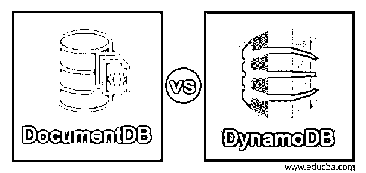

# DocumentDB 与 DynamoDB

> 原文：<https://www.educba.com/documentdb-vs-dynamodb/>

## DocumentDB 与 DynamoDB 的区别

下面的文章提供了 DocumentDB 与 DynamoDB 的概要。一个旨在存储基于文档的数据或半结构化数据的 Amazon 数据库被称为 DocumentDB，其中基于文档的数据可以轻松地存储、处理或检索，并且可以针对信息相关的实例进行管理。NoSQL 数据库是一个文件数据库，这可以作为任何其他名称的同义词使用。AWS 提供的用于管理任何级别的流量以及检索文档数据的 NoSQL 数据库称为 DynamoDB。这个数据库中不需要服务器，因为它由 Amazon lambda 负责，我们可以根据自己的需求扩展数据库。

### DocumentDB 与 DynamoDB 的直接比较(信息图表)

以下是 DocumentDB 与 DynamoDB 之间的 8 大区别:

<small>Hadoop、数据科学、统计学&其他</small>

### DocumentDB 与 DynamoDB 的主要区别

让我们讨论一下 DocumentDB 和 DynamoDB 之间的一些主要区别:

*   两个数据库都以忠实的方式处理数据库故障。DynamoDB 中提供了全局表，即使一个数据库不可用，用户也可以使用这些数据。这些数据可以被处理到另一个区域，并在需要时作为备份获取。副本可用于 DocumentDB 中的其他区域，这使得数据在数据库发生故障时可用。
*   两个数据库中都存在存储数据的安全级别。在 DynamoDB 中，它由 AWS 控制，具有所有的 SSL 和传输层安全性。AWS 还提供软件开发工具包，用于数据的安全管理。我们可以在 DocumentDB 中借助一个可以直接从应用程序下载的证书来完成所有这些操作。在下载证书之前，必须更新应用程序代码。
*   从一个数据库到另一个数据库迁移可以在两个数据库中轻松完成。但是某些更新和可移植性检查必须在 DynamoDB 中完成，这些应用程序不容易迁移。它们需要在迁移后针对该数据库进行设计。Document DB 在这方面胜出，因为所有的迁移都可以很容易地完成，不需要做任何相同的设计更改。具体来说，MongoDB 和 DocumentDB 相互兼容，因此，如果用户需要从 MongoDB 迁移，可以很容易地检查和迁移应用程序的兼容性，而无需进一步更新。
*   当我们需要将数据迁移到数据库之外时，DocumentDB 有助于加快迁移速度。如果数据必须迁移到 MongoDB，则不需要进行数据转换，因为两个数据库彼此兼容。应用程序也不需要为此目的而改变或更新。但是在 DynamoDB 中，数据被作为供应商输入，不容易将数据传输到外部。在迁移过程之前，必须将这些数据转换成其他形式。
*   DocumentDB 仅在特定地区可用，如爱尔兰、法兰克福、俄勒冈、俄亥俄州和弗吉尼亚州，而 DynamoDB 在 AWS 存在并被人们使用的任何地方都可用。因此，DynamoDB 的存在可以用于特定的目的。

### DocumentDB 与 DynamoDB 对照表

让我们讨论一下 DocumentDB 与 DynamoDB 之间的前 8 大比较:

| **文档数据库** | **DynamoDB** |
| 数据库本身向用户提供访问，管理员可以控制任何级别的访问。AWS 不涉及这个领域，因为凭证直接存储在数据库中。 | AWS 通过身份和访问管理来控制对数据库的访问，其中低级别也需要身份验证和授权。 |
| 这是昂贵的，因为我们需要每月支付 200 美元，即使用户只使用数据库的一些实例，或者只使用几个小时。但是这个数据库没有前期成本。目前不免费提供存储。 | 这涉及到初始成本，但总成本较低。按需定价是可用的，用户每月只需支付较少的 1 美元。第一阶段免费提供 25GB 数据。 |
| 每日备份由数据库本身管理，这些数据可以在需要时恢复。数据库支持任何类型的备份。 | 每日备份不可用，这使得用户在两次备份之间备份数据。由于数据库支持，用户可以在需要时恢复数据。 |
| 文档大小限制为 16MB，最大存储容量为 64 TB。大多数用户可以管理这些数据。 | 文档大小没有限制，因为它可以根据用户要求的大小进行扩展。项目大小必须管理到 400kB 的数据。 |
| 在这个数据库中可以很容易地查询数据，因为用户可以根据表的要求添加索引，而不需要数据库中的额外权限。 | 如果数据是唯一的，最好使用 DynamoDB，因为使用该数据库进行索引并不容易。表格可以被查询，但不像文档数据库那样容易。 |
| 数据库中需要存储过程，在它的帮助下完成数据检索和数据积累。可以编写查询来查看数据，但是当应用程序必须在后台运行时，就需要存储过程。 | 这个数据库不需要存储过程，这使得这个过程对用户来说更容易。他们可以通过编写简单的查询来访问数据，并且可以直接从数据库创建表。 |
| 该数据库支持 MongoDB，这使得熟悉 MongoDB 的用户可以轻松学习。 | MongoDB 在这一点上没有得到直接支持，如果没有任何应用程序更新，从 MongoDB 迁移到 DynamoDB 并不容易。 |
| 性能不错，但不如 DynamoDB。这里的查询支持 NoSQL，代码可以用 Java、JavaScript 或 Python 编写。 | DynamoDB 的性能确实令人赞赏，它支持 JSON 代码。这有助于升级 JSON 格式的应用程序，并为应用程序的新设计编写 JSON 代码。 |

### 结论

这两个数据库在许多方面是相似的，这使得用户不知道使用哪一个来满足他们的需求。本文解释了两者之间的区别和相似之处。安全、审计和数据恢复以及 AWS 支持的数据迁移都存在于这两个数据库中。

### 推荐文章

这是 DocumentDB vs DynamoDB 的指南。这里我们分别讨论信息图和比较表的主要区别。您也可以看看以下文章，了解更多信息–

1.  [数据狗 vs 新遗迹](https://www.educba.com/datadog-vs-new-relic/)
2.  [Datadog vs Splunk](https://www.educba.com/datadog-vs-splunk/)
3.  [普罗米修斯 vs Influxdb](https://www.educba.com/prometheus-vs-influxdb/)
4.  [普罗米修斯 vs 纳吉奥斯](https://www.educba.com/prometheus-vs-nagios/)

