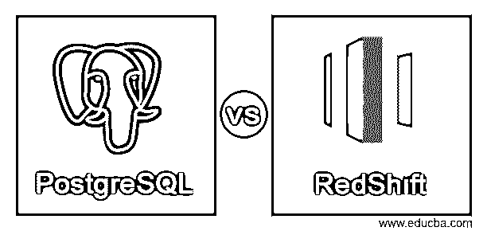
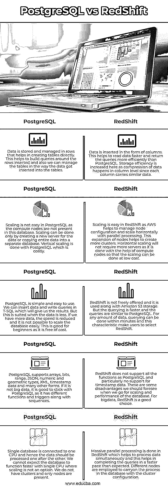

# PostgreSQL 与红移

> 原文：<https://www.educba.com/postgresql-vs-redshift/>

## PostgreSQL 与红移的区别

下面的文章提供了 PostgreSQL 与 RedShift 的概要。一个具有 SQL 支持和扩展的开源 RDBMS 系统被称为 PostgreSQL，它使用一种称为 T-SQL 的 SQL 变体在查询中实现更高级的过程。这有助于存储和扩展任何工作负载，无论其系统是复杂还是简单。它可以为任何类型的应用程序存储数据。亚马逊的一个数据仓库产品被称为 RedShift，它在并行处理和压缩的帮助下减少了执行时间。RedShift 与 PostgreSQL 兼容，我们可以在 RedShift 中运行 T-SQL 查询来获得高级查询。这主要用于分析和报告。

### PostgreSQL 与 RedShift 的直接对比(信息图)

以下是 PostgreSQL 与 RedShift 之间的 5 大区别:

<small>Hadoop、数据科学、统计学&其他</small>

### PostgreSQL 与红移的主要区别

让我们讨论一下 PostgreSQL 与 RedShift 之间的一些主要区别:

*   红移更多地用于分析，因此列数据库有助于更快地处理数据。索引键不在 RedShift 中使用，它被排序和 DIST 键所取代。外键或任何其他约束不存在，因此需要时间来整理红移数据库中的值。这里使用了集群，这样我们可以在一个短时间内管理数十亿条记录。PostgreSQL 适用于简单查询和数据较少的情况。数据存储在节点中，这里没有集群。我们有索引，这是 PostgreSQL 中的外键概念。RedShift 中的分析性能优于 PostgreSQL。
*   红移和 PostgreSQL 中都使用了 SQL，但 SQL 命令的应用有所不同。在 CREATE TABLE 的帮助下，我们可以在 RedShift 中执行分布和排序算法，但 RedShift 不支持继承和分区。我们可以插入和更新表，但是它不允许我们用 insert 命令创建新表。使用 Create 命令，我们可以在 PostgreSQL 中创建表以及排序、继承和分区。在 PostgreSQL 中，我们可以通过' with '子句插入和删除表。
*   红移遵循不同的分布样式，以便更快地将数据插入数据库。我们在 RedShift 中有键分布，其中数据与列中的键值交叉检查，并放在相同的列中。将这些值与其他列进行比较，如果有匹配的值，则将这些列放在一起。这有助于用户轻松定位数据。在 PostgreSQL 中没有遵循任何分布样式或模式，在 PostgreSQL 中，我们必须使用查询来定位相似的数据承载列。
*   真空在两个数据库中的使用是不同的。PostgreSQL 通过 VACUUM 命令帮助收回数据库中的空间，而 RedShift 对所有行进行排序，同时回收数据库中的空间。
*   数据库集群中有一个领导节点，它管理数据库中的数据插入和管理。工作分布在不同的工作节点上，数据得到良好的管理，以便在需要时可以查询。我们在 PostgreSQL 中没有任何领导节点或工作者节点，因为它与单节点数据库一起工作。

### PostgreSQL 与红移的比较表

让我们讨论一下 PostgreSQL 与 RedShift 之间的主要对比:

| **PostgreSQL** | **红移** |
| 数据按行存储和管理，这有助于直接创建表。这有助于围绕插入的行构建查询，并且我们还可以按照将数据插入表中的方式来管理表。 | 数据以列的形式插入。这有助于比 PostgreSQL 更快地读取数据并更有效地返回查询。由于每列都携带相似的数据，因此数据压缩在列级进行，从而提高了存储效率。 |
| PostgreSQL 中的伸缩并不容易，因为该数据库中不存在计算节点。只有通过为数据创建新的服务器或将整个数据复制到单独的数据库中，才能实现扩展。垂直伸缩是用 PostgreSQL 完成的，代价很高。 | RedShift 中的扩展很容易，因为 AWS 有助于管理节点配置，并通过并行处理进行水平扩展。节点的扩展有助于创建更多的集群。水平扩展不需要更多服务器，因为它是在计算节点的帮助下完成的，因此可以以较低的成本进行扩展。 |
| PostgreSQL 简单易用。我们可以在 T-SQL 中插入数据和编写查询，这将为我们提供结果。但是这适用于数据较少的情况。如果我们有更多的数据，速度会降低，并且不可能轻松地扩展数据库。这对初学者来说很好，因为它是免费的。 | 红移不是免费提供的，它与亚马逊 S3 存储一起使用。但是查询速度更快，并且查询类似于 PostgreSQL。对于任何数量的数据，查询可以在几分钟内完成，这一特性使用户选择红移。 |
| PostgreSQL 支持数组、位、范围、JSON、数字和几何类型、XML、时间戳数据和许多其他形式。如果不是大数据，最好坚持使用 PostgreSQL，因为它有不同的函数和触发器以及序列。 | RedShift 不支持 PostgreSQL 的所有功能，尤其是不支持时间戳数据。这些是我们在考虑数据库的伸缩性和性能时应该预见到的一些缺点。对于大数据，红移是个不错的选择。 |
| 一个数据库连接到一个 CPU，因此数据应该一个接一个地处理。在无法扩展的情况下，我们不能指望数据库在单个 CPU 上运行得更快。我们没有集群，只有节点。 | 大规模并行处理在 RedShift 中完成，这有助于同时处理数据，并有助于以比预期更快的速度完成查询。在具有集群配置的数据库中，采用不同的节点进行处理。 |

### 结论

当数据量以 TB 为单位时，如果在不久的将来数据量不会增加，我们可以使用 PostgreSQL。如果是大数据，并且总是运行分析查询，那么红移是一个不错的选择。此外，如果我们有一个数据库已经与 AWS，PostgreSQL 将不会是好的，因为它将花费超过预期的金额。

### 推荐文章

这是 PostgreSQL vs 红移的指南。这里我们分别讨论信息图和比较表的主要区别。您也可以看看以下文章，了解更多信息–

1.  [PostgreSQL vs SQLite](https://www.educba.com/postgresql-vs-sqlite/)
2.  [PostgreSQL vs MariaDB](https://www.educba.com/postgresql-vs-mariadb/)
3.  [PostgreSQL JSON vs JSONNB](https://www.educba.com/postgresql-json-vs-jsonnb/)
4.  [PostgreSQL Varchar vs Text](https://www.educba.com/postgresql-varchar-vs-text/)

