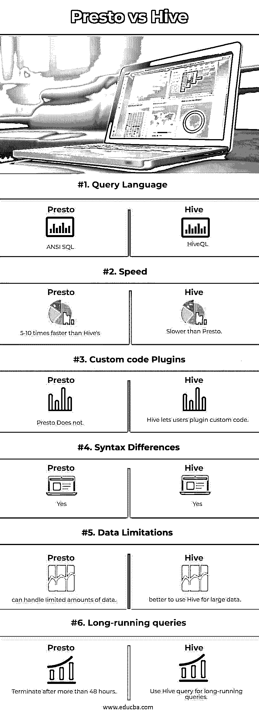

# 普雷斯托对蜂房

> 原文：<https://www.educba.com/presto-vs-hive/>

## Presto 与 Hive 的区别

Apache Hive 是一个数据仓库解决方案，运行在 Apache Hadoop 之上，允许您轻松地查询和分析大数据集。Hive 使用类似 SQL 的方法查询数据，这使得探索和分析大量数据变得简单。

Presto 是一个分布式 SQL 查询引擎，可以从 Hadoop、S3、MySQL、Teradata 以及其他关系和非关系数据库中查询数据。脸书创建了 Presto 来对大量数据存储进行查询，响应时间从几分之一秒到几分钟不等。

<small>Hadoop、数据科学、统计学&其他</small>

Apache Hive 和 Presto 都允许企业对业务数据进行查询，但是它们有几个独特的特性。

#### 1.Hive 和 Presto 之间的内存架构进程

Presto 针对延迟进行了优化，Hive 针对查询吞吐量进行了优化。Presto 对查询中每个任务可以容纳的内存量有限制，因此如果查询需要大量内存，查询将会失败。对于交互式查询，这种错误处理逻辑(或缺少这种逻辑)很好；但是，对于必须可靠执行的每日/每周报告，情况并非如此。Hive 是此类活动的最佳选择。

Hive 使用 MapReduce。MapReduce 中的每个操作都需要写入磁盘，并且每个阶段都必须等待前一个阶段完成后才能继续。因为 MapReduce 可以跨众多服务器处理任务，所以它在 Hive 中工作得很好。通过分配任务可以提高项目的速度。尽管如此，数据必须写入光盘，这可能会激怒一些用户。

虽然 Presto 将 SQL 转换为 stage，但是每个 stage 都由许多任务执行，并且每个任务都被分成几个部分。所有任务并行完成，数据通过管道在阶段之间发送。跨网络的内存到内存也用于传输数据，消除了对磁盘输入输出事务的需要。

Presto 的性能因为这个比 Hive 快 5-10 倍。

#### 2.ANSI SQL 和类似 SQL 的语言称为 HiveQL

虽然 Apache Hive 使用了一种接近 SQL 的语言，但是有足够的差异，新用户必须重新训练一些查询。HiveQL，即 Hive Query 语言，包含一些奇怪的东西，可能会让新手感到困惑。另一方面，任何熟悉 SQL 的人都应该能够很快使用 HiveQL。

当许多数据工程师第一次尝试 Presto 时，他们首先注意到的一件事是他们可以使用现有的 SQL 技能。Presto 使用普通的 SQL 在数据库中执行查询、检索数据和修改数据。如果你懂 SQL，你可以马上开始使用 Presto。许多人认为这是一个好处。

#### 3.扩展数组和地图

当与用户定义的表生成函数(如 explode()一起使用时，LATERAL VIEW (in Hive)语句展平列的映射或数组类型。在侧视图中，分解功能可用于阵列和贴图。

UNNEST 可用于扩展地图或数组。数组被折叠成一列，而映射被分成两列(键，值)。UNNEST 通常与联接一起使用，它可以与联接左侧关系中的列相关。

**蜂巢查询:**

`SELECT student, mark
FROM tests
LATERAL VIEW explode(marks) t AS mark;`

很快查询:

`SELECT student, mark
FROM tests
Cross Join UNNEST explode(marks) t AS mark;`

#### 4.自定义代码插件

因为 Presto 是基于 SQL 的，所以您已经拥有了所有需要的命令。一些工程师认为这是一个好处，因为这使他们能够轻松地检索和修改数据。

但是，无法插入自定义代码会给专业的大数据用户带来问题。Hive 在这种情况下比 Presto 更有优势。如果您非常了解这种语言，您可以在查询中加入自定义代码。这不是你需要一直做的事情，但是当你做的时候它会派上用场。

#### 5.Presto 查询的小时限制

已经运行超过 48 小时的 Presto 查询将被立即终止。运行一两天以上的 Presto 查询通常是不成功的查询。

对于长时间运行的查询，您可以将 Presto 查询重新构建为 Hive 查询。

#### 6.列名转义

当列名与保留关键字的名称匹配时，必须用引号将列名括起来。与大多数基于 SQL 的查询语言一样，Hive 中的引号字符是反斜杠字符`。在 Presto 中，双引号字符"用于引用列名，而不是`。考虑下面的例子:

`SELECT `join` FROM Demo      # Hive
SELECT "join" FROM Demo      # Presto`

#### 7.数据限制

不幸的是，Presto 作业可以存储的数据量是有限的。一旦你遇到那堵墙，Presto 的基本原理就崩溃了。您几乎可以依赖 Presto 来出色地生成每小时或每天的报告。请记住，脸书利用 Presto 创建了海量数据。然而，这是有限度的。

Hive 似乎没有任何数据限制，至少没有与现实世界场景相关的数据限制。对于制作周报或月报的企业，Hive 是更好的数据查询解决方案。如果涉及大量数据，项目将需要更长时间。另一方面，Hive 不会失败。它将继续工作，直到完成您的所有命令。

### Presto 与 Hive 的面对面比较(信息图表)

以下是 Presto 与 Hive 的主要区别:

### 主要差异

*   Presto 不允许用户插入自定义代码，但是 Hive 允许。
*   Presto 使用 ANSI SQL，Hive 使用 HiveQL
*   Presto 只能处理有限的数据量，因此对于较大的数据，建议使用 Hive。

### Hive 与 Presto 的比较表

| **基础** | 储备 | 很快 |
| **查询语言** | ANSI SQL | HiveQL |
| **速度** | 比 Hive 快 5-10 倍 | 比急速还慢 |
| **自定义代码插件** | 普雷斯托没有 | Hive 允许用户插件自定义代码 |
| **语法差异** | 是 | 是 |
| 数据**限制** | 可以处理有限的数据量 | 对于大数据，最好使用 Hive |
| **长时间运行的查询** | 超过 48 小时后终止 | 对长期运行的查询使用配置单元查询 |

### 结论–快速 vs 蜂巢

仅仅因为一些人喜欢 Hive，并不意味着你应该忽略它。如果使用得当，它的表现令人钦佩。Presto 是一个工作迅速的任务处理系统。只是不要一下子给它太大的压力。如果你这样做，你就有失败的可能。此外，Apache Hive 和 Presto 都是开源工具，所以它们的源代码都是免费的。

### 推荐文章

这是一个普雷斯托 vs 蜂房指南。在这里，我们用信息图和比较表讨论 Presto 和 Hive 的主要区别。您也可以看看以下文章，了解更多信息–

1.  [Nginx vs Tomcat](https://www.educba.com/nginx-vs-tomcat/)
2.  [Plesk vs cPanel](https://www.educba.com/plesk-vs-cpanel/)
3.  [Gnome vs Unity](https://www.educba.com/gnome-vs-unity/)
4.  [Gnome vs Xfce](https://www.educba.com/gnome-vs-xfce/)

