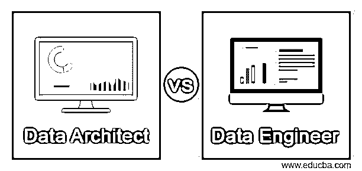
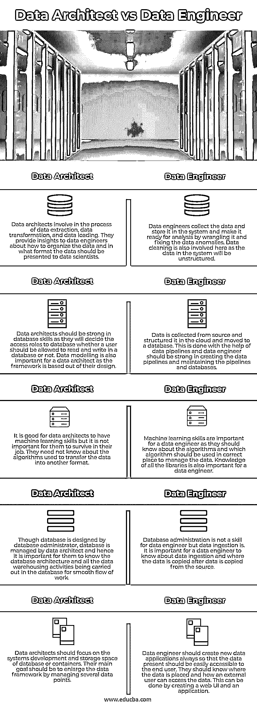

# 数据架构师 vs 数据工程师

> 原文：<https://www.educba.com/data-architect-vs-data-engineer/>

## 数据架构师与数据工程师简介

通过管理设计和将组织的需求部署到数据库中来遵循数据架构的工程师被称为数据架构师。他们与数据管理系统一起工作，在数据管理系统中，他们总是有一个计划来维护所有需求的数据库，以便可以从正确的位置收集信息。数据工程师总是处理结构化和非结构化数据，在图表和算法的帮助下，将原始数据转化为更有用的信息。各种编程语言和 SQL 方面的深厚知识是成为一名数据工程师所必需的。

### 数据架构师与数据工程师的面对面比较(信息图表)

以下是数据架构师与数据工程师之间的 5 大区别:

<small>Hadoop、数据科学、统计学&其他</small>

### 数据架构师和数据工程师的区别

数据架构师与不同领域的不同人员一起工作，例如数据工程师、数据科学家、数据矿工和数据分析师，因此他们的工作主要是数据存储、数据可视化、数据安全和系统访问。数据架构师的角色不是纯技术性的，也不完全融入软件。因此，他们充当公司管理层和 IT 部门之间的中介。数据工程师处理数据，将非结构化数据转换为结构化的可靠数据。他们花时间收集数据，基于这些数据形成算法，并管理团队处理不同的数据集进行预测分析或预测。

### 主要差异

*   数据架构师与数据科学家密切合作，在数据科学家那里，数据分析更加活跃。支持框架是由数据工程师创建的，他们不支持任何其他团队，而是为自己工作。数据架构师需要了解数据库管理系统、他们的工作方式以及他们应该向哪些人提供访问权限。数据工程师应该具备 SQL 方面的知识，并且具备一种以上的编程知识。数据工程师的技能是用他们知道的编程语言的数量和他们工作的各种云服务来衡量的。
*   数据架构是由数据架构师来完成的，他给出了相同的想法，提供了构建数据架构的概念和各种想法，并向涉众展示了数据架构，以便让所有人都知道数据架构的重要性。数据工程师根据数据架构师的输入构建框架，并为数据库中接收的所有类型的数据维护这些框架。数据架构师决定谁应该处理数据库，而数据工程师决定应该在数据库上做什么工作。
*   数据工程师的工作输入由数据架构师提供，包括数据框架的蓝图和框架的规范。框架中的数据由数据工程师管理和提供，数据工程师收集信息并将相关细节添加到数据中。这些数据基本上都是数据科学家和数据分析师使用的。基于这些数据信息，数据架构师通过提供必要的可视化来为公司提供洞察力，以了解数据在过去几年中是如何变化的。
*   数据工程师使用任何编程语言、数据库和任何云平台进行数据分析工作，而数据架构师使用数据管理工具和 ETL 工具来管理数据库并提供框架蓝图。数据建模和数据仓库是数据架构师应该掌握的技能。

| **数据架构师** | **数据工程师** |
| 数据架构师参与数据提取、数据转换和数据加载的过程。它们为数据工程师提供了关于如何组织数据以及数据应以何种格式呈现给数据科学家的见解。 | 数据工程师收集数据，将其存储在系统中，并通过争论和修复数据异常来为分析做好准备。这里还涉及到数据清理，因为系统中的数据是非结构化的。 |
| Data architects should be strong in database skills as they will decide the access roles to the database whether a user should be allowed to read and write in a database or not. Data modelling is also important for a data architect as the framework is based on their design. | 数据是从数据源收集的，在云中进行结构化，然后移动到数据库。这是在数据管道的帮助下完成的，数据工程师应该擅长创建数据管道和维护管道和数据库。 |
| 对于数据架构师来说，拥有机器学习技能是件好事，但对于他们来说，能否保住工作并不重要。他们不需要知道用于将数据转换成另一种格式的算法。 | 机器学习技能对于数据工程师来说很重要，因为他们应该知道算法，以及应该在不正确的地方使用哪种算法来管理数据。对数据工程师来说，了解所有的库也很重要。 |
| 虽然数据库是由数据库管理员设计的，但数据库是由数据架构师管理的，因此，为了工作的顺利进行，了解数据库体系结构和在数据库中执行的所有数据仓库活动对他们来说是很重要的。 | 数据库管理不是数据工程师的技能，但数据接收是。对于数据工程师来说，了解数据接收以及从源复制数据后将数据复制到何处非常重要。 |
| 数据架构师应该关注数据库或容器的系统开发和存储空间。他们的主要目标应该是通过管理几个数据点来扩大数据框架。 | 数据工程师应该始终创建新的数据应用程序，以便最终用户可以轻松访问现有的数据。他们应该知道数据放在哪里，以及外部用户如何访问数据。这可以通过创建 web UI 和应用程序来实现。 |

### 结论

这两个角色在大数据中都很重要，在大数据中，框架应该由数据架构师设计，而框架应该由数据工程师构建。这些知识基本上是相同的，但在该领域的使用有所不同，以利用双方专业人员的专业知识。

### 推荐文章

这是数据架构师和数据工程师的指南。在这里，我们分别用信息图和比较表来讨论数据架构师和数据工程师的主要区别。您也可以看看以下文章，了解更多信息–

1.  [OData vs GraphQL](https://www.educba.com/odata-vs-graphql/)
2.  [数据科学家 vs 软件工程师](https://www.educba.com/data-scientist-vs-software-engineer/)
3.  [数据科学 vs 数据工程](https://www.educba.com/data-science-vs-data-engineering/)
4.  [数据科学 vs 软件工程](https://www.educba.com/data-science-vs-software-engineering/)

