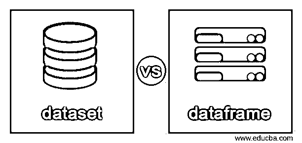

# 数据集与数据框架

> 原文：<https://www.educba.com/dataset-vs-dataframe/>

## 数据集和数据帧之间的差异

数据集通常看起来像数据帧，但它是类型化的，因此它有一些类型化的编译时错误，而数据帧更具表现力，是最常见的结构化 API，它只是用具有更多行数和列数的数据表来表示。数据集还提供了从 SQL 查询语句的执行中返回的数据的类型安全视图。数据集是一组强类型结构化数据，它们熟悉面向对象的编程语言，可以在编译时捕获错误。

数据集和数据框架是处理复杂和大数据应用程序的不同 API 之间的显著区别。

<small>Hadoop、数据科学、统计学&其他</small>

**数据集:**

通常，数据集是大量数据的集合，这些数据可以称为表格数据，并且这些数据集将对应于一个或多个表。因为它将用表中代表特定变量的每一列来计算，并且每一行将对应于数据集的给定记录集。数据集列表将为每种类型的值计算变量，它计算对象创建的高度和重量，帮助数据集的每个成员。每个值被称为数据，数据集由文档或文件的集合组成。有几个特征将定义数据集的结构和属性，这些特征包括属性和变量的数量和类型，以及适用于所有值类型的各种统计度量，可以是数字或整数、字符串。但是所有的数据都是标称数据，因此它不包含数值，而是由算法生成的，某些软件将用于测试目的。

**数据帧:**

在 dataframe 中，它类似于数据集，是最常见的结构化 API，主要用一组行和列来表示表结构。包含行和列的数据表将计算列的列表，这些列中的类型表示模式。它将数据电子表格命名为列，但一个基本区别是，当我们在一台 pc 中使用电子表格并在其中指定位置时，spark 数据帧可以跨越数千台计算机，用于将数据放在多台计算机上。使用应该是直观的，它保存的数据太大，不适合一台 PC 计算机，或者在机器上执行数据计算需要太长时间。dataframe 不仅适用于 Spark，它还支持其他语言，如 R、Python 等。但是当我们使用 R 和 Python 时，它支持这两种数据帧概念中的相似差异，除了存在于一台机器上而不是其他多台机器上的一些例外。

### 数据集与数据框架之间的直接比较(信息图表)

以下是数据集与数据帧之间的 9 大差异:

### 数据集和数据框架的主要区别

数据集和数据帧在用户端执行操作时有一些关键区别。两者都用于复杂的数据集，如大数据和其他数据结构。

**数据集:**

数据集是分布在不同机器上的数据元素的分布式集合，这些机器被组合并配置到集群中。数据集是统一的，分布在不同的节点上，数据格式将是结构化和非结构化的，可能随数据源而异。数据集中是 RDD 和数据帧的组合，原始的 RDD 也在变换后重新生成。它是编译时安全的，并通过像 dataframes 这样的 catalyst 优化器来调整查询优化。当我们使用编码器时，它处理对象和表之间的数据转换，不需要垃圾收集，因此节省了内存。它访问单个属性和元素，而不反序列化对象。

**数据帧:**

在 dataframe 中，数据的分布式集合也组织到每一行中，主要是在列中。它支持结构化和半结构化数据，并且将各种数据源转换成失去 RDD 的数据帧。它不具有编译时安全性，仅在运行时检测错误，并通过 catalyst 优化器进行查询优化，序列化以二进制格式在内存中进行。它手动避免了用于创建或销毁对象的垃圾收集，并且只对序列化数据执行操作，而不需要反序列化。

### 数据集与数据框架的比较表

| **数据集** | **数据帧** |
| 与 Dataframe 相比，它的表达能力和效率都不如 catalyst optimizer。数据集看起来像一个数据帧，但它是一个有类型的数据帧，它们有编译时错误 | The dataframe is the immutable one so once it transforms into the dataframe we cannot regenerate the domain objects. |
| It’s also an immutable one but here it overcomes this by adding the disadvantage of the dataframe for regenerating the RDD from the dataframe. It allows performing the operation on serialized data to improve the memory usage. | 通常，它通过使用堆外内存存储进行序列化来减少内存使用。 |
| Dataset is available only for Scala and Java languages. | It is available for all the languages such as java, python, scala, R, etc. |
| Additionally, the dataset provides the features like a type-safe, object-oriented programming interface for the RDD APIs. | 它提供了特定于领域的语言 API 来转换分布式数据，就像使用 spark 一样，因此它远远超出了专业数据工程师的范围。 |
| 以三种不同的方式来转换和创建数据操作。 | dataframe 提供了两种类型的操作，如转换和操作。 |
| 数据集中的每一行都是用户定义的对象，因此每一列都是成员对象变量。 | dataframe 数据有一个结构，所以它被定义为模式。 |
| 它有助于编码器的使用。 | 类似于数据集，但需要一些查询来实现。 |
| 使用 dataframe 类的“as”符号函数将数据从 dataframe 转换为 dataset | 数据转换也在表查询本身中执行。 |
| 它用于 Azure 和 AWS 云托管环境。 | 它也和数据集一样。 |

### 结论

在结论部分，数据集和数据框架都是在复杂大数据框架和应用中使用的概念。当我们使用 dataframe 时，它有一些不同的视图，它被用作表视图，作为一组行和列，但不在数据集中。

### 推荐文章

这是数据集与数据框架的指南。在这里，我们通过信息图和比较表来讨论数据集和数据框架的主要区别。您也可以看看以下文章，了解更多信息–

1.  [C++堆栈与堆](https://www.educba.com/c-stack-vs-heap/)
2.  [ArangoDB vs MongoDB](https://www.educba.com/arangodb-vs-mongodb/)
3.  [Nginx vs Tomcat](https://www.educba.com/nginx-vs-tomcat/)
4.  [inside html vs text content](https://www.educba.com/innerhtml-vs-textcontent/)

