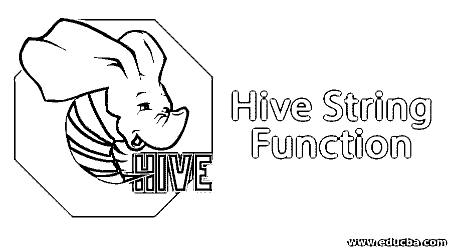

# 配置单元字符串函数

> 原文：<https://www.educba.com/hive-string-function/>




## 配置单元字符串函数介绍

字符串是一个字符序列。在 hive 中，字符串函数用于执行不同的操作，如反转字符串、转换为大写和小写、删除空格等。Hive 字符串函数看起来像 [SQL 字符串函数](https://www.educba.com/sql-string-functions/)。让我们详细看看这些字符串函数，以便更容易理解这个概念。

### 配置单元字符串函数

下面是一些带有示例的 hive 字符串函数。

<small>Hadoop、数据科学、统计学&其他</small>

#### 1.重复

这个 hive 字符串函数用于重复 N 次给定的字符串。

语法:

```
Repeat(string str, n);
```

例如:

```
Repeat('Apple',3);
```

输出:苹果苹果苹果

#### 2.反面的

这个反转函数将反转给定的字符串输入并给出结果，如下所示。

语法:

```
Reverse(string str);
```

例如:

```
ReverseE('Apple');
```

产出:elppA

#### 3.附加装饰

这个 Trim 函数用于删除字符串中的所有空格，并给出没有空格的新字符串。

语法:

```
Trim(string str);
```

例如:

```
Trim('Apple');
```

输出:

苹果，苹果公司

#### 4.Rtrim

这个 Rtrim 函数用于删除字符串右边的所有空格，并给出新的字符串。

语法:

```
RTRIM(string str);
```

例如:

```
RTRIM('Apple');
```

输出:

苹果，苹果公司

#### 5.LTRIM(即时通讯)

这个 LTRIM 函数用于删除字符串左边的所有空格，并给出新的字符串。

语法:

```
LTRIM(stringstr);
```

例如:

```
LTRIM('Apple');
```

输出:

苹果，苹果公司

#### 6.下方或左侧

这个字符串函数用于将给定字符串的所有字符转换成小写字母。

语法:

```
LOWER(string str);or LCASE(string str);
```

例如:

```
LOWER('ApPle'); or LCASE('ApPle');
```

输出:

苹果

#### 7.UPPER 或 UCASE

这个 UPPER 函数用于将给定字符串的所有字符转换成大写字母。

语法:

```
UPPER(string str);or UCASE(string str);
```

例如:

```
UPPER('apple'); or UCASE('apple');
```

输出:

苹果

#### 8.串联

所有字符串都集成了 CONCAT 函数。

语法:

```
CONCAT(stringstr1,stringstr2,stringstr3….)
```

例如:

```
CONCAT( 'Apple' , '-' , 'eat' );
```

输出:

“吃苹果”

#### 9\. CONCAT_WS

CONCAT 函数和 CONCAT_WS 函数具有相同的属性。在这个 CONCAT_WS 函数中，您可以提供分隔符，该分隔符可以在要连接的字符串之间使用

例如:

```
CONCAT_WS( '-' , 'apple' , 'eat' );
```

输出:

“吃苹果”

#### 10.长度

这个 LENGTH 函数用于获取给定字符串中出现的字符数。

语法:

```
LENGTH(string str);
```

例如:

```
LENGTH( 'Apple' );
```

输出:

Five

#### 11.空间

这个空格函数用来给字符串中指定的空格数

语法:

```
SPACE(intnum_of_spaces);
```

例如:

```
SPACE(5);
```

输出:

' '

#### 12.使分离

[SPLIT 函数将模式 pat 周围的字符串](https://www.educba.com/split-function-in-python/)分开，并返回一个字符串数组。您可以[将正则表达式](https://www.educba.com/regular-expressions-in-java/)指定为模式。

语法:

```
SPLIT(string str, string pat)
```

示例:

```
SPLIT('hive:Hadoop',':'
```

输出:

[“hive”,”Hadoop”]

#### 13.LPAD

LPAD 函数用于给字符串一个长度的行字符，用填充字符左填充。

语法:

```
LPAD(string str,int len,string pad)
```

例如:

LPAD('Hadoop '，8，' H ')；

输出:

hhhadoop

#### 14.RPAD

RPAD 函数用于给出长度为 len 个字符的字符串，用填充字符右填充。

语法:

```
RPAD(string str, int len, string pad)
```

输出:

hadooppp

#### 15.英斯特灵

这个函数用来给出一个子串在 str 中第一次出现的位置。如果字符串的一个参数为 null，那么它将输出 NULL。如果缺少子字符串或者在字符串中找不到子字符串，那么它将返回 0。str 中第一个字符的索引值是 1。

语法:

```
INSTR(string str, string substring);
```

例如:

```
INSTR('Rachel','el');
```

输出:

Four

#### 16.确定…的位置，发现…的位置

此函数用于给出子字符串在位置 pos 之后第一次出现的位置。

语法:

```
LOCATE(string substring, string str[,int pos]);
```

例如:

```
LOCATE('el','Rachel',2);
```

输出:

Four

#### 17.翻译

这个函数用于将给定字符串的字符翻译成 to 字符串中提到的相应字符。如果给定字符串中的任何参数为 NULL，那么它将输出 NULL。

语法:

```
TRANSLATE(string|char|varchar input, string|char|varchar from, string|char|varchar to);
```

例如:

```
TRANSLATE('Make sure u knew that code','e','o');
```

输出:

樱井真子，苏鲁，你知道那个科多吗

#### 18.ASCII(字符串 str)；

ASCII 函数用于给出给定字符串第一个字符的 ASCII 值。

示例 1:

```
ASCII('hadoop') ;
```

输出:

One hundred and four

示例 2:

```
ASCII('A') ;
```

输出:

Sixty-five

#### 19.打印函数

根据 PRINTF 样式格式字符串返回输入格式。

语法:

```
PRINTF(Obj...args);
```

#### 20.regxp_replace

语法:

```
regxp_replace(string A, string B, String C)
```

这个函数返回一个字符串，它是用 c 替换 B 中所有匹配 Java 正则语法的子字符串的输出。

#### 21.From_unix 时间

语法:

```
from_unixtime(int Unix time)
```

这个函数将从 [Unix epoch](https://www.educba.com/what-is-unix/) 开始的秒数转换成一个字符串，该字符串表示当前系统时区的时间戳。例如，时间戳的格式如下(2019-01-01 00:00:00 UTC ),则此函数会将其转换为“2019-01-01 00:00:00”的格式

例如:

```
from_unixtime(int 2011-01-06 12:00:00 UTC)
```

输出:

2011-01-06 12:00:00

#### 22.获取 _ json _ 对象

语法:

```
get_json_object(string json_string, string path)
```

基于指定的 JSON 路径，该函数从 JSON 字符串中提取 [JSON 对象](https://www.educba.com/what-is-json/)，并返回提取的 JSON 对象的 JSON 字符串。如果 JSON 字符串无效，那么它将返回 NULL。

#### 23.截止日期

语法:

```
to_date(string timestamp)
```

这个函数将返回时间戳字符串的日期部分。

例如:

```
to_date("2019-03-04 00:04:12)
```

输出:

2019-03-04

### 推荐文章

这是一个 Hive 字符串函数的指南。在这里，我们讨论了 Hive 中使用的基本概念和各种字符串函数，并给出了示例和输出。您也可以浏览我们推荐的其他文章，了解更多信息——

1.  [PostgreSQL 字符串函数](https://www.educba.com/postgresql-string-functions/)
2.  [蜂巢面试问题](https://www.educba.com/hive-interview-questions/)
3.  [JavaScript 字符串函数](https://www.educba.com/javascript-string-functions/)
4.  [VB.Net 字符串函数的例子](https://www.educba.com/vb-dot-net-string-functions/)
5.  [如何使用 VBScript 字符串函数](https://www.educba.com/vbscript-string-functions/)
6.  [蜂巢架构的组件](https://www.educba.com/hive-architecture/)
7.  [Hive Order By](https://www.educba.com/hive-order-by/)
8.  [蜂箱安装](https://www.educba.com/hive-installation/)


