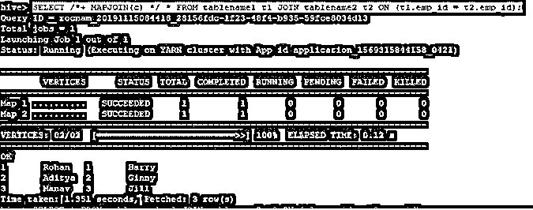
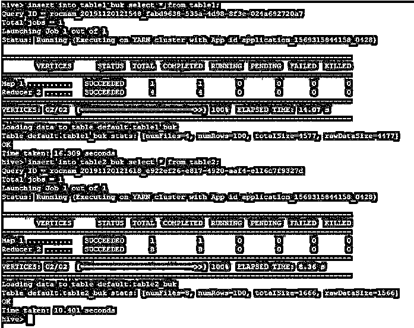
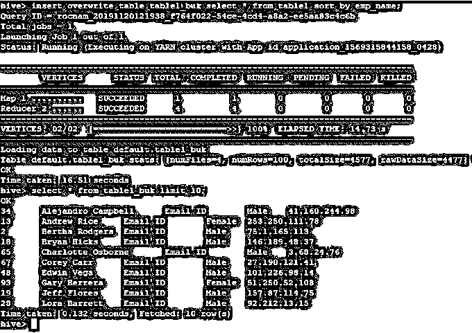
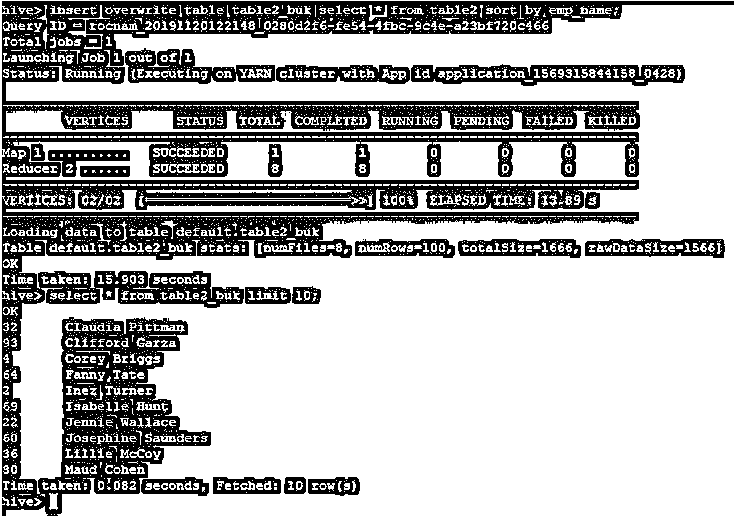
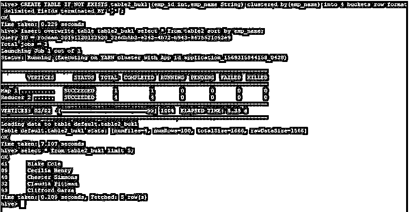

# 配置单元中的地图连接

> 原文：<https://www.educba.com/map-join-in-hive/>

## Hive 中的地图连接简介

Map join 是 Hive 查询中使用的一项功能，用于提高速度方面的效率。Join 是用于合并两个表中的数据的条件。因此，当我们执行普通连接时，作业被发送到一个 Map-Reduce 任务，该任务将主任务分成两个阶段——“Map 阶段”和“Reduce 阶段”。Map 阶段解释输入数据，并以键值对的形式将输出返回给 reduce 阶段。接下来是洗牌阶段，在这里它们被分类和组合。reducer 接受这个排序后的值，并完成连接作业。

可以在映射器内将表完全加载到内存中，而无需使用映射器/缩减器进程。它从较小的表中读取数据，并将其存储在内存哈希表中，然后将其序列化为哈希内存文件，从而大大减少了时间。在 Hive 中也称为映射端连接。基本上，它涉及到只使用 Map 阶段并跳过 Reduce 阶段来执行两个表之间的连接。如果您的查询定期使用小型表连接，那么可以观察到查询计算时间的减少。

<small>Hadoop、数据科学、统计学&其他</small>

### 配置单元中映射连接的语法。

如果我们想使用 map-join 执行连接查询，那么我们必须在下面的语句中指定一个关键字"/*+ MAPJOIN(b) */":

`SELECT /*+ MAPJOIN(c) */ * FROM tablename1 t1 JOIN tablename2 t2 ON (t1.emp_id = t2.emp_id);`

对于这个例子，我们需要创建两个表，名称分别为 tablename1 和 tablename2，包含两列:emp_id 和 emp_name。一个应该是较大的文件，一个应该是较小的文件。

在运行查询之前，我们必须将 below 属性设置为 true:

`hive.auto.convert.join=true`

地图连接的连接查询如上所述，我们得到的结果是:

该查询在 1.351 秒内完成。

### Hive 中的地图连接示例

下面举几个例子

#### 1.地图连接示例

对于这个例子，让我们创建两个表，名为 table1 和 table2，分别包含 100 和 200 条记录。您可以参考下面的命令和执行命令的截图:

`CREATE TABLE IF NOT EXISTS table1 ( emp_id int, emp_name String, email_id String, gender String, ip_address String) row format delimited fields terminated BY ',' tblproperties("skip.header.line.count"="1");`

`CREATE TABLE IF NOT EXISTS table2 ( emp_id int, emp_name String) row format delimited fields terminated BY ',' tblproperties("skip.header.line.count"="1");`

现在，我们使用以下命令将记录加载到两个表中:

`load data local inpath 'https://cdn.educba.com/relativePath/data1.csv' into table table1;`

`load data local inpath 'https://cdn.educba.com/relativePath/data2.csv' into table table2;`

让我们对他们的 ID 执行普通的 map-join 查询，如下所示，并验证执行相同操作所需的时间:

`SELECT /*+ MAPJOIN(table2) */ table1.emp_name, table1.emp_id,table2.emp_id FROM table1 JOIN table2 ON table1.emp_name = table2.emp_name;`

正如我们所见，一个普通的地图连接查询需要 12.521 秒。

#### 2.桶图联接示例

现在让我们使用 Bucket-map join 来运行相同的操作。存储时需要遵循一些约束条件:

*   只有当任何一个表的总存储桶数是另一个表的存储桶数的倍数时，存储桶才能相互连接。
*   必须有分桶表才能[执行分桶](https://www.educba.com/bucketing-in-hive/)。因此让我们创造同样的东西。

以下是用于创建分桶表 table1 和 table2 的命令:

`CREATE TABLE IF NOT EXISTS table1_buk (emp_id int, emp_name String, email_id String, gender String, ip_address String) clustered by(emp_name) into 4 buckets row format delimited fields terminated BY ',';`

`CREATE TABLE IF NOT EXISTS table2_buk ( emp_id int, emp_name String) clustered by(emp_name) into 8 buckets row format delimited fields terminated BY ',' ;`

我们将把表 1 中的相同记录也插入到这些分桶表中:

`insert into table1_buk select * from table1;`

`insert into table2_buk select * from table2;`

现在我们有了两个分桶的表，让我们对它们执行一个分桶映射连接。第一个表有 4 个存储桶，而第二个表在同一列上创建了 8 个存储桶。

为了让 bucket-map 连接查询工作，我们应该在配置单元中将 below 属性设置为 true:

`set hive.optimize.bucketmapjoin = true`

`SELECT /*+ MAPJOIN(table2_buk) */ table1_buk.emp_name,table1_buk.emp_id, table2_buk.emp_id FROM table1_buk JOIN table2_buk ON table1_buk.emp_name = table2_buk.emp_name ;`

正如我们所见，查询在 8.735 秒内完成，这比普通的地图连接要快。

#### 3.排序合并存储桶映射连接示例(SMB)

[SMB 可以在具有相同桶数的分桶表上执行](https://www.educba.com/what-is-smb/)，如果表需要在连接列上排序和分桶。映射器级别相应地连接这些桶。

与 Bucket-map join 相同，table1 有 4 个 Bucket，table2 有 8 个 Bucket。对于这个例子，我们将创建另一个有 4 个桶的表。

要运行 SMB 查询，我们需要设置以下配置单元属性，如下所示:

hive . input . format = org . Apache . Hadoop . hive . QL . io . bucketizedhiveinputformat；
hive . optimize . bucketmapjoin = true；
hive . optimize . bucketmapjoin . sorted merge = true；

要执行 SMB 连接，需要按照连接列对数据进行排序。因此，我们覆盖表 1 中的数据，分时段如下:

`insert overwrite table table1_buk select * from table1 sort by emp_name;`

数据现在已经排序，可以在下面的截图中看到:

我们还将覆盖分时段表 2 中的数据，如下所示:

`insert overwrite table table2_buk select * from table2 sort by emp_name;`

让我们对上述两个表执行如下连接:

`SELECT /*+ MAPJOIN(table2_buk) */ table1_buk.emp_name,table1_buk.emp_id, table2_buk.emp_id FROM table1_buk JOIN table2_buk ON table1_buk.emp_name = table2_buk.emp_name ;`

我们可以看到，该查询耗时 10.165 秒，再次优于普通的地图连接。

现在让我们为 table2 创建另一个表，它有 4 个桶，相同的数据用 emp_name 排序。

`CREATE TABLE IF NOT EXISTS table2_buk1 (emp_id int,emp_name String) clustered by(emp_name) into 4 buckets row format delimited fields terminated BY ',' ;`

`insert overwrite table table2_buk1 select * from table2 sort by emp_name;`

考虑到我们现在有两个带有 4 个桶的表，让我们再次执行一个连接查询。

`SELECT /*+ MAPJOIN(table2_buk1) */table1_buk.emp_name, table1_buk.emp_id, table2_buk1.emp_id FROM table1_buk JOIN table2_buk1 ON table1_buk.emp_name = table2_buk1.emp_name ;`

该查询比普通地图连接查询快 8.851 秒。

### 优势

*   Map join 减少了 shuffle 中排序和合并过程所用的时间，并减少了阶段，从而最大限度地降低了成本。
*   它提高了任务的执行效率。

### 限制

*   不允许同一表/别名在同一查询中联接不同的列。
*   映射联接查询无法将完整的外部联接转换为映射端联接。
*   只有当其中一个表足够小，可以放入内存时，才能执行地图连接。因此，在表数据很大的情况下，不能执行该操作。
*   只有当右表很小时，[左连接才有可能](https://www.educba.com/left-join-in-oracle/)到映射连接。
*   仅当左侧表的大小较小时，才能对地图连接执行右侧连接。

### 结论

我们已经尝试在 Hive 中包含地图连接的最佳可能点。正如我们在上面看到的，当一个表有较少的数据时，地图端连接效果最好，这样作业可以快速完成。此处显示的查询所花费的时间取决于数据集的大小；因此，此处显示的时间仅用于分析。由于我们拥有庞大的数据，地图连接可以很容易地在实时应用程序中实现，从而减少网络 I/O 流量。

### 推荐文章

这是一个 Hive 中的地图连接指南。在这里，我们讨论 Hive 中地图连接的例子以及优点和局限性。您也可以阅读以下文章，了解更多信息——

1.  [加入蜂巢](https://www.educba.com/joins-in-hive/)
2.  [Hive 内置函数](https://www.educba.com/hive-built-in-functions/)
3.  什么是蜂巢？
4.  [配置单元命令](https://www.educba.com/hive-command/)
5.  [蜂房分区指南](https://www.educba.com/partitioning-in-hive/)
6.  [学习 7 大蜂巢版本](https://www.educba.com/hive-versions/)

