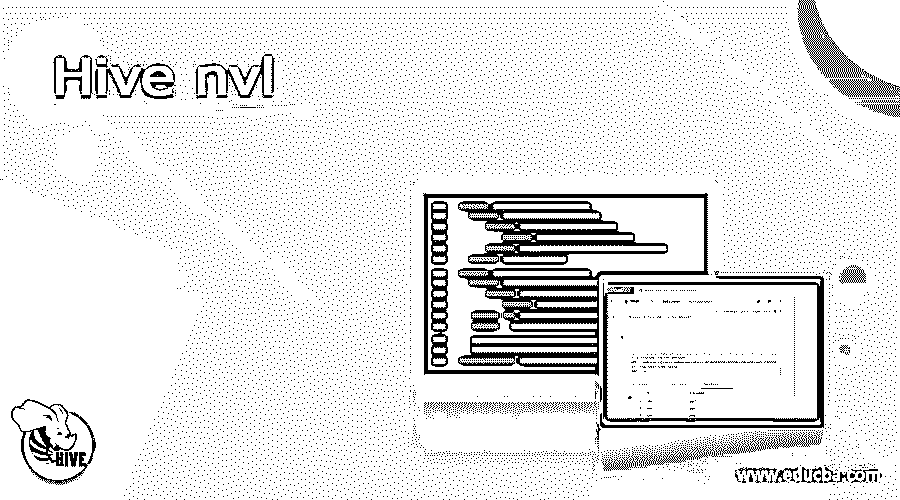
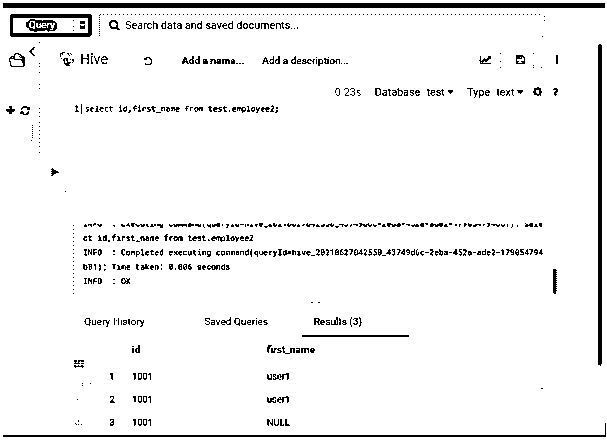
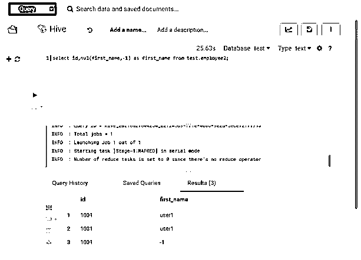

# 他妈的 nvl

> 原文：<https://www.educba.com/hive-nvl/>

## Hive nvl 简介

在 hive 中，我们处理大量的数据以及大型数据集。在某些情况下，我们在表中得到空值。但在分析目的上，我们需要一个有意义的充分数据。在某些情况下，我们需要一种机制，它将确定空值，并应将其替换为有意义的完整值。这将有助于前面的进一步分析。这里，hive nvl 函数开始发挥作用。这将有助于替换配置单元表中的空值，并将必要的值放在空值的位置。我们也可以将 hive nvl 函数与多重控制语句一起使用。

**Hive nvl 命令的语法**

<small>Hadoop、数据科学、统计学&其他</small>

`nvl(<Column name >,<Value that’s needs to be replace>)`

1) nvl:在 hive 服务中，我们需要使用函数的数量。hive nvl 函数是相同的函数之一。我们可以使用 nvl 函数作为 hive 查询中的关键字。它会更新，我们需要用特定的值替换表中的空值。在 nvl 关键字的帮助下，我们可以很容易地替换 hive 表中的空值。但是在触发 nvl 函数之前，请先了解一下 hive 表结构，以及我们需要替换哪些值。

2)列名:在 hive nvl 函数中，我们需要在其中定义 hive 列名。这将有助于理解我们需要选择哪一列来标识空值。

3)需要替换的值:在 hive nvl 函数中，我们需要提供必要的值。当任何空值出现时，相同的值将被替换。

### nvl 在 Hive 中是如何工作的？

在 hive 服务中，我们要处理大量的数据和大型数据集。很有可能在配置单元表中存在空值。很难确定出现空值的情况的数量。在 hive nvl 函数的帮助下，很容易识别 hive 表中的空值，并用特定的或有意义的值替换空值。配置单元 nvl 将使用不同的控制语句或配置单元查询。我们需要传递列名和需要替换的值。然后，nvl 函数将检查特定的表，如果出现空值，它将使用提供的值替换空值。

下面是我们可以在 hive nvl 中使用的条件函数列表。

1) IF(布尔测试条件，T 值真，T 值假或空) :我们有多个不同类型的条件函数。上述条件函数是蜂巢生态系统中最好的条件函数之一。它与“IF”控制语句非常相似。我们也可以将这个“IF”控制语句与其他编程语言相关联。在 IF hive 控制语句中，它将测试在 hive IF 控制语句下提供的条件函数。如果提供的表达式是正确的，那么它将返回一个必要的或相应的结果。结果将取决于条件结果是真还是假(在某些情况下，结果也将为空)。

2) isnull(a):在 isnull 条件函数中，如果为空，则返回值 true，否则返回值 false。

3)isnotnull(a):isnotnull 条件函数是 isnull 条件函数的反义词换句话说我们可以说这个函数是 isnull 条件函数的否定。如果不为空，它将返回真值，否则返回假值。

4)a THEN b[WHEN c THEN d]…[ELSE e]END 的情况:在 hive 中，我们也能够测试顺序条件。该条件函数将测试多个条件，并检查当前顺序条件或表达式中的任何一个是否为真，然后它将为初始真条件返回相应的或必要的结果。在同一个条件函数中，我们可以使用不同的运算符，如 REGEXP、OR、In(我们也可以在 CASE 表达式中使用它们)。

5)CASE a WHEN b THEN c[WHEN d THEN e]…[ELSE f]END:仅与上述条件函数类似。这个条件函数将测试多个条件。但这里我们提供的是初始条件。这将取决于需求或应用程序代码。它将检查当前序列条件或表达式中的任何一个是否为真，然后它将返回初始真条件的相应或必要结果。在同一个条件函数中，我们可以使用不同的运算符，如 REGEXP、OR、In(我们也可以在 CASE 表达式中使用它们)。

6) NVL(arg1，arg2):在这个条件函数中，我们提供了不同的参数。如果表达式或条件为空，那么它将返回表达式。在某些情况下，如果结果不为空，那么将返回第二个参数。

7) coalesce(value1，value 2，...):在这个条件函数中，它将返回所提供列表的第一个非空值(该值在参数中提供)。

8) decode( <expr>、<search1>、<result1>、… <search n="">、<result n="">、<default>):在这个条件函数中，它将有助于将一个表达式与条件函数中提供的一个或多个可能值进行比较。一旦找到必要的匹配，它将返回相应的结果。</default></result></search></result1></search1></expr>

理解 Hive nvl 命令的示例

**配置单元 nvl:简单配置单元命令**

在 hive 环境中，我们能够用特定值替换空值。

**命令:**

`select id,nvl(first_name,-1) as first_name from test.employee2;`

**说明:**

按照上面的命令，我们用-1 值替换空值形式。

**输出:**

### 结论

我们已经看到了“Hive nvl”的完整概念，以及正确的示例、解释和带有不同输出的命令。这将有助于识别 hive 表中的空值，并用有意义的值替换空值。

### 推荐文章

这是 Hive nvl 的指南。这里我们讨论一下简介，语法，nvl 在 Hive 中是如何工作的？、示例和命令。您也可以看看以下文章，了解更多信息–

1.  [蜂巢表](https://www.educba.com/hive-table/)
2.  [HiveQL 想要](https://www.educba.com/hiveql-queries/)
3.  [蜂巢时间戳](https://www.educba.com/hive-timestamp/)
4.  [HiveQL Group By](https://www.educba.com/hiveql-group-by/)

