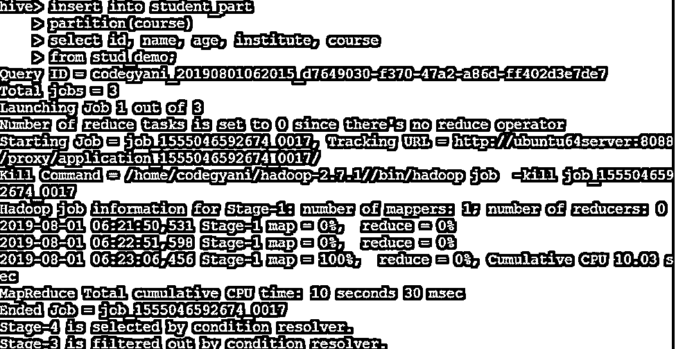
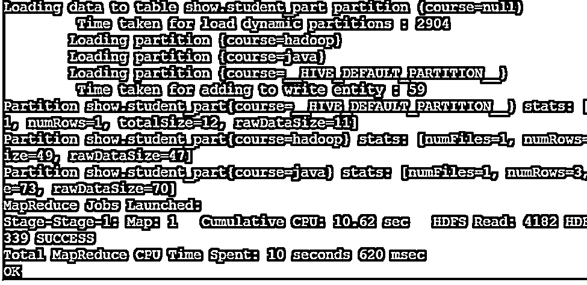

# 蜂巢中的动态分区

> 原文：<https://www.educba.com/dynamic-partitioning-in-hive/>

## Hive 中的动态分区简介

分区是 Hive 中的一个重要概念，它通过规则和模式基于数据对表进行分区。动态分区是对分区表的一次插入。我们不需要显式地在需要动态分区的表上创建分区。在 Hive 中使用动态分区进行数据插入时，会产生大量的子目录。

**语法**

<small>Hadoop、数据科学、统计学&其他</small>

为了启用动态分区，我们使用以下 HIVE 命令:

`set hive.exec.dynamic.partition = true;`

这将为我们的 hive 应用程序设置动态分区。

`set hive.exec.dynamic.partition.mode = nonstrict;`

这会将模式设置为非严格模式。非严格模式意味着它允许所有的分区都是动态的。

它也可以被称为变量分区。可变分区意味着在执行之前不配置分区，否则在运行时根据文件或所需分区的大小进行配置。它确保了 RAM 的最佳利用方式和内存的最佳分配。

在动态分区中，使用 Map-reduce 作业读取和分区每一行数据。默认情况下，在配置单元中禁用动态分区，以防止意外分区。

要使用它，我们需要在配置单元或配置单元配置 XML 文件中设置一些属性。

`<property>
<name>hive.exec.dynamic.partition</name>
<value>true</value>
</property>
<property>
This is used to enable the dynamic Partition in Hive
<name>hive.exec.dynamic.partition.mode</name>
<value>nonstrict</value>
</property>
<property>
Non strict mode means the table will not have any static partition
<name>hive.exec.max.dynamic.partitions</name>
<value>1000</value>
</property>
<property>
Maximum no of partitions that can be created with dynamic partition with one statement
<name>hive.exec.max.dynamic.partitions.pernode</name>
<value>100</value>
</property>
<property>
This is the maximum number of partitions created by each mapper and reducer`

所以基本上有了这些值，我们告诉 hive 根据数据的大小和可用空间来动态划分数据。通常，与静态分区相比，动态分区需要更多时间来加载数据，并且数据加载是从非分区表中完成的。我们可以在托管表和外部表中执行分区。

### 动态分区是如何工作的？

让我们寻找一个动态分区如何工作的例子:

*   我们需要创建一个非分区表来存储可能是临时表的数据。
*   我们将采用一个 EMP 表作为参考:

**查询:**

`Create table stud_demo ( id int , name string , age int , institute string , course string)
row format delimited fields terminated by “,”;`

*   从任何外部源加载表中的数据，比如说一个文本文件:-

`LOAD DATA local inpath ‘path name’ into table employee_np;`

*   现在创建一个分区表，我们要用动态分区在其中插入数据。

**查询:**

`Create table student_part ( id int , name string , age int , institute string)
Partitioned by (course string)
Row format delimited fields terminated by “,”;`

**Note:** We will check whether the dynamic partition is activated for HIVE tables or not.

*   一旦创建了这个表，我们就可以使用以下命令来检查分区是否正确:

`SHOW PARTITIONS student_part;`

*   插入我们想要插入的数据和所需的分区:

`Insert into student_part  partition(course)
Select id,name,age,institute,course from  stud_demo;`

*   通过这个查询，我们可以在列过程中动态划分表来插入数据。

### 动态分区的优势

*   适合在表格中加载大文件。
*   读取逐行数据。
*   分区基于可用的内存和 RAM，因此资源得到了充分利用。
*   通常用于从未分区表中加载数据。
*   如果列数未知，并且我们希望基于列对数据进行分区，则使用动态分区。
*   数据负载水平分布。
*   通常，查询处理时间会减少。
*   要进行分区的列值在运行时是已知的。
*   我们可以使用从未分区的表中加载数据。
*   外部表和托管表都可以用于动态分区。

### 动态分区的缺点

*   与静态分区相比，加载数据通常需要更多时间。
*   我们不能对动态分区执行 alter。
*   拥有大量的分区可能会增加 NameNode 的开销。
*   查询处理有时会花费更多的时间来执行。
*   这有时会是一个昂贵的操作。

### 结论

从上面的文章中，我们看到了如何在 hive 中使用它以及如何创建它。我们还检查了在配置单元上使用动态分区的优势以及如何使用它。因此，从这篇文章中，我们可以对它在 hive 中的工作方式及其优势有一个大致的了解。

### 推荐文章

这是一个 Hive 中动态分区的指南。这里我们讨论基本概念，动态分区是如何工作的，以及 Hive 中分区的优缺点。您也可以浏览我们推荐的其他文章，了解更多信息——

1.  [配置单元数据类型](https://www.educba.com/hive-data-types/)
2.  [配置单元中的索引](https://www.educba.com/indexes-in-hive/)
3.  [蜂巢功能](https://www.educba.com/hive-function/)
4.  [蜂巢架构](https://www.educba.com/hive-architecture/)
5.  [配置单元内部连接|工作和示例](https://www.educba.com/hive-inner-join/)

