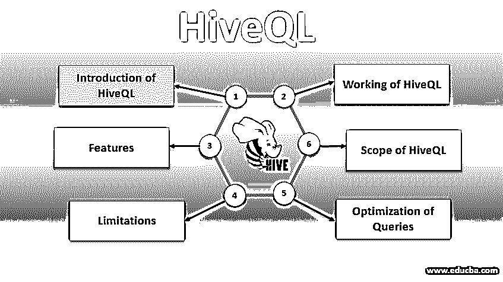

# HiveQL

> 原文：<https://www.educba.com/hiveql/>

## HiveQL 简介

Hive 为使用 Hive 查询语言编写 Hive 查询提供了一个 CLI。HQL 语法通常类似于大多数数据分析师熟悉的 SQL 语法。Hive 的 SQL 语言将用户与编程 Map Reduce 的范围区分开来。它使用相关数据库环境中众所周知的概念，如行、表、列和模式，来鼓励学习。HiveQL 的语法大体类似于 SQL，这是大多数数据分析师所熟悉的。文本文件、序列文件、ORC 和 RCFILE(列文件记录)是 Hive 支持的四种格式。

### HiveQL 的工作

Hive 为数据操作提供了一种类似 SQL 的方言，消除了我们编写低级 MapReduce 作业来获取数据(通过 Mapper)和聚合最终结果(通过 Reducer 模块)的需要。

<small>Hadoop、数据科学、统计学&其他</small>

#### 正在执行配置单元查询

执行配置单元查询的步骤包括:

1.  Hive 接口(通过 CLI 或 Web UI)将查询发送到驱动程序(JDBC、ODBC 或节俭服务器)进行编译、优化和执行。它通过编译器检查查询的语法和执行计划。
2.  编译器向 Metastore 发送请求，并接收元数据作为响应。
3.  编译器将执行计划反馈给驱动程序，驱动程序再将其发送给执行引擎。
4.  执行引擎与作业跟踪器交互，作业跟踪器是完成作业的名称节点。
5.  并行地，执行引擎也执行元数据操作。
6.  名称节点通过任务跟踪器或数据节点完成工作。
7.  与执行引擎共享的结果，然后通过驱动程序显示给界面。

#### 查询的优化

调整 HiveQL 以更好地优化查询。使用下面设置的命令，我们可以覆盖默认配置并实现更快的查询执行。

**1** 。SET hive.execution.engine = tez

默认情况下，执行引擎设置为 Mapreduce，但我们可以显式地将其设置为 tez(仅适用于 Hadoop 2)或 Spark(适用于 Hive 1.1。0 以后)。

**2** 。SET hive.mapred.mode = unstrict

这是为了[动态分区](https://www.educba.com/dynamic-partitioning-in-hive/)，有助于加载大型数据集。然而，静态分区被设置为默认，这发生在“严格”模式下。

**3** 。SET hive . vectorized . execution = true

set hive . vectorized . execution . enabled = true

矢量化查询执行允许像聚合、过滤或连接这样的操作成批发生，每批 1024 行，而不是一次一行。

**4** 。设置 hive.auto.convert.join = true

当连接一个大数据集和一个小数据集时，[地图连接更有效，可以使用上面的命令设置。](https://www.educba.com/map-join-in-hive/)

**5** 。设置 hive.exec.parallel = true

在 Hadoop 中，MapReduce 作业是并行执行的。有时，如果查询不相互依赖，那么并行执行可能更有利于实现更好的内存管理。

**6** 。设置 hive.exec.compress.output=true

这使得最终输出能够以压缩格式存储在 HDFS。

**7** 。设置 hive.exec.compress.output = true

这使得最终输出能够以压缩格式存储在 HDFS。

### HiveQL 的特点

1.  作为一种高级语言，Hive 查询被隐式地转换为 map-reduce 作业或复杂的 Dag(有向无环图)。在查询之前使用' Explain '关键字，我们可以得到查询计划。
2.  使用 RDMS 格式的元数据存储和复制数据来加快查询执行，从而在数据丢失时便于检索。
3.  位图索引是为了加速查询。
4.  通过允许数据分区来提高性能。
5.  Hive 可以处理不同类型的压缩文件，从而节省磁盘空间。
6.  为了操作字符串、整数或日期，HiveQL 支持扩展用户定义函数(UDF)，以解决内置 UDF 不支持的问题。
7.  它提供了一系列额外的 API 来构建定制的查询引擎。
8.  支持不同的文件格式，如 Textfile、Sequencefile、ORC(优化的行列格式)、RCFile、Avro 和 Parquet。ORC 文件格式最适合于提高查询性能，因为它以最优化的方式存储数据，从而提高查询执行速度。
9.  对于大型数据集 10，它是一个高效的数据分析和 ETL 工具。易于编写查询，因为它类似于 SQL。配置单元中的 DDL(数据定义语言)命令用于指定和更改配置单元中的数据库或表的结构。这些命令是 drop、create、truncate、alter、show 或 describe。

### 限制

1.  由于 Hadoop 是一个面向批处理的系统，因此 Hive 查询具有更高的延迟。
2.  不支持嵌套查询或子查询。
3.  不能在记录级别执行更新、删除或插入操作。
4.  HQL 的 Hive 作用域不提供实时数据处理或查询。

HiveQL 拥有数十亿到数万亿的数据记录，为大数据专业人士提供了广阔的发展空间。

### HiveQL 的范围

以下是 HiveQL 的范围如何扩大，以及如何更好地服务于分析用户每天生成的海量数据。

**安全性:**在处理大数据的同时，Hive 提供数据安全性。对于分布式系统来说，这项任务很复杂，因为需要多个组件相互通信。 [Kerberos 授权支持](https://www.educba.com/kerberos/)允许客户端和服务器之间的认证。

**锁定:**传统上，Hive 缺乏对行、列或查询的锁定。Hive 可以利用 Apache Zookeeper 来支持锁定。

**工作流管理** : Apache Oozie 是一个工作流调度器，用于自动执行各种 HiveQL 查询，以顺序或并行方式执行。

**可视化:** Zeppelin notebook 是一款基于网络的笔记本，支持交互式数据分析。它支持 Hive 和 Sparks 进行数据可视化和协作。

### 结论

HiveQL 在组织中被广泛用于解决复杂的用例。记住这种语言提供的特性和限制，Hive query 语言被用于电信、医疗保健、零售、银行和金融服务，甚至 NASA 的测试推进实验室的气候评估系统。编写类似 SQL 的查询和命令的简易性被广泛接受。该领域不断增长的就业机会吸引了来自不同行业的应届毕业生和专业人士来获得该领域的实践经验和知识。

### 推荐文章

这是 HiveQL 的指南。这里我们讨论 HiveQL 的介绍，优化查询及其限制和特性。您也可以浏览我们的相关文章，了解更多信息——

1.  [什么是 Hive 数据类型？](https://www.educba.com/hive-data-types/)
2.  [蜂巢替代品|了解特性](https://www.educba.com/hive-alternatives/)
3.  [Hive 命令的顶层组件](https://www.educba.com/hive-command/)
4.  [十大蜂巢面试问题](https://www.educba.com/hive-interview-questions/)
5.  HQL |什么是 HQL？
6.  [SQL |中的 LIKE 查询如何使用？](https://www.educba.com/like-query-in-sql/)

