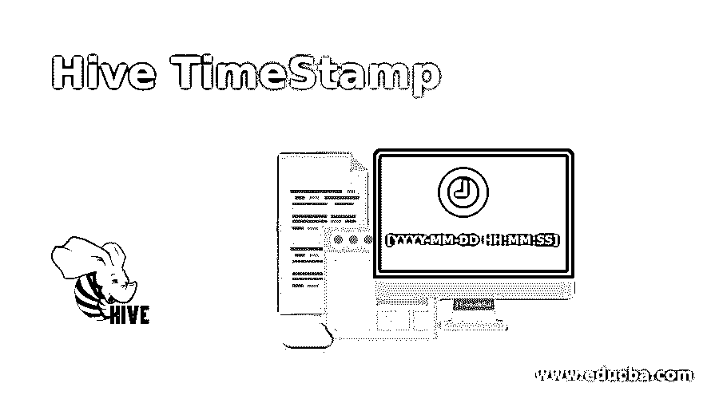

# 配置单元时间戳

> 原文：<https://www.educba.com/hive-timestamp/>

## 配置单元时间戳简介

配置单元时间戳被解释为不受时区限制，并以 UNIX 格式存储为偏移量。在表中发生不同的内部变化时，获取表的更新信息是很有用的。配置单元时间戳格式为年-月-日-小时-分钟-秒[YYYY-MM-DD HH:MM:SS]，可选择秒的小数部分。上述格式附带的任何其他内容都应该作为字符串读取，并在以后进行转换。

在 hive 中，时间戳在不同的应用程序(如事务)中起着至关重要的作用，用于标识 hive 表上的更改或更新。

<small>Hadoop、数据科学、统计学&其他</small>

**Note:** The hive timestamp is only available with starting Hive 0.8.0 version.

**语法:**

`Function name ( string date | string timestamp | string patter | string startdate | string enddate | string timezone | string fmt )`

**注意:**在 hive 时间戳中，我们需要使用 hive 中可用的不同时间戳或日期函数，并根据我们的需求来使用它。

### 时间戳在 Hive 中是如何工作的？

在 hive 时间戳中，借助于这些预定义的函数，它具有时间戳的内置功能。我们可以研究蜂巢的时间戳。它具有将 hive 时间戳转换为 UNIX 时间格式或从 UNIX 时间格式转换为 hive 时间戳的功能。所有现有的日期时间用户定义函数，如月、日、年、小时等。正在使用时间戳数据类型。

hive 时间戳支持以下三种转换:

*   **Integer numeric 类型:**在 Integer numeric 中，我们可以用秒来解释 UNIX 时间戳
*   **浮点数值类型:**在浮点数值中，我们可以用十进制格式或精度来解释以秒为单位的 UNIX 时间戳
*   **字符串类型:**在字符串类型中，我们可以解释为符合 JDBC 的 java.sql.Timestamp 格式“YYYY-MM-DD HH:MM:ss . ffffffff”。它考虑小数点后 9 位的精度。

**Note:** The unix_timestamp() function is available in the hive. But it is providing the current timestamp in the second’s format. But the value is not fixed. Hence it is very difficult for optimizing the query and gets the related information. That’s why the unix_timestamp() function will deprecate from the version of hive 2.0.

### HiveTimestamp 的示例

下面是下面给出的例子:

如前所述，我们在配置单元中有许多可用的预定义函数。让我们逐一探索。

#### 1.unix_timestamp()

UNIX 时间戳函数有助于获得第二种格式的时间戳信息。在 Hadoop 中使用不同的应用程序(如 YARN、HBase 等)来计算时差通常很有用。

unix_timestamp 函数的返回数据类型是“bigint”。

**查询:**

`select unix_timestamp();`

**输出:**

#### 2.unix _ 时间戳(字符串日期)

带有字符串日期的 UNIX 时间戳函数有助于将人类可读的时间或字符串日期转换为秒。它考虑本地时区(群集或节点使用的时区)。字符串格式应为“YYYY–MM–DD–HH–MM–SS”。

unix_timestampfunction 的返回数据类型是“bigint”。

**查询:**

`select unix_timestamp('2020-03-25 16:32:01');`

**输出:**

#### 3.unix_timestamp(字符串日期，字符串模式)

带有字符串日期和模式函数的 UNIX 时间戳有助于在不同模式下转换时间戳。根据我们的要求，我们可以按照“YYYY–MM–DD”或“HH: MM”获得以秒为单位的时间戳。

unix_timestamp 函数返回的数据类型是“bigint”。

**查询—“YYYY–MM–DD”格式**

select UNIX _ timestamp(' 2020-03-25 '，' yyyy-MM-DD ')；

**输出:**

**查询—“HH:MM”格式**

`select unix_timestamp('16:39','HH:mm');`

**输出:**

#### 4.到日期(字符串时间戳)

在上面的函数中，我们可以从时间戳中获得完整的日期信息。时间戳格式只能是 hive 时间戳。

to_date 函数的返回数据类型因配置单元的版本而异。假设版本低于 2.1.0，那么它的字符串。如果版本高于 2.1.0，则数据类型将为“日期”。

**查询:**

`select to_date('2020-03-25 16:32:01');`

**输出:**

#### 5.年份(字符串日期)

借助 year 函数，我们可以从字符串日期中获取年份。year 函数返回的数据类型是“int”。

**查询:**

`select to_year('2020-03-25');`

**输出:**

#### 6.季度(日期|时间戳|字符串)

在上面的函数中，我们可以从时间戳中获取季度信息。quarterfunction 的返回数据类型是“int”。

**查询:**

`select quarter('2020-03-25 16:32:01');`

**输出:**

#### 7.月份(字符串日期|时间戳)

在上面的函数中，我们可以从时间戳中获取月份信息。monthfunction 返回的数据类型是“int”。

**查询:**

选择月份(' 2020-03-25 16:32:01 ')；

**输出:**

#### 8.小时(字符串日期)

在上面的函数中，我们可以从时间戳中获取小时信息。

hourfunction 的返回数据类型是“int”。

**查询:**

`select hour('2020-03-25 16:32:01');`

**输出:**

#### 9.分钟(字符串日期)

在上面的函数中，我们可以从时间戳中获取分钟信息。

minutefunction 的返回数据类型是“int”。

**查询:**

`select minute('2020-03-25 16:32:01');`

**输出:**

#### 10.一年中的星期(字符串日期)

借助 weekofyear 函数，我们可以确定日期属于哪一周。

weekofyear 函数的返回数据类型是“int”。

**查询:**

`select weekofyear('2020-03-25 16:32:01');`

**输出:**

#### 11.datediff(字符串结束日期，字符串开始日期)

借助 datediff 函数，我们将得到两个日期之间的差异。输出将是数字格式。datediff 函数返回的数据类型是“int”。

**查询:**

`select datediff('2020-03-30', '2020-03-25');`

**输出:**

#### 12.date_add(日期|时间戳开始日期，小整数|整数天)

在 date_add 函数中，我们将获得下一个日期和相应的整数值。我们提供了天数。date_addfunction 的返回数据类型是“int”。

**查询:**

`select date_add('2020-03-25 16:32:01', 1);`

**输出:**

#### 13.date _ sub(date | timestamp start date，smallint |int days)

在 date_sub 函数中，我们将获得过去日期的天数整数值。

date_sub 函数返回的数据类型是“int”。

**查询:**

`select date_sub('2020-03-25 16:32:01', 1);`

**输出:**

### 使用配置单元时间戳的优势

*   配置单元时间戳对于编写自动化作业很有用。
*   在表中插入记录时检查更新时间。
*   用于将时间戳与 Hadoop 的不同服务(如 YARN、HBase 和其他服务)进行比较。
*   在交易应用、零售行业等方面非常有用。
*   它有助于故障排除和修复配置单元事务作业。

### 结论

我们已经看到了“Hive Timestamp”的完整概念，以及适当的示例、解释、语法、SQL 查询和不同的功能。在“Hive Timestamp”的帮助下，我们将获得 Hive 的表和当前环境的更新信息。主要用于自动化脚本、交易应用、零售业等。

### 推荐文章

这是一个 Hive 时间戳的指南。在这里，我们还将讨论简介，以及时间戳在配置单元中是如何工作的？以及不同的示例和代码实现。您也可以看看以下文章，了解更多信息–

1.  [配置单元中的日期函数](https://www.educba.com/date-functions-in-hive/)
2.  [蜂巢版本](https://www.educba.com/hive-versions/)
3.  [配置单元数据类型](https://www.educba.com/hive-data-types/)
4.  [Hive 字符串函数](https://www.educba.com/hive-string-function/)

