# 信息学中的 Joiner 变换

> 原文：<https://www.educba.com/joiner-transformation-in-informatica/>

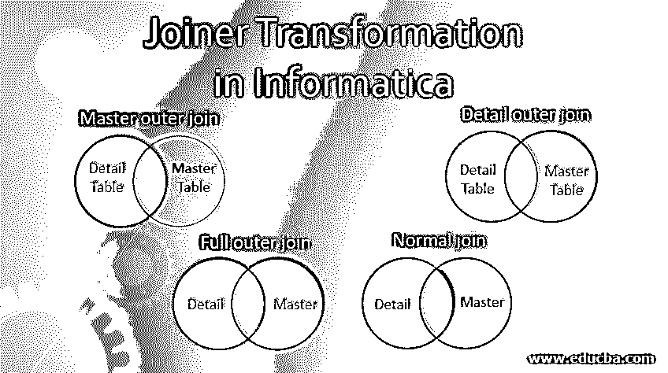

## 什么是信息学中的 Joiner 变换？

joiner 变换是信息科学中一种活跃的连通变换。通过使用该连接，您可以轻松地创建连接。这些连接类似于数据库中的连接。当要从不同的数据库创建连接时，这非常有用。Joiner 转换使用两个源来连接可用的数据。这里，源可以是主源，也可以是详细源。joiner 变换的属性源可以是主源，也可以是详细源。

连接可以如下所示:

<small>Hadoop、数据科学、统计学&其他</small>

*   主外部联接
*   详细外部连接
*   完全外部连接
*   正常连接

### 如何在 Informatica 中进行 Joiner 变换？

让我们从使用 joiner 转换创建映射的一步一步的过程开始。

**步骤 1:** 在数据库中创建一个新的目标。在信息目标中导入此表

**步骤 2:** 在数据库中创建一个新的源，并将其导入 Informatica 源。

**步骤 3:** 一旦创建了这些，就将这些源和目标纳入映射。转到映射选项，然后单击“创建”。

这里，源和目标被添加到映射设计器中。现在转到映射菜单，然后添加一个连接器。

给定的源和目标现在可以被拉入到这个映射中。这是我们在上一步中创建的源和目标。现在继续，去转换菜单，然后点击创建。

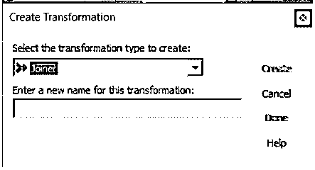

**第四步:**给这个转换起个名字。当您单击 Create 时，将会创建一个新的 joiner 转换。

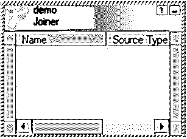

**步骤 5:** 在这个新创建的转换中，从源限定符中拖放所有的列。

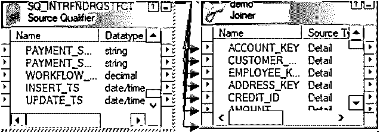

**步骤 6:** 现在双击这个转换，然后在编辑转换窗口中做如下操作:

*   转到条件选项卡

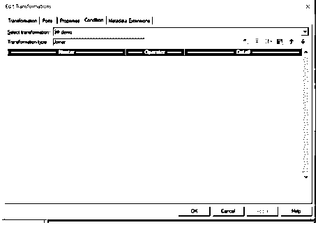

*   单击“新建”按钮创建一个新条件。在这里，您可以添加希望映射具有的连接条件。
*   现在转到属性选项卡，选择您想要应用的连接。

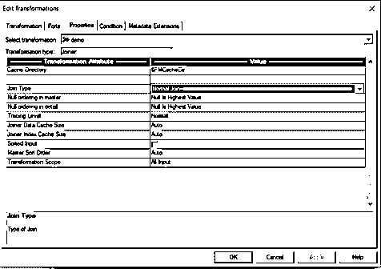

这可以是普通连接、完全外部连接、主外部连接或详细外部连接。为了获得更好的性能，可以将源表作为主源，这样记录会更少。要执行以下任务，步骤可能会有所帮助。

**第 7 步:**转到 ports 选项卡，然后选择您希望使其成为 masters 的任何列。这是 ports 选项卡中的最后一列，您可以在其中选择应该充当主源的列。

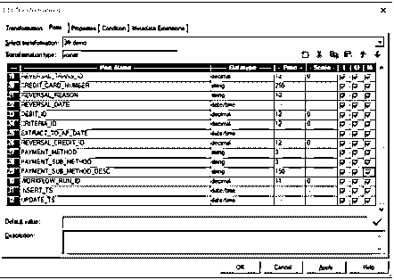

**第 8 步:**一旦完成了这一步，并在 joiner 中添加了条件及其源，您就可以将端口连接到输出。根据所确定的条件，拖放您想要在输出中显示的列。

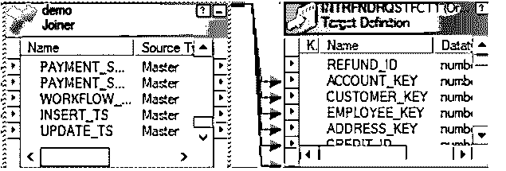

一旦形成了这个连接，您必须在继续创建其工作流之前验证映射。

### 信息学中 Joiner 变换的工作流程

创建一个工作流来运行所创建的 joiner 转换。

**步骤 1:** 一旦创建了映射，还应该创建一个工作流来执行和运行它。工作流使我们能够运行具有特定会话属性的映射。此工作流可以手动创建，也可以使用工作流向导创建。如果您必须手动创建工作流，您可以导航到工作流，然后单击创建。

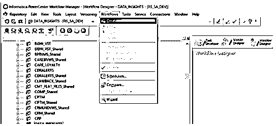

将打开一个窗口，其中应提供工作流名称，这有助于唯一地标识工作流。您可以根据您的映射对其进行命名，以便轻松地将工作流与映射相关联。

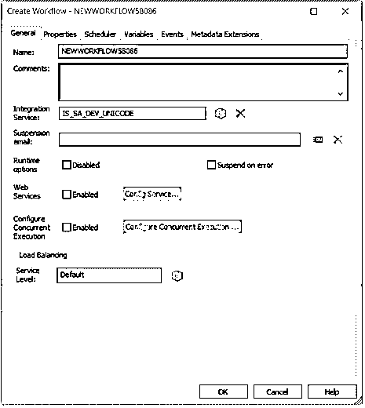

创建工作流后，下一个任务是为该工作流创建会话。会话有助于定义特定工作流的属性。

**步骤 2:** 在 Informatica 中，会话可以有两种类型。它们可以是可重用的和不可重用的。我们的会话应该创建一个不可重用的会话，这将是我们的工作流所独有的。由于我们工作流的功能是唯一的，不会被重用，我们可以将此会话保持为不可重用。要创建新会话，请转到“任务”菜单，然后选择“创建”选项。

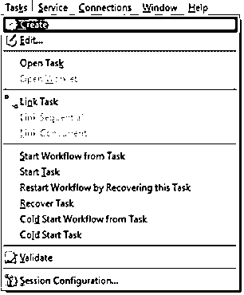

**步骤 3:** 为创建的会话指定一个唯一的名称。单击一个新会话，然后将其命名为 m_Joiner。单击创建新会话后，您可以选择与您的映射相对应的会话。

**步骤 4:** 要设置和定义属性，您可以双击会话 ta，这将有助于您获得会话共有的属性。

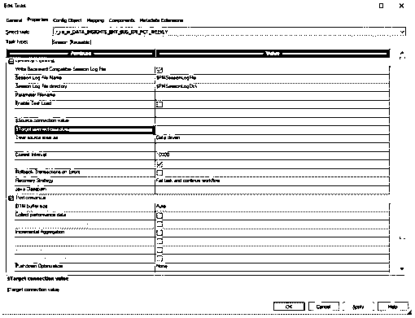

这里可以提到所有的来源和目标。在$Source_Connection_Value 和$Target_Connection_Value 中提到了它们。用户可以定义参数而不是目标，这些参数文件可以被不同的源和目标重用。

**步骤 5:** 在同一个会话中，当您移动到映射选项卡时，您可以配置源和目标连接。通过单击要使用的目标上的源，可以很容易地配置这些。所有这些设置将使您的工作流准备运行。您可以通过选择将验证工作流的验证选项来验证会话和工作流。

**步骤 6:** 当工作流通过验证后，就可以运行了。会话任务将使工作流能够运行，工作流监视器将打开并显示工作流状态。所有满足 joiner 条件的行都将显示在 run properties 中。如果有任何错误，甚至可以在监视器的帮助下进行检查。

### 结论

joiner 变换是最常用和最有用的变换。它有助于连接两个具有所需条件的表。Joiner 转换通过使用四种类型的连接来帮助用户连接两个表。这些连接可以是普通连接、完全外部连接、主连接或详细连接。Maser join 有助于优化数据并提高制图性能。行数较少的列将被选择并进一步连接。这使得过程更快。因此，连接有助于按照定义的条件从多个表中提取数据。

### 推荐文章

这是一个指南 Joiner 转换在信息。这里我们讨论如何在 Informatica 中执行 Joiner 转换以及工作流。您也可以看看以下文章，了解更多信息–

1.  [信息转换](https://www.educba.com/transformations-in-informatica/)
2.  [信息论中的秩变换](https://www.educba.com/rank-transformation-in-informatica/)
3.  [信息中的路由器改造](https://www.educba.com/router-transformation-in-informatica/)
4.  [信息转换与示例](https://www.educba.com/transformations-in-informatica-with-example/)

