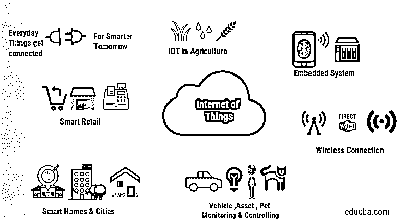

# 什么是 IOT？

> 原文：<https://www.educba.com/what-is-iot/>

## IOT 简介

IOT 也被称为物联网。它是通过互联网将物理对象连接到其他设备的方式。凯文·阿什顿给出了物联网这个术语，他在 1999 年首次提到它。物联网是指当事物或物体比人更多地连接到互联网。物联网中的东西被定义为物体，可以是人或汽车，内置传感器，具有 IP 地址，能够通过互联网收集和传输数据。

它广泛应用于不同行业的组织中。它帮助他们更高效地工作，向客户提供增强的服务，改进决策，并增加业务价值。一般都是从微服务、无线、MEMS 技术[演变而来。它是从 M2M 通信演变而来的，当机器在没有任何人为干扰或交互的情况下相互连接时。它有助于连接到云，并能够管理和收集数据。](https://www.educba.com/what-is-microservices/)

<small>Hadoop、数据科学、统计学&其他</small>

### 谅解

它主要由带有嵌入式处理器、传感器和通信的智能设备组成，用于收集和发送来自不同环境的数据。连接到物联网集线器或网关的设备共享它们在本地收集和分析的数据。这些设备也可以与其他设备连接，并根据它们从其他设备获得的信息进行操作。这些设备主要在没有任何人类交互或干预的情况下工作。工程师可以与设备交互以设置和收集来自设备的信息。该过程分为 3 个不同的步骤:收集数据和整理，传输数据，分析数据和采取的行动。

### 为什么会被使用？

当单独的设备连接到互联网时，发送和接收数据，并发送数据以使事情智能化。

在物联网的帮助下，所有连接到互联网的事物都可以分为三类:

#### 1.收集和发送信息

在这种情况下，信息被收集并通过网络发送。这主要是借助传感器来完成的。它可以是温度传感器、运动传感器、空气质量传感器、湿度传感器和光传感器等。这些传感器自动连接，从不同的环境或设备收集或接收信息，帮助做出正确的决策。例如，如果农民能够自动获得土壤湿度的信息，那么他们就能够决定农场何时再次需要水，以及何时需要多少水。它帮助农民提供适量的水，而不是给农场或农作物过多或过少的水。这有助于明智地利用资源，不要让资源被浪费。在这种帮助下，农民可以获得更多的作物和金钱，以更多的食物来造福世界。传感器允许机器感知世界。

#### 2.接受和行动

它有助于接收信息，然后根据信息采取行动。机器是这个领域的一个很好的例子；当他们收到相应的信息时，他们就采取行动。例如，打印机接收要打印的信息，然后打印它。当收集和发送信息时，物联网的力量变得非常强大，它还可以获取和作用于数据。

#### 3.双管齐下

传感器用于收集信息，无需任何人或人为干预。它有助于实现收集、发送和接收信息，并根据信息采取行动。

### 优势

物联网的优势在于:

*   它有助于监控整个业务流程。
*   它有助于改善客户体验。
*   它有助于创造更多的收入。
*   它有助于提高员工的生产力。
*   它有助于为组织节省时间和金钱。
*   它有助于做出更好的商业决策。
*   它有助于整合和适应商业模式。
*   这有助于降低成本。
*   它提高了流程效率、资产利用率和生产率。
*   它有利于实时洞察和分析，从而做出更好的决策。
*   它有利于人们在商业和工业中创造机会。

### IOT 的应用

物联网在消费物联网、企业物联网和制造以及工业物联网等各个领域有许多应用。这些应用可以是电信、能源、汽车等。例如，智能家居、智能家电、联网供暖、照明都可以在电脑和移动设备的帮助下进行控制。带有传感器的设备有助于收集和分析用户数据，并将信息发送给其他技术，使用户的生活变得更容易。其他例子有智能健康、智能城市、智能农业、智能电视、可穿戴设备、智能汽车等。智能建筑有助于降低能源成本，并帮助温度自动调节。智能农业系统可以帮助监测作物的环境、光照、温度、湿度和土壤湿度。它有助于智能城市，如路灯、智能电表和卫生设施等。

### 范围

在当今世界，信息技术的范围非常广泛，因为一切都与互联网相连。它将各种系统中的设备连接到互联网，这些设备或对象代表它们自己可以从任何地方被控制。它有助于实现更多的数据和位置，更多的方式来提高效率和改善安全和保障。它有助于组织通过[物联网分析](https://www.educba.com/iot-analytics/)和安全性来提高性能，从而实现良好的结果。许多组织，如石油和天然气、保险、制造、运输、基础设施和其他零售部门都可以从中受益，有些已经从中受益。物联网平台通常使设备或物体能够被观察者识别和了解情况，而无需获得人的帮助或任何其他人为干预。因此，物联网的范围在未来是巨大的，并且它已经显示出了成果。

### IOT 安全

物联网通过互联网与数十亿台设备相连，大量数据点参与信息的收集、传输和发送。由于物联网的长结构和扩展表面，物联网的安全和隐私是不同组织的巨大关注点。由于这些设备紧密相连，攻击者可以利用一个漏洞一口气操纵全部数据，而不定期更新的设备是这类攻击的主要原因。其他个人信息，如年龄、地址、信用卡信息等。当设备通过各种方式相互连接时，也由用户提供。这些设备被用来出售用户的个人信息。它还对基础设施、电力、交通和金融服务等构成风险。

### 学习的受众

学习这些的合适受众是工程师、销售主管、管理人员、顾问、业务分析师，对技术感兴趣的人可以学习物联网。这有助于他们了解即将进入这个世界的新技术，以及在没有任何人为干预的情况下，事物是如何相互联系以实现目标的。它有助于减少人工劳动和时间。它有更多的设置成本，但可以很容易地由他们工作的组织调整。

有很多平台可以学习。在线社区和论坛可用于了解物联网。视频可以很容易地实现它，也可以完成一些事情。组织主要关注最新的事物，他们在物联网上投资巨大，以提高员工的技能并优先发展业务。这些组织正在开展内部培训和计划，以帮助他们的员工和客户感受到物联网的重要性。

### IOT 在未来市场中的重要性

它在未来市场中非常重要，因为今天的一切都基于互联网和智能设备。互联网有助于连接设备，通过网络收集和发送信息，因此在不久的将来这将是一件大事。调查显示，到 2020 年，将有大约 280 亿台设备通过互联网连接。

全球各地的组织主要瞄准这个网络，它确保他们的产品只能在[物联网架构](https://www.educba.com/iot-architecture/)上开发。营销公司也需要适应全球市场的新趋势，因为一些组织已经通过在其组织中采用物联网获益匪浅。这有助于组织提高员工的技能和业务增长。IOT 正在快速适应，并获得了更多的关注。根据今天的市场趋势，它正在主导数字营销和其他各种组织。

### 职业成长

IT 部门或组织不同领域的物联网技能有助于您实现良好的职业发展。这有助于在各个领域获得高薪和职位。它在市场上提供了很多机会，因为人们对这种技能的需求越来越少，而需求却越来越多。物联网专家获得了高薪。构建设备、可通信芯片、网关、云管理、数据安全和物联网领域知识的技能有助于人们轻松找到工作。

设备应该能够感知数据，收集信息并通过网络发送。通信芯片应该对低能量和高能量精确地检测和传送数据。网关就像 wi-fi、蓝牙和其他允许收集和发送数据的无线技术。云管理用于分析数据并向关键物联网设备提供反馈。它用于通过并行批处理技术提取、转换和加载数据。人们应该不断提高这些方面的技能，例如使用传感器来捕获事件、传输传感器、存储和聚合传感器数据、分析数据、在云中实施数据分析、数据安全以及隐私。所以，对于许多有一技之长的人来说，机会是很大的，在抓住一个好机会的帮助下，他们可以取得更多的成就。

### 结论

物联网是大多数组织广泛采用的技术。它有助于在没有任何人工干预和人类帮助的情况下实现目标。这种嵌入式技术有助于对象与内部状态或外部环境进行交互，从而帮助提高决策能力。正如所有的技术一样，但是明智的选择和投资掌握在我们手中。

然而，人们和组织通过物联网数据化取得了巨大成就。数据安全和隐私问题是组织需要关注的唯一问题，这成为许多小企业或组织采用物联网的最大障碍之一。世界正以非常快的速度数字化，设备一直不间断地连接到互联网。全球的大型网络已经扩展。对于希望在这一技术领域发展的不同市场、组织和个人来说，物联网是一个清晰的未来。

### 推荐文章

这是一本关于什么是 IOT 的指南？在这里，我们讨论了一些基本概念，用途，应用，优势，以及未来的重要性。您也可以浏览我们推荐的其他文章，了解更多信息——

*   [流行的物联网开发工具](https://www.educba.com/iot-tools/)
*   [物联网特性](https://www.educba.com/iot-features/)
*   [物联网的优势](https://www.educba.com/benefits-of-iot/)
*   [物联网板](https://www.educba.com/iot-boards/)

